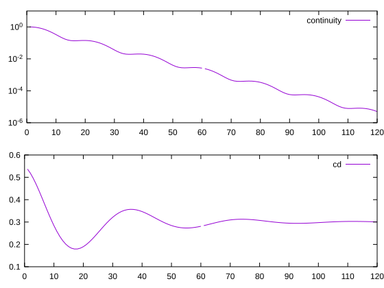

# foresight

>#### FORtran Easy Svg Interactive Gnuplot-like Html Tool
> gnuplot-like plots from pure Fortran — a library and a command line tool rendering interactive HTML, SVG and text, with no dependency beyond a Fortran compiler.

[](https://github.com/szaghi/foresight/tags)
[](https://github.com/szaghi/foresight/issues)
[](https://github.com/szaghi/foresight/actions/workflows/ci.yml)
[](https://github.com/szaghi/foresight/actions/workflows/ci.yml)
[](#copyrights)

| 🖱️ **Interactive HTML**<br>One self-contained page per plot: wheel zoom, pan, box zoom, gnuplot hotkeys, series hidden from the key, dashboard panels zoomed together | 📈 **gnuplot Semantics**<br>Autoscale to the tick grid, reversed and log axes, blocks and datasets, gnuplot palette and dash types | 🛰️ **Live Monitoring**<br>`foresight --watch` re-renders while a job appends to its logs; the page reloads keeping your zoom, or following the newest data | 🧩 **Library and CLI**<br>`fig%plot(...)` from your solver, or gnuplot-subset scripts from the shell — the same interpreter |
|:---:|:---:|:---:|:---:|
| 🎯 **Exact & Reproducible**<br>Tick labels built from integers (`0.3`, never `0.30000000000000004`), byte-exact golden tests | 🪶 **Pure Fortran**<br>Fortran 2018 plus libc `rename` and `nanosleep` — no Python, no gnuplot, no graphics library | 📟 **Text Terminal**<br>gnuplot `dumb` and `block` output, characters or Braille dots in ANSI colors: plots over plain ssh, redrawn in place while watching | 📦 **FoBiS**<br>Static library and command line tool, built and tested with FoBiS |

For full documentation (guide, gnuplot subset reference, examples, API, etc...) see the [foresight website](https://szaghi.github.io/foresight/).

---

## Authors

- Stefano Zaghi — [@szaghi](https://github.com/szaghi)

Contributions are welcome — see the [Contributing](https://szaghi.github.io/foresight/guide/contributing) page.

## Copyrights

This project is distributed under the [GPL v3](http://www.gnu.org/licenses/gpl-3.0.html) license.

> Anyone interested in using, developing, or contributing to this project is welcome.

---

## Quick start

From Fortran:

```fortran
use foresight, only : figure_object, I4P, R8P
implicit none
type(figure_object)    :: fig
real(R8P), allocatable :: t(:)
integer(I4P)           :: i

t = [(0.1_R8P * i, i = 0, 100)]
call fig%set_title('Damped oscillation')
call fig%plot(t, exp(-0.3_R8P * t) * cos(2.0_R8P * t), title='u(t)')
call fig%plot(t, exp(-0.3_R8P * t), title='envelope', dt=2_I4P)
call fig%save('quickstart.html')   ! interactive page; .svg static, .txt text
```

From the shell, with a gnuplot script:

```gnuplot
# residuals.gp
set title "Residuals"
set logscale y
set grid
plot 'residuals.dat' using 1:2 with lines title 'continuity', \
     ''              using 1:3 with lines title 'momentum'
```

```bash
foresight residuals.gp                                  # residuals.html
foresight --watch residuals.gp                          # re-render while residuals.dat grows
foresight --watch -e "set terminal dumb" residuals.gp   # the same, as text in the terminal
```



---

## Install

### FoBiS

**Standalone** — clone, fetch dependencies, and build:

```bash
git clone https://github.com/szaghi/foresight && cd foresight
fobis fetch                                  # fetch PENF and the other dependencies
fobis build --mode foresight-gnu             # command line tool: bin/foresight
fobis build --mode foresight-static-gnu      # static library: lib/libforesight.a, modules in lib/mod
```

Link the library into your program:

```bash
gfortran -I foresight/lib/mod my_program.f90 foresight/lib/libforesight.a -o my_program
```

**As a project dependency** — declare foresight and PENF in your `fobos` and run `fetch`:

```ini
[dependencies]
deps_dir  = src/third_party
PENF      = https://github.com/szaghi/PENF
foresight = https://github.com/szaghi/foresight
```

```bash
fobis fetch           # fetch the sources
fobis build           # foresight modules are compiled with your project
```

**Tests**

```bash
fobis build --mode tests-gnu-debug
bash scripts/run_tests.sh            # Fortran tests, byte-exact golden files included
fobis rule --ex test-js              # viewer tick rules (needs node)
```
