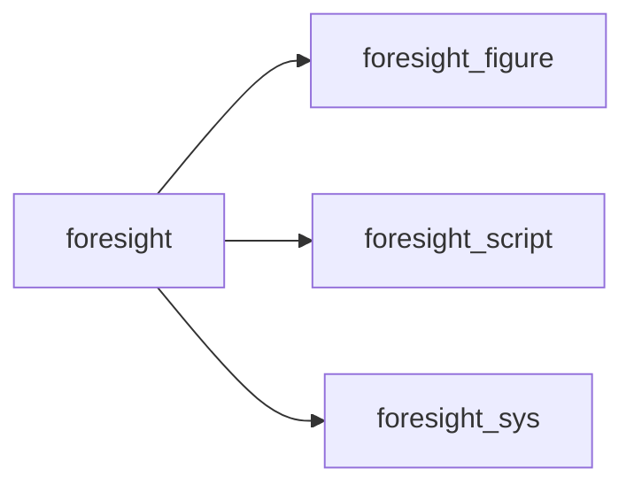

# foresight

> foresight, FORtran Easy Svg Interactive Gnuplot-like Html Tool.

 Library entry point: re-exports the public API of all foresight modules.

**Source**: `src/lib/foresight.F90`

**Dependencies**

