# foresight_axes

> foresight_axes, a plot panel: the axes, the plotted series, the key and the decorations.

 Layout follows gnuplot defaults: full border with inward ticks mirrored on the opposite side, tick labels outside
 bottom and left, key inside the plot area (top right by default) with right-aligned titles and the samples on their
 right. A key `outside` lies in a side margin (left, right) or, centred, above or below the plot; `below` and `above`
 lay its entries out in rows (`horizontal`), as many per row as the panel width holds.

 A second y axis (gnuplot `y2`) scales the series plotted on it (`axes x1y2`) on its own, autoscaled from them alone;
 as gnuplot, its ticks and labels are off until `set y2tics` (on the right border, not mirrored), and it is drawn only
 when it has data or a fully fixed range.
 Text extents are measured by the output device (estimated for vector formats, whose viewer renders the glyphs).

**Source**: `src/lib/foresight_axes.F90`

**Dependencies**

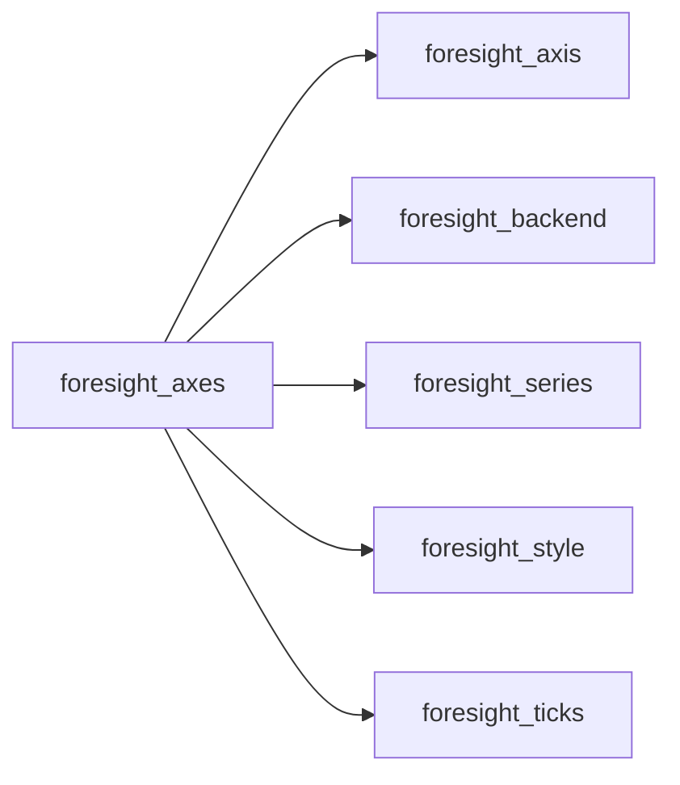

## Contents

- [axes_object](#axes-object)
- [add_series](#add-series)
- [data_extent](#data-extent)
- [render](#render)
- [draw_frame](#draw-frame)
- [draw_grid](#draw-grid)
- [draw_key](#draw-key)
- [key_layout](#key-layout)
- [draw_series](#draw-series)
- [setup_axes](#setup-axes)
- [axes_names](#axes-names)
- [key_position](#key-position)
- [key_place](#key-place)
- [has_title](#has-title)
- [place_plot_area](#place-plot-area)

## Variables

| Name | Type | Attributes | Description |
|------|------|------------|-------------|
| `PAD` | real(kind=R8P) | parameter | Outer padding [px]. |
| `TICK_MAJOR` | real(kind=R8P) | parameter | Major tick length [px]. |
| `TICK_MINOR` | real(kind=R8P) | parameter | Minor tick length [px]. |
| `GAP` | real(kind=R8P) | parameter | Gap between border, tick labels and axis labels [px]. |
| `LINE_HEIGHT` | real(kind=R8P) | parameter | Text line height [font size]. |
| `SAMPLE_LENGTH` | real(kind=R8P) | parameter | Key sample length [font size]. |
| `CAP_LENGTH` | real(kind=R8P) | parameter | Error bar cap length [px]. |
| `FRAME_COLOR` | character(len=*) | parameter | Border and tick color. |
| `GRID_COLOR` | character(len=*) | parameter | Grid line color. |
| `GRID_DASHES` | character(len=*) | parameter | Grid line dash array. |

## Derived Types

### axes_object

Plot panel.

#### Components

| Name | Type | Attributes | Description |
|------|------|------------|-------------|
| `xaxis` | type([axis_object](/api/src/lib/foresight_axis#axis-object)) |  | Horizontal axis. |
| `yaxis` | type([axis_object](/api/src/lib/foresight_axis#axis-object)) |  | Vertical axis. |
| `y2axis` | type([axis_object](/api/src/lib/foresight_axis#axis-object)) |  | Second |
| `y2_active` | logical |  | The second y axis is drawn, set by `setup_axes`. |
| `series` | type([series_object](/api/src/lib/foresight_series#series-object)) | allocatable | Plotted series. |
| `title` | character(len=:) | allocatable | Panel title, empty for none. |
| `grid` | logical |  | Draw grid lines at the major ticks. |
| `key` | logical |  | Draw the key. |
| `key_h` | character(len=6) |  | Key horizontal position: left, center, right. |
| `key_v` | character(len=6) |  | Key vertical position: top, center, bottom. |
| `key_box` | logical |  | Draw a box around the key. |
| `key_outside` | logical |  | Key outside the plot area (gnuplot `outside`). |
| `key_margin` | character(len=6) |  | `top` or `bottom` margin (gnuplot `above`, `below`), else |
| `key_horizontal` | logical |  | Entries side by side, in rows. |
| `origin` | real(kind=R8P) |  | Bottom left corner, page fraction (`set origin`). |
| `size` | real(kind=R8P) |  | Width, height, page fraction (`set size`). |

#### Type-Bound Procedures

| Name | Attributes | Description |
|------|------------|-------------|
| `add_series` | pass(self) | Add a data series. |
| `data_extent` | pass(self) | Extent of the placeable data. |
| `render` | pass(self) | Render the panel. |
| `draw_frame` | pass(self) | Draw border, ticks, labels and title. |
| `draw_grid` | pass(self) | Draw the grid. |
| `draw_key` | pass(self) | Draw the key. |
| `key_layout` | pass(self) | Key size and entry grid. |
| `key_place` | pass(self) | Where the key lies. |
| `draw_series` | pass(self) | Draw a series. |
| `has_title` | pass(self) | Whether the panel has a title. |
| `place_plot_area` | pass(self) | Plot area from the margins. |
| `setup_axes` | pass(self) | Effective ranges and ticks. |

## Subroutines

### add_series

Add the series (`x`, `y`) with gnuplot-like style options; unset options take gnuplot defaults.

 Error bar styles need their bounds: `ylow`/`yhigh` for `yerrorbars`, `xlow`/`xhigh` for `xerrorbars`, all four for
 `xyerrorbars`. `axes` is gnuplot's `x1y1` (default) or `x1y2`, the second y axis.

```fortran
subroutine add_series(self, x, y, title, with, lc, lw, dt, ps, xlow, xhigh, ylow, yhigh, axes, pt)
```

**Arguments**

| Name | Type | Intent | Attributes | Description |
|------|------|--------|------------|-------------|
| `self` | class([axes_object](/api/src/lib/foresight_axes#axes-object)) | inout |  | Panel. |
| `x` | real(kind=R8P) | in |  | Abscissae. |
| `y` | real(kind=R8P) | in |  | Ordinates. |
| `title` | character(len=*) | in | optional | Key title, empty or absent for none. |
| `with` | character(len=*) | in | optional | Plotting style: `lines` (default), `points`, `linespoints`. |
| `lc` | character(len=*) | in | optional | Line color (SVG color); default from the gnuplot palette. |
| `lw` | real(kind=R8P) | in | optional | Line width [px]. |
| `dt` | integer(kind=I4P) | in | optional | Dash type, 1..5. |
| `ps` | real(kind=R8P) | in | optional | Point size scale factor. |
| `xlow` | real(kind=R8P) | in | optional | Horizontal error bar starts. |
| `xhigh` | real(kind=R8P) | in | optional | Horizontal error bar ends. |
| `ylow` | real(kind=R8P) | in | optional | Vertical error bar starts. |
| `yhigh` | real(kind=R8P) | in | optional | Vertical error bar ends. |
| `axes` | character(len=*) | in | optional | Axes of the series: `x1y1` or `x1y2`. |
| `pt` | integer(kind=I4P) | in | optional | gnuplot point type: 0 a dot, 1.. the shapes. |

**Call graph**

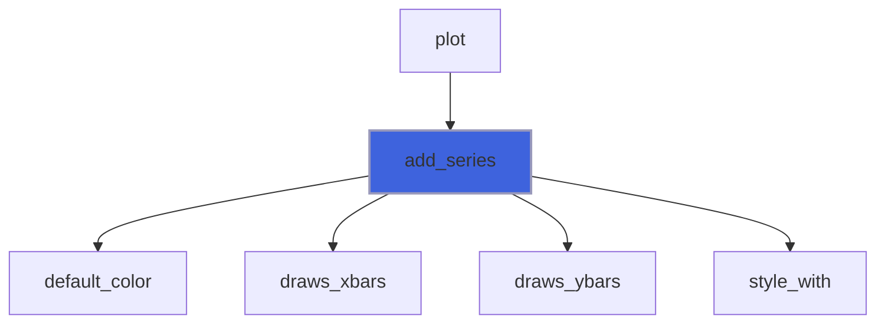

### data_extent

Extent of the series points placeable on their axes, the whole data before any range is set: x over every series,
 y per axis (1 the first, 2 the second).

**Attributes**: pure

```fortran
subroutine data_extent(self, xmin, xmax, ymin, ymax, found)
```

**Arguments**

| Name | Type | Intent | Attributes | Description |
|------|------|--------|------------|-------------|
| `self` | class([axes_object](/api/src/lib/foresight_axes#axes-object)) | in |  | Panel. |
| `xmin` | real(kind=R8P) | out |  | Smallest abscissa. |
| `xmax` | real(kind=R8P) | out |  | Largest abscissa. |
| `ymin` | real(kind=R8P) | out |  | Smallest ordinate, per y axis. |
| `ymax` | real(kind=R8P) | out |  | Largest ordinate, per y axis. |
| `found` | logical | out |  | Any placeable point, per y axis. |

**Call graph**

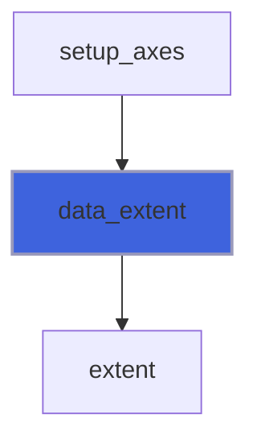

### render

Render the panel into the pixel box of top-left corner (`x0`, `y0`) and size `width` x `height`.

```fortran
subroutine render(self, backend, x0, y0, width, height, font_size)
```

**Arguments**

| Name | Type | Intent | Attributes | Description |
|------|------|--------|------------|-------------|
| `self` | class([axes_object](/api/src/lib/foresight_axes#axes-object)) | inout |  | Panel. |
| `backend` | class([backend_object](/api/src/lib/foresight_backend#backend-object)) | inout |  | Output device. |
| `x0` | real(kind=R8P) | in |  | Box left side [px]. |
| `y0` | real(kind=R8P) | in |  | Box top side [px]. |
| `width` | real(kind=R8P) | in |  | Box width [px]. |
| `height` | real(kind=R8P) | in |  | Box height [px]. |
| `font_size` | real(kind=R8P) | in |  | Font size [px]. |

**Call graph**

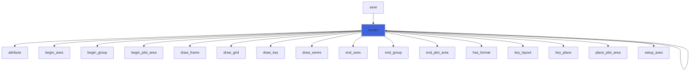

### draw_frame

Draw border, ticks (mirrored if so set), tick labels, axis labels and title.

```fortran
subroutine draw_frame(self, backend, area, x0, y0, x1, font_size)
```

**Arguments**

| Name | Type | Intent | Attributes | Description |
|------|------|--------|------------|-------------|
| `self` | class([axes_object](/api/src/lib/foresight_axes#axes-object)) | in |  | Panel. |
| `backend` | class([backend_object](/api/src/lib/foresight_backend#backend-object)) | inout |  | Output device. |
| `area` | real(kind=R8P) | in |  | Plot area: left, right, top, bottom [px]. |
| `x0` | real(kind=R8P) | in |  | Box left side [px]. |
| `y0` | real(kind=R8P) | in |  | Box top side [px]. |
| `x1` | real(kind=R8P) | in |  | Box right side [px]. |
| `font_size` | real(kind=R8P) | in |  | Font size [px]. |

**Call graph**

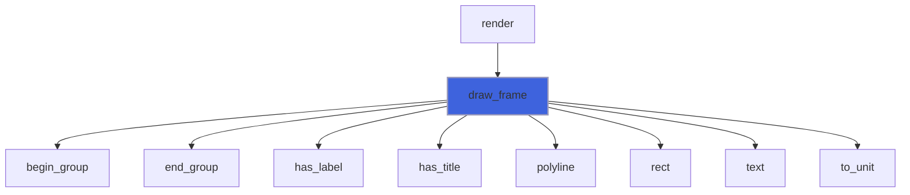

### draw_grid

Draw grid lines at the major ticks.

```fortran
subroutine draw_grid(self, backend, area)
```

**Arguments**

| Name | Type | Intent | Attributes | Description |
|------|------|--------|------------|-------------|
| `self` | class([axes_object](/api/src/lib/foresight_axes#axes-object)) | in |  | Panel. |
| `backend` | class([backend_object](/api/src/lib/foresight_backend#backend-object)) | inout |  | Output device. |
| `area` | real(kind=R8P) | in |  | Plot area: left, right, top, bottom [px]. |

**Call graph**

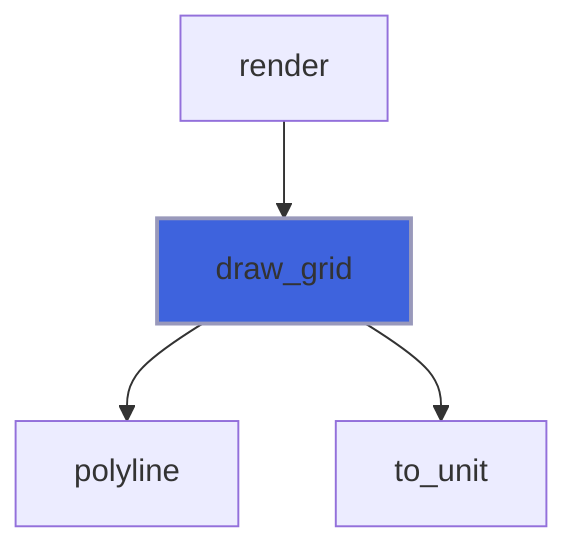

### draw_key

Draw the key at its place (`key_place`): right-aligned titles, style samples on their right; entries in a column,
 or row after row (`key_horizontal`).

```fortran
subroutine draw_key(self, backend, area, box, font_size, grid, extent)
```

**Arguments**

| Name | Type | Intent | Attributes | Description |
|------|------|--------|------------|-------------|
| `self` | class([axes_object](/api/src/lib/foresight_axes#axes-object)) | in |  | Panel. |
| `backend` | class([backend_object](/api/src/lib/foresight_backend#backend-object)) | inout |  | Output device. |
| `area` | real(kind=R8P) | in |  | Plot area: left, right, top, bottom [px]. |
| `box` | real(kind=R8P) | in |  | Panel box: left, top, right, bottom [px]. |
| `font_size` | real(kind=R8P) | in |  | Font size [px]. |
| `grid` | integer(kind=I4P) | in |  | Entries, columns, rows (`key_layout`). |
| `extent` | real(kind=R8P) | in |  | Key width and height [px] (`key_layout`). |

**Call graph**

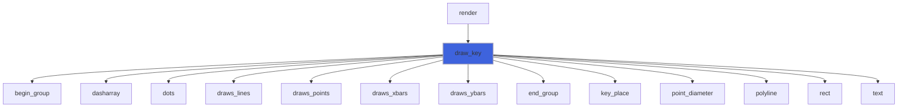

### key_layout

Key grid and size: entries (titled series), columns (1, or as many as `room` holds when horizontal) and rows;
 each entry is the widest title, a gap and the sample, with a gap between entries.

**Attributes**: pure

```fortran
subroutine key_layout(self, backend, font_size, room, grid, extent)
```

**Arguments**

| Name | Type | Intent | Attributes | Description |
|------|------|--------|------------|-------------|
| `self` | class([axes_object](/api/src/lib/foresight_axes#axes-object)) | in |  | Panel. |
| `backend` | class([backend_object](/api/src/lib/foresight_backend#backend-object)) | in |  | Output device, for text widths. |
| `font_size` | real(kind=R8P) | in |  | Font size [px]. |
| `room` | real(kind=R8P) | in |  | Width available to a row of entries [px]. |
| `grid` | integer(kind=I4P) | out |  | Entries, columns, rows. |
| `extent` | real(kind=R8P) | out |  | Key width and height [px]. |

**Call graph**

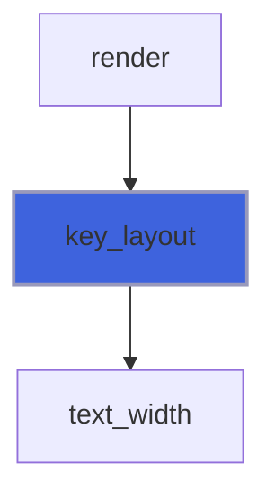

### draw_series

Draw the `s`-th series in the plot area against its vertical axis `yaxis`; unplaceable points (NaN, non-positive
 on log axes) break the line.

```fortran
subroutine draw_series(self, backend, s, yaxis)
```

**Arguments**

| Name | Type | Intent | Attributes | Description |
|------|------|--------|------------|-------------|
| `self` | class([axes_object](/api/src/lib/foresight_axes#axes-object)) | in |  | Panel. |
| `backend` | class([backend_object](/api/src/lib/foresight_backend#backend-object)) | inout |  | Output device. |
| `s` | integer(kind=I4P) | in |  | Series index. |
| `yaxis` | type([axis_object](/api/src/lib/foresight_axis#axis-object)) | in |  | Vertical axis of the series. |

**Call graph**

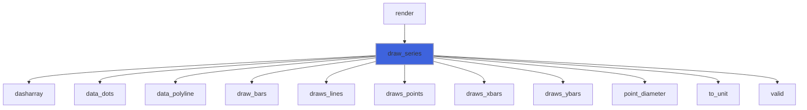

### setup_axes

Effective ranges and ticks for the plot area: x from every series, each y axis from its own series and the points
 inside the x range, as gnuplot. The second y axis is active when it has data or both its ends are fixed.

```fortran
subroutine setup_axes(self, area)
```

**Arguments**

| Name | Type | Intent | Attributes | Description |
|------|------|--------|------------|-------------|
| `self` | class([axes_object](/api/src/lib/foresight_axes#axes-object)) | inout |  | Panel. |
| `area` | real(kind=R8P) | in |  | Plot area: left, right, top, bottom [px]. |

**Call graph**

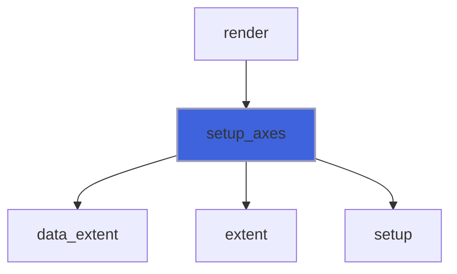

### axes_names

Axes named by gnuplot's concatenated axis names, e.g. `x`, `y2`, `xy`, `xyy2`: each found one sets its flag (the
 others are left unchanged); `bad` is the first unsupported rest (`x2` included), empty if none.

**Attributes**: pure

```fortran
subroutine axes_names(names, x, y, y2, bad)
```

**Arguments**

| Name | Type | Intent | Attributes | Description |
|------|------|--------|------------|-------------|
| `names` | character(len=*) | in |  | Axis names. |
| `x` | logical | inout |  | x named. |
| `y` | logical | inout |  | y named. |
| `y2` | logical | inout |  | y2 named. |
| `bad` | character(len=:) | out | allocatable | Unsupported rest, empty if none. |

**Call graph**

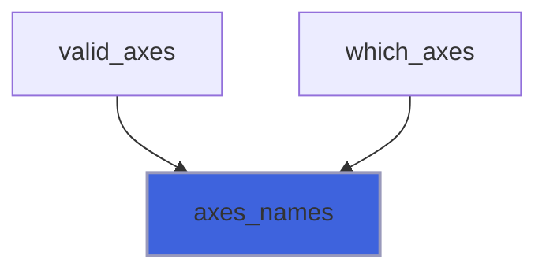

### key_position

Update the key position from gnuplot `set key` position words, applied in order: `left`, `right`, `top`,
 `bottom`, and `center`, which centres the direction not given yet by `words` (both if none, as gnuplot);
 `inside`, `outside`; `below` (`under`) and `above` (`over`), centred rows below or above the plot; `horizontal`,
 `vertical` the layout of the entries.

**Attributes**: pure

```fortran
subroutine key_position(words, horizontal, vertical, outside, margin, layout, bad)
```

**Arguments**

| Name | Type | Intent | Attributes | Description |
|------|------|--------|------------|-------------|
| `words` | character(len=*) | in |  | Blank separated words. |
| `horizontal` | character(len=6) | inout |  | Horizontal position. |
| `vertical` | character(len=6) | inout |  | Vertical position. |
| `outside` | logical | inout |  | Outside the plot area. |
| `margin` | character(len=6) | inout |  | `top`, `bottom` or empty. |
| `layout` | logical | inout |  | Entries side by side. |
| `bad` | character(len=:) | out | allocatable | First word not a position, empty if none. |

**Call graph**

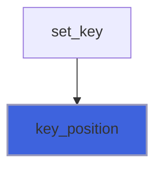

## Functions

### key_place

Where the key lies: `inside` the plot area, in the `left` or `right` margin, `top` (above the plot) or `bottom`
 (below it); outside and centred both ways it stays inside, as gnuplot.

**Attributes**: pure

**Returns**: `character(len=6)`

```fortran
function key_place(self) result(place)
```

**Arguments**

| Name | Type | Intent | Attributes | Description |
|------|------|--------|------------|-------------|
| `self` | class([axes_object](/api/src/lib/foresight_axes#axes-object)) | in |  | Panel. |

**Call graph**

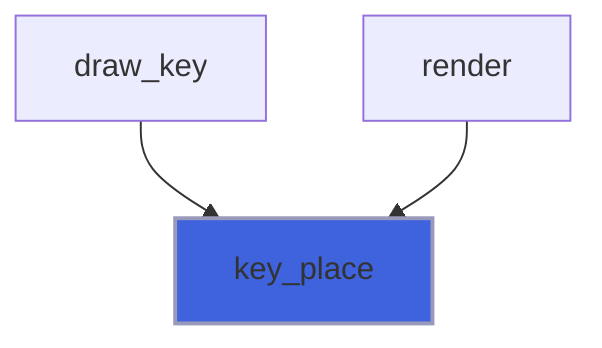

### has_title

Whether the panel has a non-empty title.

**Attributes**: pure

**Returns**: `logical`

```fortran
function has_title(self) result(has)
```

**Arguments**

| Name | Type | Intent | Attributes | Description |
|------|------|--------|------------|-------------|
| `self` | class([axes_object](/api/src/lib/foresight_axes#axes-object)) | in |  | Panel. |

**Call graph**

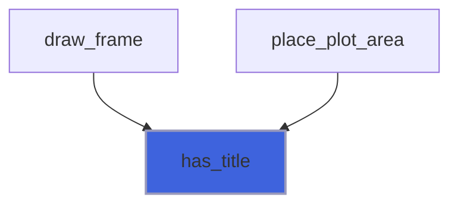

### place_plot_area

Plot area left by the margins that tick labels, axis labels, title and a key `above` need, measured by the device.

**Attributes**: pure

**Returns**: `real(kind=R8P)`

```fortran
function place_plot_area(self, backend, x0, y0, width, height, font_size, above) result(area)
```

**Arguments**

| Name | Type | Intent | Attributes | Description |
|------|------|--------|------------|-------------|
| `self` | class([axes_object](/api/src/lib/foresight_axes#axes-object)) | in |  | Panel. |
| `backend` | class([backend_object](/api/src/lib/foresight_backend#backend-object)) | in |  | Output device, for text widths. |
| `x0` | real(kind=R8P) | in |  | Box left side [px]. |
| `y0` | real(kind=R8P) | in |  | Box top side [px]. |
| `width` | real(kind=R8P) | in |  | Box width [px]. |
| `height` | real(kind=R8P) | in |  | Box height [px]. |
| `font_size` | real(kind=R8P) | in |  | Font size [px]. |
| `above` | real(kind=R8P) | in |  | Room for a key between the title and the plot [px]. |

**Call graph**

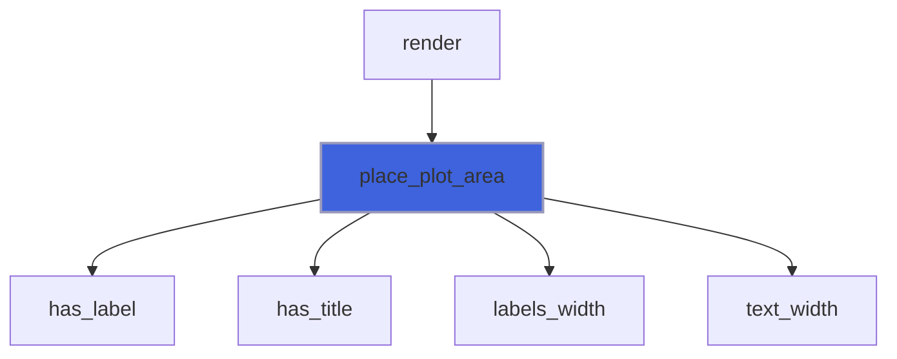
