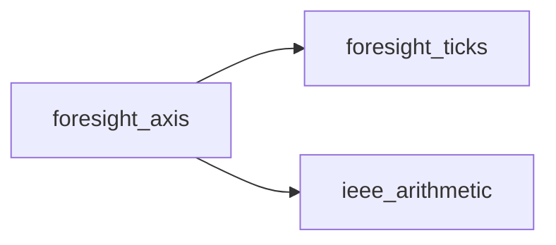
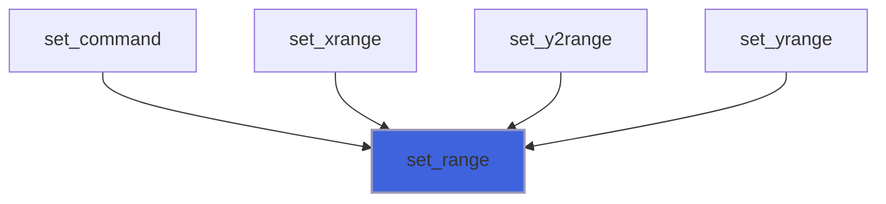
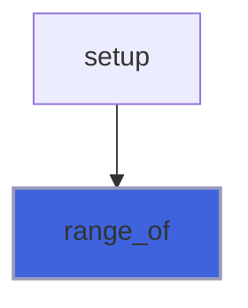
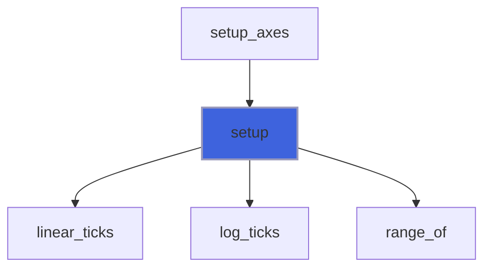
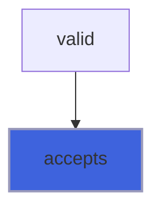
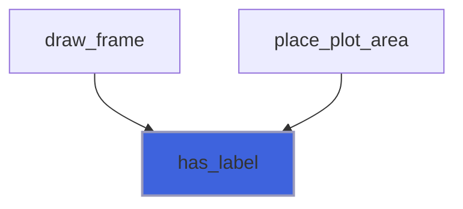
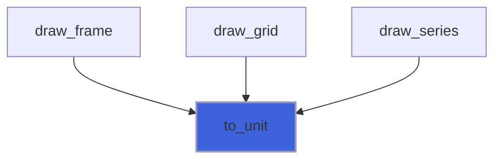

# foresight_axis

> foresight_axis, a plot axis: user settings and the derived effective range and ticks.

 Range semantics follow gnuplot `set xrange [min:max]`: `min` is the value at the axis start and `max` at its end
 (`min > max` reverses the axis); an unset end is autoscaled to the data and extended outward to the tick grid.

**Source**: `src/lib/foresight_axis.F90`

**Dependencies**



## Contents

- [axis_object](#axis-object)
- [set_range](#set-range)
- [range_of](#range-of)
- [setup](#setup)
- [accepts](#accepts)
- [has_label](#has-label)
- [to_unit](#to-unit)

## Derived Types

### axis_object

Plot axis.

#### Components

| Name | Type | Attributes | Description |
|------|------|------------|-------------|
| `label` | character(len=:) | allocatable | Axis label, empty for none. |
| `log` | logical |  | Base-10 logarithmic scale. |
| `min_fixed` | logical |  | Axis start set by the user, else autoscaled. |
| `max_fixed` | logical |  | Axis end set by the user, else autoscaled. |
| `min_user` | real(kind=R8P) |  | User value at the axis start. |
| `max_user` | real(kind=R8P) |  | User value at the axis end. |
| `lo` | real(kind=R8P) |  | Effective value at the axis start, set by `setup`. |
| `hi` | real(kind=R8P) |  | Effective value at the axis end, set by `setup`. |
| `tics` | type([tics_object](/api/src/lib/foresight_ticks#tics-object)) |  | User tick settings: fixed step, none, label format. |
| `ticks` | type([tick_object](/api/src/lib/foresight_ticks#tick-object)) | allocatable | Ticks, set by `setup`. |

#### Type-Bound Procedures

| Name | Attributes | Description |
|------|------------|-------------|
| `accepts` | pass(self) | Whether a value can be placed on the axis. |
| `has_label` | pass(self) | Whether the axis has a label. |
| `range_of` | pass(self) | Range before the tick extension. |
| `set_range` | pass(self) | Set the range, gnuplot style. |
| `setup` | pass(self) | Compute effective range and ticks. |
| `to_unit` | pass(self) | Map a value to the unit interval. |

## Subroutines

### set_range

Set the range as gnuplot `set xrange [min:max]`: an absent end is autoscaled.

**Attributes**: pure

```fortran
subroutine set_range(self, min, max)
```

**Arguments**

| Name | Type | Intent | Attributes | Description |
|------|------|--------|------------|-------------|
| `self` | class([axis_object](/api/src/lib/foresight_axis#axis-object)) | inout |  | Axis. |
| `min` | real(kind=R8P) | in | optional | Value at the axis start. |
| `max` | real(kind=R8P) | in | optional | Value at the axis end. |

**Call graph**



### range_of

Values at the axis start and end from the data extent and the user ends, before the extension to the ticks: the
 range functions are sampled on, as gnuplot.

 A degenerate range is widened by 1% (gnuplot "empty range" behaviour); with no data the range defaults to
 [-10:10], or [1:10] on a log axis.

**Attributes**: pure

```fortran
subroutine range_of(self, dmin, dmax, has_data, lo, hi)
```

**Arguments**

| Name | Type | Intent | Attributes | Description |
|------|------|--------|------------|-------------|
| `self` | class([axis_object](/api/src/lib/foresight_axis#axis-object)) | in |  | Axis. |
| `dmin` | real(kind=R8P) | in |  | Smallest placeable data value. |
| `dmax` | real(kind=R8P) | in |  | Largest placeable data value. |
| `has_data` | logical | in |  | Whether `dmin`/`dmax` are meaningful. |
| `lo` | real(kind=R8P) | out |  | Value at the axis start. |
| `hi` | real(kind=R8P) | out |  | Value at the axis end. |

**Call graph**



### setup

Compute the effective range (`range_of`) and the ticks from the data extent and the axis length.

```fortran
subroutine setup(self, dmin, dmax, has_data, npx)
```

**Arguments**

| Name | Type | Intent | Attributes | Description |
|------|------|--------|------------|-------------|
| `self` | class([axis_object](/api/src/lib/foresight_axis#axis-object)) | inout |  | Axis. |
| `dmin` | real(kind=R8P) | in |  | Smallest placeable data value. |
| `dmax` | real(kind=R8P) | in |  | Largest placeable data value. |
| `has_data` | logical | in |  | Whether `dmin`/`dmax` are meaningful. |
| `npx` | real(kind=R8P) | in |  | Axis length [px]. |

**Call graph**



## Functions

### accepts

Whether `v` can be placed on the axis: finite, and positive on a log axis.

**Attributes**: elemental

**Returns**: `logical`

```fortran
function accepts(self, v) result(ok)
```

**Arguments**

| Name | Type | Intent | Attributes | Description |
|------|------|--------|------------|-------------|
| `self` | class([axis_object](/api/src/lib/foresight_axis#axis-object)) | in |  | Axis. |
| `v` | real(kind=R8P) | in |  | Value. |

**Call graph**



### has_label

Whether the axis has a non-empty label.

**Attributes**: pure

**Returns**: `logical`

```fortran
function has_label(self) result(has)
```

**Arguments**

| Name | Type | Intent | Attributes | Description |
|------|------|--------|------------|-------------|
| `self` | class([axis_object](/api/src/lib/foresight_axis#axis-object)) | in |  | Axis. |

**Call graph**



### to_unit

Map the placeable value `v` to the axis unit interval: 0 at the axis start, 1 at its end.

**Attributes**: elemental

**Returns**: `real(kind=R8P)`

```fortran
function to_unit(self, v) result(u)
```

**Arguments**

| Name | Type | Intent | Attributes | Description |
|------|------|--------|------------|-------------|
| `self` | class([axis_object](/api/src/lib/foresight_axis#axis-object)) | in |  | Axis. |
| `v` | real(kind=R8P) | in |  | Value. |

**Call graph**


