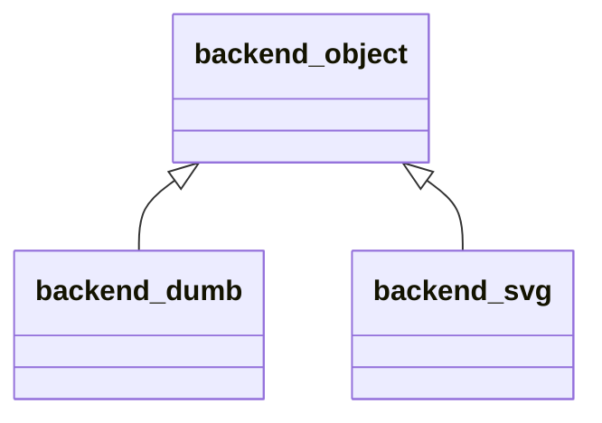

# foresight_backend

> foresight_backend, abstract output device.

 Two coordinate spaces. Page primitives take pixel coordinates (origin top-left, y downward). The `data_*`
 primitives, valid between `begin_plot_area` and `end_plot_area`, take unit-square coordinates of the plot area
 (origin bottom-left, y upward, [0, 1] spanning the axis ranges) and are clipped to it. Keeping data in unit
 coordinates lets an interactive device zoom and pan by changing a single view transform.

 A panel is bracketed by `begin_axes`/`end_axes`, which hand the device the panel geometry and axis ranges, and its
 redrawable decorations (grid, ticks) by named `begin_group`/`end_group`: an interactive device regenerates them after
 a zoom, a static one just writes them.

**Source**: `src/lib/foresight_backend.F90`

## Contents

- [axes_view](#axes-view)
- [backend_object](#backend-object)

## Derived Types

### axes_view

Geometry and axis ranges of a plot panel.

#### Components

| Name | Type | Attributes | Description |
|------|------|------------|-------------|
| `area` | real(kind=R8P) |  | Plot area: left, right, top, bottom [px]. |
| `x` | real(kind=R8P) |  | x axis values at the axis start and end. |
| `y` | real(kind=R8P) |  | y axis values at the axis start and end. |
| `xlog` | logical |  | Log x axis. |
| `ylog` | logical |  | Log y axis. |
| `grid` | logical |  | Grid shown. |
| `font_size` | real(kind=R8P) |  | Font size [px]. |
| `xtics` | character(len=:) | allocatable | x tick positions for the viewer (`tics_object%attribute`), empty for auto. |
| `ytics` | character(len=:) | allocatable | y tick positions for the viewer, empty for auto. |
| `xformat` | character(len=:) | allocatable | x tick label format, empty for the default. |
| `yformat` | character(len=:) | allocatable | y tick label format, empty for the default. |
| `mirror` | logical |  | Ticks mirrored on the opposite border: x, y, y2. |
| `y2_active` | logical |  | Second y axis drawn; the `y2*` components are meaningful only then. |
| `y2` | real(kind=R8P) |  | y2 axis values at the axis start and end. |
| `y2log` | logical |  | Log y2 axis. |
| `y2tics` | character(len=:) | allocatable | y2 tick positions for the viewer, empty for auto. |
| `y2format` | character(len=:) | allocatable | y2 tick label format, empty for the default. |

### backend_object

Abstract output device.

**Inheritance**

**Attributes**: abstract

#### Type-Bound Procedures

| Name | Attributes | Description |
|------|------------|-------------|
| `begin_page` | pass(self) | Open the output page. |
| `end_page` | pass(self) | Close the output page. |
| `begin_axes` | pass(self) | Open a plot panel. |
| `end_axes` | pass(self) | Close the plot panel. |
| `begin_group` | pass(self) | Open a named group. |
| `end_group` | pass(self) | Close the group. |
| `rect` | pass(self) | Rectangle [px]. |
| `polyline` | pass(self) | Polyline [px]. |
| `dots` | pass(self) | Round dots or markers [px]. |
| `text` | pass(self) | Text [px]. |
| `begin_plot_area` | pass(self) | Open the clipped plot area. |
| `end_plot_area` | pass(self) | Close the plot area. |
| `data_polyline` | pass(self) | Polyline [unit square]. |
| `data_dots` | pass(self) | Dots or markers [unit square]. |
| `data_bars` | pass(self) | Error bars [unit square]. |
| `text_width` | pass(self) | Text width [px]. |
