# foresight_backend_block

> foresight_backend_block, text output device drawing with Unicode block or Braille characters (gnuplot `block`).

 The page is the character grid of foresight_backend_dumb, its layout and text unchanged; the graphics (frame, ticks,
 grid, series, key samples) are drawn on a bitmap of `sx` x `sy` dots per cell, each cell written as the character
 of its dots: `half` (1x2, half blocks), `quadrants` (2x2, the default as in gnuplot), `sextants` (2x3, Unicode 13)
 or `braille` (2x4). Text is written over the graphics. Unlike gnuplot, a cell without dots is a blank, Braille
 included, so rows trim and copy as text; a point is its dot and the four neighbours. A cell takes the color of the
 last series drawn in it.

**Source**: `src/lib/foresight_backend_block.F90`

**Dependencies**


## Contents

- [backend_block](#backend-block)
- [begin_page](#begin-page)
- [begin_plot_area](#begin-plot-area)
- [end_plot_area](#end-plot-area)
- [polyline](#polyline)
- [px_point](#px-point)
- [px_segment](#px-segment)
- [rect](#rect)
- [dot](#dot)
- [dot_line](#dot-line)
- [cell](#cell)
- [dot_index](#dot-index)
- [code_point](#code-point)
- [utf8](#utf8)

## Variables

| Name | Type | Attributes | Description |
|------|------|------------|-------------|
| `BLOCK_CHARSETS` | character(len=*) | parameter | Character sets (gnuplot names). |

## Derived Types

### backend_block

Block character text device.

**Inheritance**

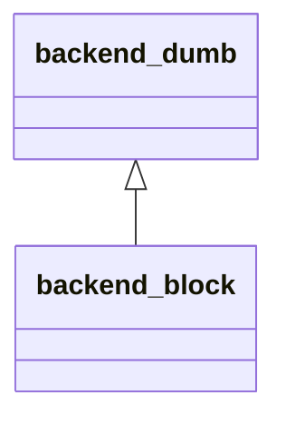

**Extends**: [`backend_dumb`](/api/src/lib/foresight_backend_dumb#backend-dumb)

#### Components

| Name | Type | Attributes | Description |
|------|------|------------|-------------|
| `clear_screen` | logical |  | Clear the terminal before writing to standard output. |
| `file` | character(len=:) | allocatable | Output file, `-` for standard output. |
| `grid` | character(len=1) | allocatable | Cells, (column, row). |
| `symbols` | type([color_symbol](/api/src/lib/foresight_backend_dumb#color-symbol)) | allocatable | Symbols in use. |
| `tint` | integer(kind=I4P) | allocatable | Cell color, index in `symbols`, 0 for the default. |
| `colors` | character(len=7) |  | Color mode: `mono`, `ansi`, `ansi256`, `ansirgb`. |
| `cw` | real(kind=R8P) |  | Cell width [px]. |
| `ch` | real(kind=R8P) |  | Cell height [px]. |
| `font_size` | real(kind=R8P) |  | Font size [px]. |
| `area` | real(kind=R8P) |  | Plot area: left, top, width, height [px]. |
| `hidden` | logical |  | Inside a hidden group: nothing is drawn. |
| `charset` | character(len=9) |  | Character set. |
| `sx` | integer(kind=I4P) |  | Dots per cell, horizontally. |
| `sy` | integer(kind=I4P) |  | Dots per cell, vertically. |
| `dots_on` | logical | allocatable | Bitmap, (dot column, dot row). |
| `clip` | integer(kind=I4P) |  | Dots of the open plot area: first, last column, first, last row; |

#### Type-Bound Procedures

| Name | Attributes | Description |
|------|------------|-------------|
| `end_page` | pass(self) |  |
| `begin_axes` | pass(self) |  |
| `end_axes` | pass(self) |  |
| `begin_group` | pass(self) |  |
| `end_group` | pass(self) |  |
| `dots` | pass(self) |  |
| `text` | pass(self) |  |
| `data_polyline` | pass(self) |  |
| `data_dots` | pass(self) |  |
| `data_bars` | pass(self) |  |
| `text_width` | pass(self) |  |
| `col` | pass(self) | Column of an abscissa [px]. |
| `color_index` | pass(self) | Index of a color in `symbols`. |
| `row` | pass(self) | Row of an ordinate [px]. |
| `put` | pass(self) | Set a cell. |
| `begin_page` | pass(self) |  |
| `begin_plot_area` | pass(self) |  |
| `end_plot_area` | pass(self) |  |
| `cell` | pass(self) |  |
| `polyline` | pass(self) |  |
| `px_point` | pass(self) |  |
| `px_segment` | pass(self) |  |
| `rect` | pass(self) |  |
| `dot` | pass(self) | Set a dot. |
| `dot_line` | pass(self) | Rasterise a dot segment. |

## Subroutines

### begin_page

Start a blank page and its bitmap.

```fortran
subroutine begin_page(self, file, width, height, font_size)
```

**Arguments**

| Name | Type | Intent | Attributes | Description |
|------|------|--------|------------|-------------|
| `self` | class([backend_block](/api/src/lib/foresight_backend_block#backend-block)) | inout |  | Device. |
| `file` | character(len=*) | in |  | Output file, `-` for standard output. |
| `width` | real(kind=R8P) | in |  | Page width [px]. |
| `height` | real(kind=R8P) | in |  | Page height [px]. |
| `font_size` | real(kind=R8P) | in |  | Font size [px]. |

**Call graph**

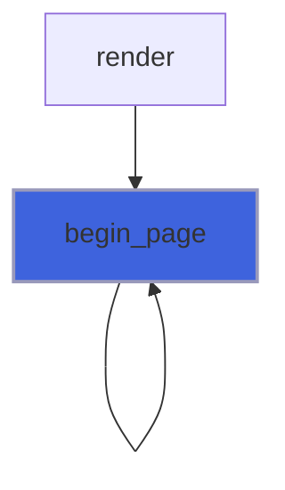

### begin_plot_area

Remember the plot area and its dots, where point markers are clipped.

```fortran
subroutine begin_plot_area(self, x, y, width, height)
```

**Arguments**

| Name | Type | Intent | Attributes | Description |
|------|------|--------|------------|-------------|
| `self` | class([backend_block](/api/src/lib/foresight_backend_block#backend-block)) | inout |  | Device. |
| `x` | real(kind=R8P) | in |  | Left side [px]. |
| `y` | real(kind=R8P) | in |  | Top side [px]. |
| `width` | real(kind=R8P) | in |  | Width [px]. |
| `height` | real(kind=R8P) | in |  | Height [px]. |

**Call graph**

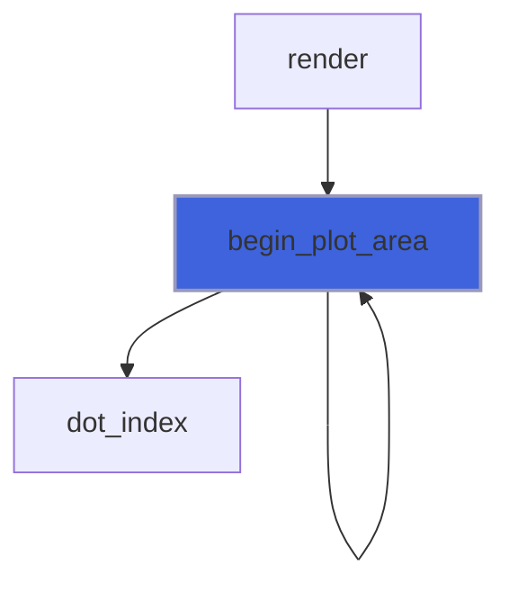

### end_plot_area

Leave the plot area: markers are no longer clipped (key samples).

```fortran
subroutine end_plot_area(self)
```

**Arguments**

| Name | Type | Intent | Attributes | Description |
|------|------|--------|------------|-------------|
| `self` | class([backend_block](/api/src/lib/foresight_backend_block#backend-block)) | inout |  | Device. |

**Call graph**


### polyline

Frame lines (ticks) and key samples drawn on the bitmap, grid lines dotted (every other dot).

```fortran
subroutine polyline(self, x, y, color, line_width, dasharray)
```

**Arguments**

| Name | Type | Intent | Attributes | Description |
|------|------|--------|------------|-------------|
| `self` | class([backend_block](/api/src/lib/foresight_backend_block#backend-block)) | inout |  | Device. |
| `x` | real(kind=R8P) | in |  | Abscissae [px]. |
| `y` | real(kind=R8P) | in |  | Ordinates [px]. |
| `color` | character(len=*) | in |  | Stroke color. |
| `line_width` | real(kind=R8P) | in |  | Stroke width [px]. |
| `dasharray` | character(len=*) | in |  | SVG dash array. |

**Call graph**

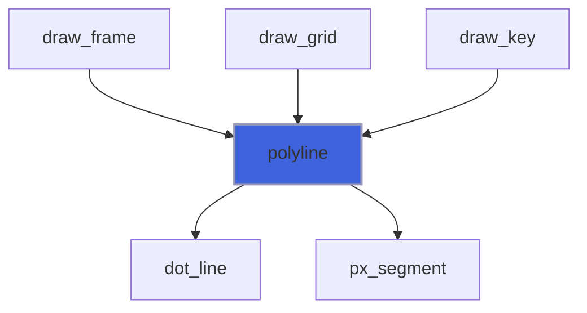

### px_point

A data point at `p` [px]: its dot and the four neighbours, inside the plot area when in one.

```fortran
subroutine px_point(self, p, color)
```

**Arguments**

| Name | Type | Intent | Attributes | Description |
|------|------|--------|------------|-------------|
| `self` | class([backend_block](/api/src/lib/foresight_backend_block#backend-block)) | inout |  | Device. |
| `p` | real(kind=R8P) | in |  | Point [px]. |
| `color` | character(len=*) | in |  | Color. |

**Call graph**

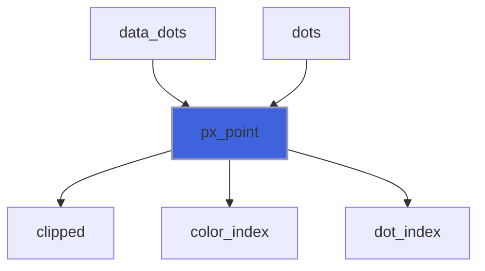

### px_segment

A data segment from `a` to `b` [px] on the bitmap; `symbol` (the error bar character in text) is not used.

```fortran
subroutine px_segment(self, a, b, color, symbol)
```

**Arguments**

| Name | Type | Intent | Attributes | Description |
|------|------|--------|------------|-------------|
| `self` | class([backend_block](/api/src/lib/foresight_backend_block#backend-block)) | inout |  | Device. |
| `a` | real(kind=R8P) | in |  | Start [px]. |
| `b` | real(kind=R8P) | in |  | End [px]. |
| `color` | character(len=*) | in |  | Color. |
| `symbol` | character(len=*) | in |  | Symbol, unused. |

**Call graph**

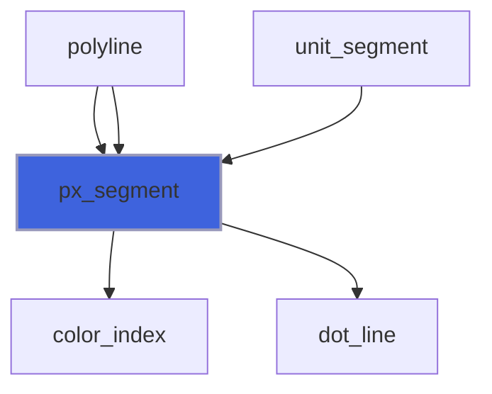

### rect

Stroked rectangles drawn on the bitmap; fills are ignored.

```fortran
subroutine rect(self, x, y, width, height, stroke, fill, line_width)
```

**Arguments**

| Name | Type | Intent | Attributes | Description |
|------|------|--------|------------|-------------|
| `self` | class([backend_block](/api/src/lib/foresight_backend_block#backend-block)) | inout |  | Device. |
| `x` | real(kind=R8P) | in |  | Left side [px]. |
| `y` | real(kind=R8P) | in |  | Top side [px]. |
| `width` | real(kind=R8P) | in |  | Width [px]. |
| `height` | real(kind=R8P) | in |  | Height [px]. |
| `stroke` | character(len=*) | in |  | Stroke color. |
| `fill` | character(len=*) | in |  | Fill color. |
| `line_width` | real(kind=R8P) | in |  | Stroke width [px]. |

**Call graph**

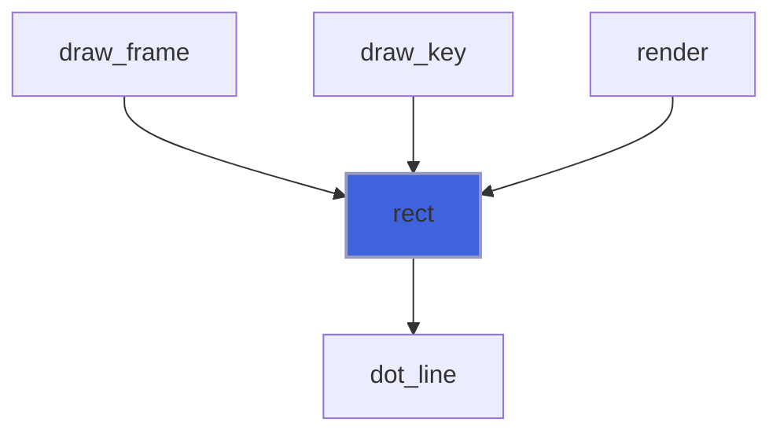

### dot

Set dot (`i`, `j`) and color its cell with `tint` (unless 0, or the cell holds text), ignoring dots off the page.

**Attributes**: pure

```fortran
subroutine dot(self, i, j, tint)
```

**Arguments**

| Name | Type | Intent | Attributes | Description |
|------|------|--------|------------|-------------|
| `self` | class([backend_block](/api/src/lib/foresight_backend_block#backend-block)) | inout |  | Device. |
| `i` | integer(kind=I4P) | in |  | Dot column. |
| `j` | integer(kind=I4P) | in |  | Dot row. |
| `tint` | integer(kind=I4P) | in |  | Color index, 0 to keep the cell color. |

**Call graph**

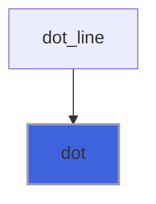

### dot_line

Bresenham segment of dots from `a` to `b` [px], every other dot if `dotted`.

**Attributes**: pure

```fortran
subroutine dot_line(self, a, b, tint, dotted)
```

**Arguments**

| Name | Type | Intent | Attributes | Description |
|------|------|--------|------------|-------------|
| `self` | class([backend_block](/api/src/lib/foresight_backend_block#backend-block)) | inout |  | Device. |
| `a` | real(kind=R8P) | in |  | Start [px]. |
| `b` | real(kind=R8P) | in |  | End [px]. |
| `tint` | integer(kind=I4P) | in |  | Color index, 0 for the default. |
| `dotted` | logical | in |  | Every other dot only. |

**Call graph**

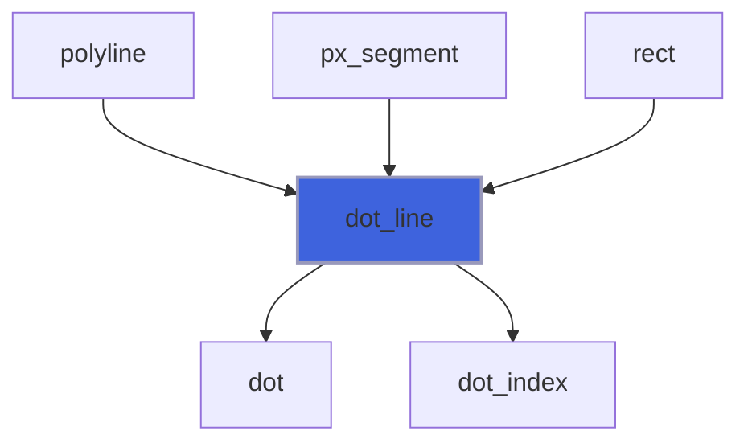

## Functions

### cell

Text of the cell (`c`, `r`): its text character, else the character of its dots, a blank if none.

**Attributes**: pure

**Returns**: `character(len=:)`

```fortran
function cell(self, c, r) result(text)
```

**Arguments**

| Name | Type | Intent | Attributes | Description |
|------|------|--------|------------|-------------|
| `self` | class([backend_block](/api/src/lib/foresight_backend_block#backend-block)) | in |  | Device. |
| `c` | integer(kind=I4P) | in |  | Column. |
| `r` | integer(kind=I4P) | in |  | Row. |

**Call graph**

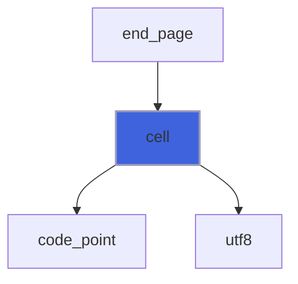

### dot_index

Dot containing the coordinate `p` [px] with cells `cell_size` px wide of `per_cell` dots, clamped to 1..`last`.

**Attributes**: elemental

**Returns**: `integer(kind=I4P)`

```fortran
function dot_index(p, cell_size, per_cell, last) result(d)
```

**Arguments**

| Name | Type | Intent | Attributes | Description |
|------|------|--------|------------|-------------|
| `p` | real(kind=R8P) | in |  | Coordinate [px]. |
| `cell_size` | real(kind=R8P) | in |  | Cell size [px]. |
| `per_cell` | integer(kind=I4P) | in |  | Dots per cell. |
| `last` | integer(kind=I4P) | in |  | Last dot. |

**Call graph**

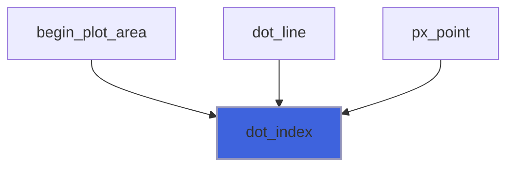

### code_point

Unicode code point of the cell character of `charset` with the dots `bits`, non-zero: bit i + sx * j for the dot of
 column i and row j (from 0, left to right, top to bottom).

**Attributes**: pure

**Returns**: `integer(kind=I4P)`

```fortran
function code_point(charset, bits) result(code)
```

**Arguments**

| Name | Type | Intent | Attributes | Description |
|------|------|--------|------------|-------------|
| `charset` | character(len=*) | in |  | Character set. |
| `bits` | integer(kind=I4P) | in |  | Dots. |

**Call graph**

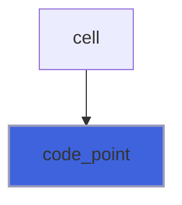

### utf8

UTF-8 encoding of the code point `code` (at most U+10FFFF).

**Attributes**: pure

**Returns**: `character(len=:)`

```fortran
function utf8(code) result(text)
```

**Arguments**

| Name | Type | Intent | Attributes | Description |
|------|------|--------|------------|-------------|
| `code` | integer(kind=I4P) | in |  | Code point. |

**Call graph**

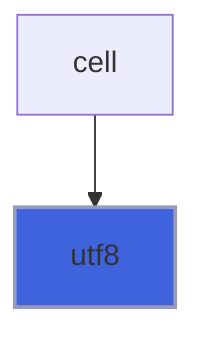
