# foresight_backend_dumb

> foresight_backend_dumb, text output device (gnuplot `dumb` terminal).

 The page is a grid of character cells, `CELL_WIDTH` x `CELL_HEIGHT` font sizes each, so the layout engine works
 unchanged in its virtual pixels. Series are drawn with gnuplot's dumb symbols, one per color in order of use, the
 frame with `+`, `-` and `|`, the grid with `.`; superscripts become `^`. Data segments are clipped to the plot area
 before rasterisation: points far outside the range never cost more than the cells actually drawn.

 With `colors` other than `mono` (gnuplot `ansi`, `ansi256`, `ansirgb`) the cells of each series take its color
 through ANSI escape sequences, the nearest of the 6 basic colors, of the 256-color palette, or the color itself;
 frame, grid, text, and black, white or named series colors keep the terminal's own color.

 Data are drawn through `px_segment` and `px_point`, in pixels: a device drawing at a finer resolution than the cells
 (foresight_backend_block) overrides them, `cell`, `rect` and `polyline`, and keeps the rest.

**Source**: `src/lib/foresight_backend_dumb.F90`

**Dependencies**

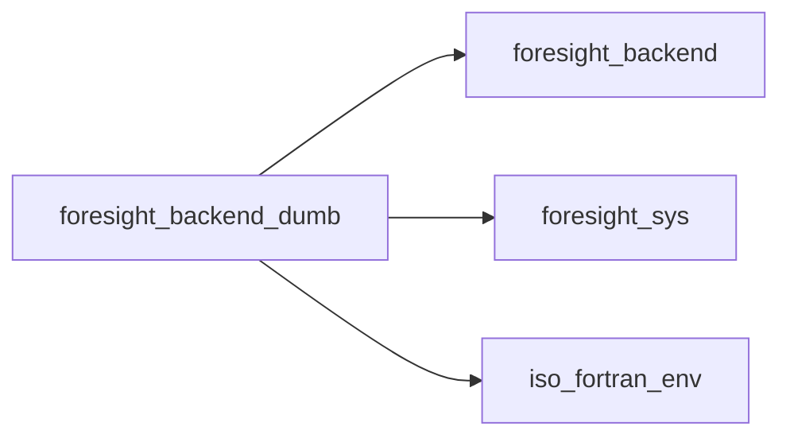

## Contents

- [color_symbol](#color-symbol)
- [backend_dumb](#backend-dumb)
- [begin_page](#begin-page)
- [end_page](#end-page)
- [begin_axes](#begin-axes)
- [end_axes](#end-axes)
- [begin_group](#begin-group)
- [end_group](#end-group)
- [rect](#rect)
- [polyline](#polyline)
- [dots](#dots)
- [text](#text)
- [begin_plot_area](#begin-plot-area)
- [end_plot_area](#end-plot-area)
- [data_polyline](#data-polyline)
- [data_dots](#data-dots)
- [data_bars](#data-bars)
- [px_point](#px-point)
- [px_segment](#px-segment)
- [put](#put)
- [segment](#segment)
- [unit_segment](#unit-segment)
- [text_width](#text-width)
- [cell](#cell)
- [col](#col)
- [row](#row)
- [color_index](#color-index)
- [symbol_of](#symbol-of)
- [color_rgb](#color-rgb)
- [ansi_escape](#ansi-escape)

## Variables

| Name | Type | Attributes | Description |
|------|------|------------|-------------|
| `SYMBOLS` | character(len=*) | parameter | Series symbols, cycled. |
| `FRAME_COLOR` | character(len=*) | parameter | Frame color, drawn as ticks. |
| `GRID_COLOR` | character(len=*) | parameter | Grid color, drawn as dots on blank cells. |
| `CELL_WIDTH` | real(kind=R8P) | parameter | Cell width [font size]. |
| `CELL_HEIGHT` | real(kind=R8P) | parameter | Cell height [font size]. |
| `TEXT_COLORS` | character(len=*) | parameter | Color modes (gnuplot names). |
| `ESC` | character(len=1) | parameter | Escape character. |

## Derived Types

### color_symbol

Symbol assigned to a color.

#### Components

| Name | Type | Attributes | Description |
|------|------|------------|-------------|
| `color` | character(len=:) | allocatable | SVG color. |
| `symbol` | character(len=1) |  | Cell symbol. |

### backend_dumb

Text output device.

**Inheritance**

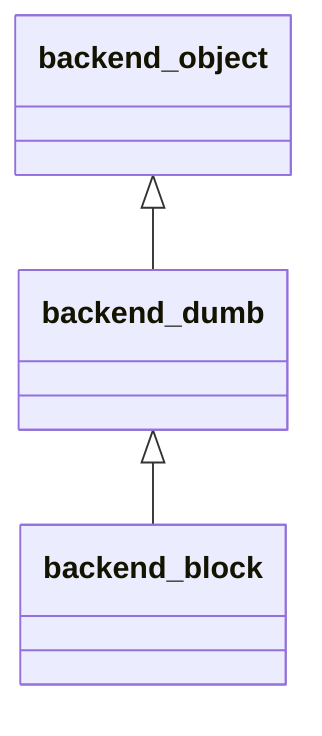

**Extends**: [`backend_object`](/api/src/lib/foresight_backend#backend-object)

#### Components

| Name | Type | Attributes | Description |
|------|------|------------|-------------|
| `clear_screen` | logical |  | Clear the terminal before writing to standard output. |
| `file` | character(len=:) | allocatable | Output file, `-` for standard output. |
| `grid` | character(len=1) | allocatable | Cells, (column, row). |
| `symbols` | type([color_symbol](/api/src/lib/foresight_backend_dumb#color-symbol)) | allocatable | Symbols in use. |
| `tint` | integer(kind=I4P) | allocatable | Cell color, index in `symbols`, 0 for the default. |
| `colors` | character(len=7) |  | Color mode: `mono`, `ansi`, `ansi256`, `ansirgb`. |
| `cw` | real(kind=R8P) |  | Cell width [px]. |
| `ch` | real(kind=R8P) |  | Cell height [px]. |
| `font_size` | real(kind=R8P) |  | Font size [px]. |
| `area` | real(kind=R8P) |  | Plot area: left, top, width, height [px]. |
| `hidden` | logical |  | Inside a hidden group: nothing is drawn. |

#### Type-Bound Procedures

| Name | Attributes | Description |
|------|------------|-------------|
| `begin_page` | pass(self) |  |
| `end_page` | pass(self) |  |
| `begin_axes` | pass(self) |  |
| `end_axes` | pass(self) |  |
| `begin_group` | pass(self) |  |
| `end_group` | pass(self) |  |
| `rect` | pass(self) |  |
| `polyline` | pass(self) |  |
| `dots` | pass(self) |  |
| `text` | pass(self) |  |
| `begin_plot_area` | pass(self) |  |
| `end_plot_area` | pass(self) |  |
| `data_polyline` | pass(self) |  |
| `data_dots` | pass(self) |  |
| `data_bars` | pass(self) |  |
| `text_width` | pass(self) |  |
| `cell` | pass(self) | Text of a cell. |
| `col` | pass(self) | Column of an abscissa [px]. |
| `color_index` | pass(self) | Index of a color in `symbols`. |
| `px_point` | pass(self) | Draw a data point [px]. |
| `px_segment` | pass(self) | Draw a data segment [px]. |
| `row` | pass(self) | Row of an ordinate [px]. |
| `put` | pass(self) | Set a cell. |
| `segment` | pass(self) | Rasterise a cell segment. |
| `symbol_of` | pass(self) | Symbol of a color. |
| `unit_segment` | pass(self) | Clip and draw a unit-square segment. |

## Subroutines

### begin_page

Start a blank page of `width` x `height` px.

```fortran
subroutine begin_page(self, file, width, height, font_size)
```

**Arguments**

| Name | Type | Intent | Attributes | Description |
|------|------|--------|------------|-------------|
| `self` | class([backend_dumb](/api/src/lib/foresight_backend_dumb#backend-dumb)) | inout |  | Device. |
| `file` | character(len=*) | in |  | Output file, `-` for standard output. |
| `width` | real(kind=R8P) | in |  | Page width [px]. |
| `height` | real(kind=R8P) | in |  | Page height [px]. |
| `font_size` | real(kind=R8P) | in |  | Font size [px]. |

**Call graph**

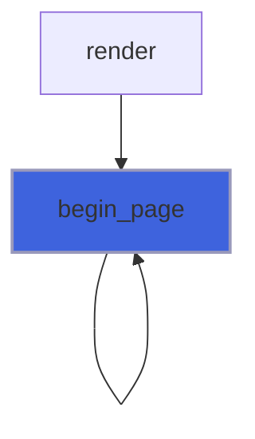

### end_page

Write the page, rows right-trimmed: to standard output, or atomically to the file.

```fortran
subroutine end_page(self)
```

**Arguments**

| Name | Type | Intent | Attributes | Description |
|------|------|--------|------------|-------------|
| `self` | class([backend_dumb](/api/src/lib/foresight_backend_dumb#backend-dumb)) | inout |  | Device. |

**Call graph**

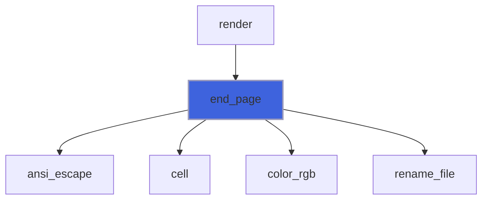

### begin_axes

No panel metadata in text.

```fortran
subroutine begin_axes(self, view)
```

**Arguments**

| Name | Type | Intent | Attributes | Description |
|------|------|--------|------------|-------------|
| `self` | class([backend_dumb](/api/src/lib/foresight_backend_dumb#backend-dumb)) | inout |  | Device. |
| `view` | type([axes_view](/api/src/lib/foresight_backend#axes-view)) | in |  | Panel geometry and axis ranges. |

**Call graph**

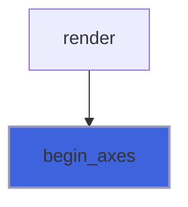

### end_axes

No panel metadata in text.

```fortran
subroutine end_axes(self)
```

**Arguments**

| Name | Type | Intent | Attributes | Description |
|------|------|--------|------------|-------------|
| `self` | class([backend_dumb](/api/src/lib/foresight_backend_dumb#backend-dumb)) | inout |  | Device. |

**Call graph**

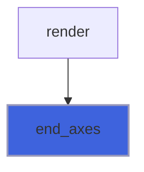

### begin_group

A hidden group (the grid when off) is not drawn at all.

```fortran
subroutine begin_group(self, name, visible, series)
```

**Arguments**

| Name | Type | Intent | Attributes | Description |
|------|------|--------|------------|-------------|
| `self` | class([backend_dumb](/api/src/lib/foresight_backend_dumb#backend-dumb)) | inout |  | Device. |
| `name` | character(len=*) | in |  | Group name. |
| `visible` | logical | in | optional | Group shown. |
| `series` | integer(kind=I4P) | in | optional | Series number, unused in text. |

**Call graph**

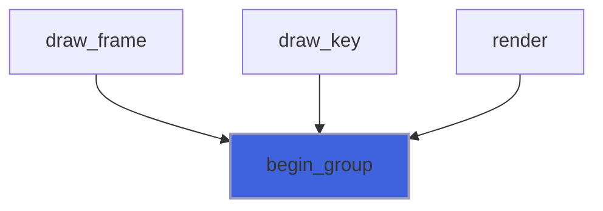

### end_group

Leave the group.

```fortran
subroutine end_group(self)
```

**Arguments**

| Name | Type | Intent | Attributes | Description |
|------|------|--------|------------|-------------|
| `self` | class([backend_dumb](/api/src/lib/foresight_backend_dumb#backend-dumb)) | inout |  | Device. |

**Call graph**

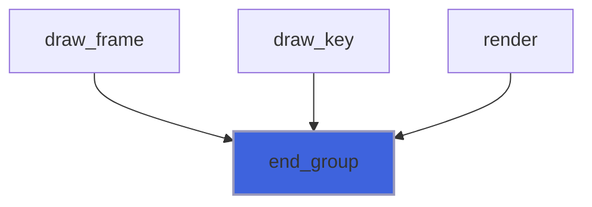

### rect

Stroked rectangles are drawn with `-`, `|` and `+` corners; fills are ignored.

```fortran
subroutine rect(self, x, y, width, height, stroke, fill, line_width)
```

**Arguments**

| Name | Type | Intent | Attributes | Description |
|------|------|--------|------------|-------------|
| `self` | class([backend_dumb](/api/src/lib/foresight_backend_dumb#backend-dumb)) | inout |  | Device. |
| `x` | real(kind=R8P) | in |  | Left side [px]. |
| `y` | real(kind=R8P) | in |  | Top side [px]. |
| `width` | real(kind=R8P) | in |  | Width [px]. |
| `height` | real(kind=R8P) | in |  | Height [px]. |
| `stroke` | character(len=*) | in |  | Stroke color. |
| `fill` | character(len=*) | in |  | Fill color. |
| `line_width` | real(kind=R8P) | in |  | Stroke width [px]. |

**Call graph**

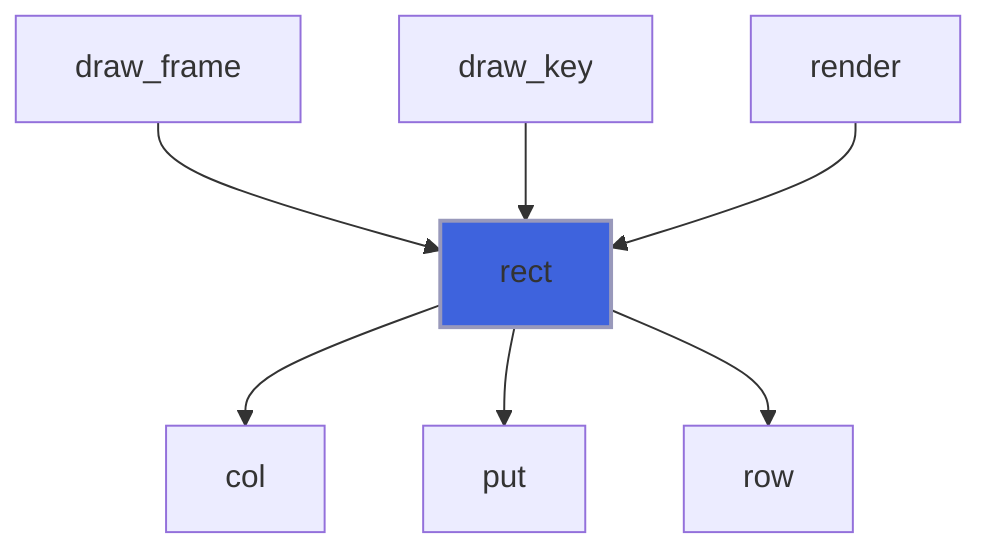

### polyline

Frame polylines (ticks) mark their start with `+`, grid lines dot blank cells, others use the color symbol.

```fortran
subroutine polyline(self, x, y, color, line_width, dasharray)
```

**Arguments**

| Name | Type | Intent | Attributes | Description |
|------|------|--------|------------|-------------|
| `self` | class([backend_dumb](/api/src/lib/foresight_backend_dumb#backend-dumb)) | inout |  | Device. |
| `x` | real(kind=R8P) | in |  | Abscissae [px]. |
| `y` | real(kind=R8P) | in |  | Ordinates [px]. |
| `color` | character(len=*) | in |  | Stroke color. |
| `line_width` | real(kind=R8P) | in |  | Stroke width [px]. |
| `dasharray` | character(len=*) | in |  | SVG dash array. |

**Call graph**

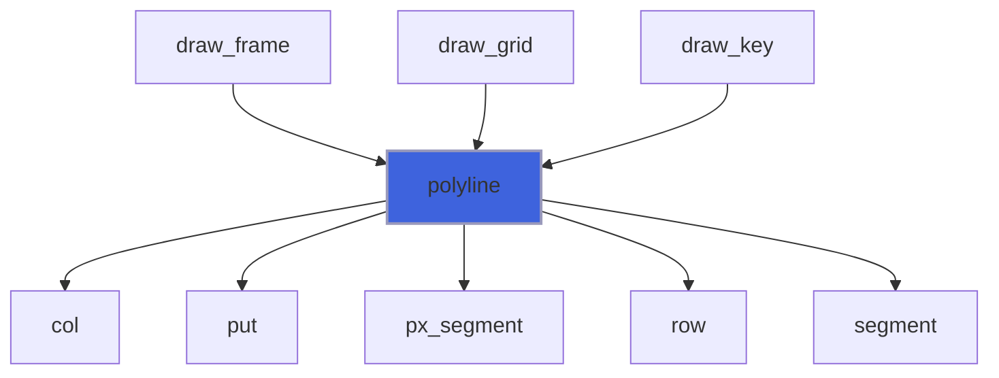

### dots

Dots are the color symbol, whatever the point type.

```fortran
subroutine dots(self, x, y, color, diameter, pt, line_width)
```

**Arguments**

| Name | Type | Intent | Attributes | Description |
|------|------|--------|------------|-------------|
| `self` | class([backend_dumb](/api/src/lib/foresight_backend_dumb#backend-dumb)) | inout |  | Device. |
| `x` | real(kind=R8P) | in |  | Abscissae [px]. |
| `y` | real(kind=R8P) | in |  | Ordinates [px]. |
| `color` | character(len=*) | in |  | Fill color. |
| `diameter` | real(kind=R8P) | in |  | Dot diameter [px]. |
| `pt` | integer(kind=I4P) | in | optional | Point type, ignored. |
| `line_width` | real(kind=R8P) | in | optional | Marker line width, ignored. |

**Call graph**

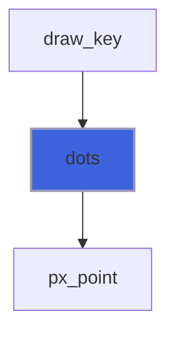

### text

Text in the row of its baseline; superscripts appended after `^`; rotated text written top to bottom.

```fortran
subroutine text(self, x, y, string, anchor, sup, rotate)
```

**Arguments**

| Name | Type | Intent | Attributes | Description |
|------|------|--------|------------|-------------|
| `self` | class([backend_dumb](/api/src/lib/foresight_backend_dumb#backend-dumb)) | inout |  | Device. |
| `x` | real(kind=R8P) | in |  | Anchor abscissa [px]. |
| `y` | real(kind=R8P) | in |  | Anchor ordinate (baseline) [px]. |
| `string` | character(len=*) | in |  | Text. |
| `anchor` | character(len=*) | in |  | Horizontal anchor: `start`, `middle` or `end`. |
| `sup` | character(len=*) | in | optional | Superscript appended to `string`. |
| `rotate` | real(kind=R8P) | in | optional | Rotation [deg]. |

**Call graph**

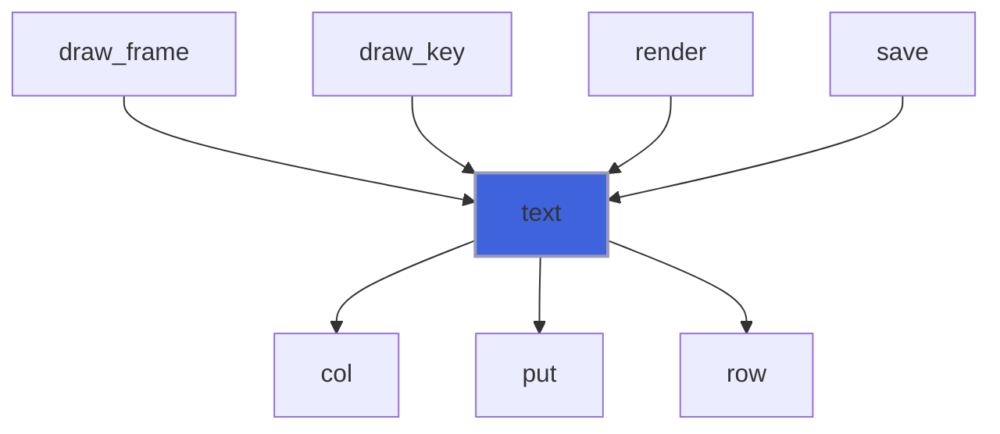

### begin_plot_area

Remember the plot area, where unit-square coordinates map.

```fortran
subroutine begin_plot_area(self, x, y, width, height)
```

**Arguments**

| Name | Type | Intent | Attributes | Description |
|------|------|--------|------------|-------------|
| `self` | class([backend_dumb](/api/src/lib/foresight_backend_dumb#backend-dumb)) | inout |  | Device. |
| `x` | real(kind=R8P) | in |  | Left side [px]. |
| `y` | real(kind=R8P) | in |  | Top side [px]. |
| `width` | real(kind=R8P) | in |  | Width [px]. |
| `height` | real(kind=R8P) | in |  | Height [px]. |

**Call graph**

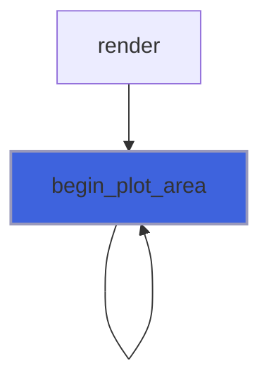

### end_plot_area

Nothing to close in text.

```fortran
subroutine end_plot_area(self)
```

**Arguments**

| Name | Type | Intent | Attributes | Description |
|------|------|--------|------------|-------------|
| `self` | class([backend_dumb](/api/src/lib/foresight_backend_dumb#backend-dumb)) | inout |  | Device. |

**Call graph**

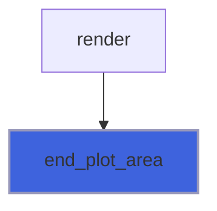

### data_polyline

Polyline [unit square] drawn with the color symbol, clipped to the plot area.

```fortran
subroutine data_polyline(self, x, y, color, line_width, dasharray)
```

**Arguments**

| Name | Type | Intent | Attributes | Description |
|------|------|--------|------------|-------------|
| `self` | class([backend_dumb](/api/src/lib/foresight_backend_dumb#backend-dumb)) | inout |  | Device. |
| `x` | real(kind=R8P) | in |  | Abscissae [unit]. |
| `y` | real(kind=R8P) | in |  | Ordinates [unit]. |
| `color` | character(len=*) | in |  | Stroke color. |
| `line_width` | real(kind=R8P) | in |  | Stroke width [px]. |
| `dasharray` | character(len=*) | in |  | SVG dash array. |

**Call graph**

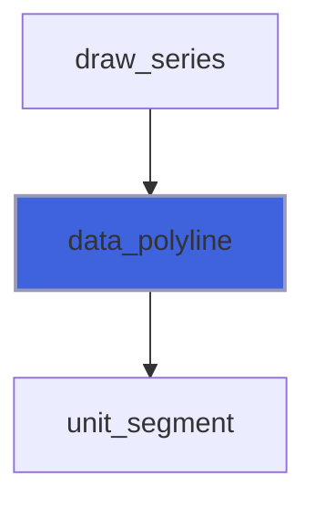

### data_dots

Dots [unit square] inside the plot area drawn with the color symbol, whatever the point type.

```fortran
subroutine data_dots(self, x, y, color, diameter, pt, line_width)
```

**Arguments**

| Name | Type | Intent | Attributes | Description |
|------|------|--------|------------|-------------|
| `self` | class([backend_dumb](/api/src/lib/foresight_backend_dumb#backend-dumb)) | inout |  | Device. |
| `x` | real(kind=R8P) | in |  | Abscissae [unit]. |
| `y` | real(kind=R8P) | in |  | Ordinates [unit]. |
| `color` | character(len=*) | in |  | Fill color. |
| `diameter` | real(kind=R8P) | in |  | Dot diameter [px]. |
| `pt` | integer(kind=I4P) | in | optional | Point type, ignored. |
| `line_width` | real(kind=R8P) | in | optional | Marker line width, ignored. |

**Call graph**

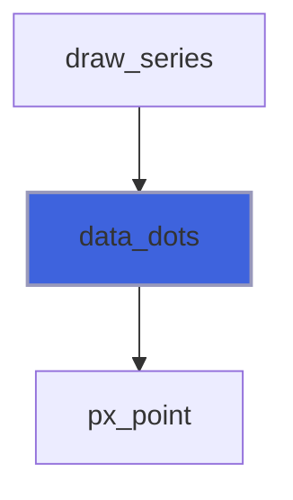

### data_bars

Error bars [unit square] as `|` (vertical) or `-` (horizontal) runs, clipped to the plot area; no caps.

```fortran
subroutine data_bars(self, x1, y1, x2, y2, color, line_width, cap, vertical)
```

**Arguments**

| Name | Type | Intent | Attributes | Description |
|------|------|--------|------------|-------------|
| `self` | class([backend_dumb](/api/src/lib/foresight_backend_dumb#backend-dumb)) | inout |  | Device. |
| `x1` | real(kind=R8P) | in |  | Bar start abscissae. |
| `y1` | real(kind=R8P) | in |  | Bar start ordinates. |
| `x2` | real(kind=R8P) | in |  | Bar end abscissae. |
| `y2` | real(kind=R8P) | in |  | Bar end ordinates. |
| `color` | character(len=*) | in |  | Stroke color. |
| `line_width` | real(kind=R8P) | in |  | Stroke width [px]. |
| `cap` | real(kind=R8P) | in |  | Cap length [px]. |
| `vertical` | logical | in |  | Vertical bars. |

**Call graph**

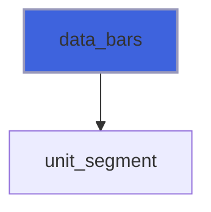

### px_point

A data point at `p` [px]: the color symbol in its cell.

```fortran
subroutine px_point(self, p, color)
```

**Arguments**

| Name | Type | Intent | Attributes | Description |
|------|------|--------|------------|-------------|
| `self` | class([backend_dumb](/api/src/lib/foresight_backend_dumb#backend-dumb)) | inout |  | Device. |
| `p` | real(kind=R8P) | in |  | Point [px]. |
| `color` | character(len=*) | in |  | Color. |

**Call graph**

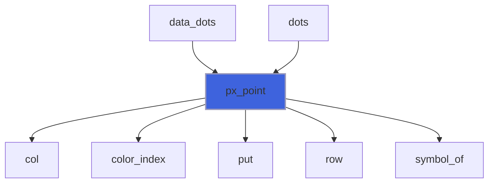

### px_segment

A data segment from `a` to `b` [px] with `symbol`, or the color symbol if empty.

```fortran
subroutine px_segment(self, a, b, color, symbol)
```

**Arguments**

| Name | Type | Intent | Attributes | Description |
|------|------|--------|------------|-------------|
| `self` | class([backend_dumb](/api/src/lib/foresight_backend_dumb#backend-dumb)) | inout |  | Device. |
| `a` | real(kind=R8P) | in |  | Start [px]. |
| `b` | real(kind=R8P) | in |  | End [px]. |
| `color` | character(len=*) | in |  | Color. |
| `symbol` | character(len=*) | in |  | Symbol, empty for the color symbol. |

**Call graph**

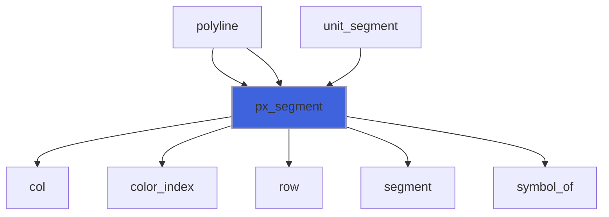

### put

Set cell (`c`, `r`) and its color index `tint` (default 0), ignoring cells off the page.

**Attributes**: pure

```fortran
subroutine put(self, c, r, symbol, tint)
```

**Arguments**

| Name | Type | Intent | Attributes | Description |
|------|------|--------|------------|-------------|
| `self` | class([backend_dumb](/api/src/lib/foresight_backend_dumb#backend-dumb)) | inout |  | Device. |
| `c` | integer(kind=I4P) | in |  | Column. |
| `r` | integer(kind=I4P) | in |  | Row. |
| `symbol` | character(len=1) | in |  | Symbol. |
| `tint` | integer(kind=I4P) | in | optional | Color index in `symbols`. |

**Call graph**

```mermaid
flowchart TD
  begin_axes["begin_axes"] --> put["put"]
  begin_group["begin_group"] --> put["put"]
  begin_page["begin_page"] --> put["put"]
  begin_page["begin_page"] --> put["put"]
  begin_plot_area["begin_plot_area"] --> put["put"]
  data_bars["data_bars"] --> put["put"]
  data_dots["data_dots"] --> put["put"]
  data_polyline["data_polyline"] --> put["put"]
  dots["dots"] --> put["put"]
  end_axes["end_axes"] --> put["put"]
  end_group["end_group"] --> put["put"]
  end_page["end_page"] --> put["put"]
  end_page["end_page"] --> put["put"]
  end_plot_area["end_plot_area"] --> put["put"]
  open_svg["open_svg"] --> put["put"]
  polyline["polyline"] --> put["put"]
  polyline["polyline"] --> put["put"]
  px_point["px_point"] --> put["put"]
  rect["rect"] --> put["put"]
  rect["rect"] --> put["put"]
  segment["segment"] --> put["put"]
  text["text"] --> put["put"]
  text["text"] --> put["put"]
  style put fill:#3e63dd,stroke:#99b,stroke-width:2px
```

### segment

Bresenham segment between cells, optionally writing blank cells only.

**Attributes**: pure

```fortran
subroutine segment(self, c1, r1, c2, r2, symbol, blank_only, tint)
```

**Arguments**

| Name | Type | Intent | Attributes | Description |
|------|------|--------|------------|-------------|
| `self` | class([backend_dumb](/api/src/lib/foresight_backend_dumb#backend-dumb)) | inout |  | Device. |
| `c1` | integer(kind=I4P) | in |  | Start column. |
| `r1` | integer(kind=I4P) | in |  | Start row. |
| `c2` | integer(kind=I4P) | in |  | End column. |
| `r2` | integer(kind=I4P) | in |  | End row. |
| `symbol` | character(len=1) | in |  | Symbol. |
| `blank_only` | logical | in |  | Write blank cells only. |
| `tint` | integer(kind=I4P) | in | optional | Color index in `symbols`. |

**Call graph**

```mermaid
flowchart TD
  polyline["polyline"] --> segment["segment"]
  px_segment["px_segment"] --> segment["segment"]
  segment["segment"] --> put["put"]
  style segment fill:#3e63dd,stroke:#99b,stroke-width:2px
```

### unit_segment

Clip the unit-square segment to [0, 1]^2 (Liang-Barsky), then draw it in the plot area.

```fortran
subroutine unit_segment(self, u1, v1, u2, v2, color, symbol)
```

**Arguments**

| Name | Type | Intent | Attributes | Description |
|------|------|--------|------------|-------------|
| `self` | class([backend_dumb](/api/src/lib/foresight_backend_dumb#backend-dumb)) | inout |  | Device. |
| `u1` | real(kind=R8P) | in |  | Start abscissa [unit]. |
| `v1` | real(kind=R8P) | in |  | Start ordinate [unit]. |
| `u2` | real(kind=R8P) | in |  | End abscissa [unit]. |
| `v2` | real(kind=R8P) | in |  | End ordinate [unit]. |
| `color` | character(len=*) | in |  | Color. |
| `symbol` | character(len=*) | in |  | Symbol, empty for the color symbol. |

**Call graph**

```mermaid
flowchart TD
  data_bars["data_bars"] --> unit_segment["unit_segment"]
  data_polyline["data_polyline"] --> unit_segment["unit_segment"]
  unit_segment["unit_segment"] --> px_segment["px_segment"]
  style unit_segment fill:#3e63dd,stroke:#99b,stroke-width:2px
```

## Functions

### text_width

Width of `string` in cells [px]: superscripts take full cells after a `^`.

**Attributes**: pure

**Returns**: `real(kind=R8P)`

```fortran
function text_width(self, string, sup, font_size) result(width)
```

**Arguments**

| Name | Type | Intent | Attributes | Description |
|------|------|--------|------------|-------------|
| `self` | class([backend_dumb](/api/src/lib/foresight_backend_dumb#backend-dumb)) | in |  | Device. |
| `string` | character(len=*) | in |  | Text. |
| `sup` | character(len=*) | in |  | Superscript. |
| `font_size` | real(kind=R8P) | in |  | Font size [px]. |

**Call graph**

```mermaid
flowchart TD
  key_layout["key_layout"] --> text_width["text_width"]
  place_plot_area["place_plot_area"] --> text_width["text_width"]
  style text_width fill:#3e63dd,stroke:#99b,stroke-width:2px
```

### cell

Text of the cell (`c`, `r`): its character.

**Attributes**: pure

**Returns**: `character(len=:)`

```fortran
function cell(self, c, r) result(text)
```

**Arguments**

| Name | Type | Intent | Attributes | Description |
|------|------|--------|------------|-------------|
| `self` | class([backend_dumb](/api/src/lib/foresight_backend_dumb#backend-dumb)) | in |  | Device. |
| `c` | integer(kind=I4P) | in |  | Column. |
| `r` | integer(kind=I4P) | in |  | Row. |

**Call graph**

```mermaid
flowchart TD
  end_page["end_page"] --> cell["cell"]
  style cell fill:#3e63dd,stroke:#99b,stroke-width:2px
```

### col

Column of the cell containing the abscissa `x` [px], clamped to the page.

**Attributes**: elemental

**Returns**: `integer(kind=I4P)`

```fortran
function col(self, x) result(c)
```

**Arguments**

| Name | Type | Intent | Attributes | Description |
|------|------|--------|------------|-------------|
| `self` | class([backend_dumb](/api/src/lib/foresight_backend_dumb#backend-dumb)) | in |  | Device. |
| `x` | real(kind=R8P) | in |  | Abscissa [px]. |

**Call graph**

```mermaid
flowchart TD
  polyline["polyline"] --> col["col"]
  px_point["px_point"] --> col["col"]
  px_segment["px_segment"] --> col["col"]
  rect["rect"] --> col["col"]
  text["text"] --> col["col"]
  style col fill:#3e63dd,stroke:#99b,stroke-width:2px
```

### row

Row of the cell containing the ordinate `y` [px], clamped to the page.

**Attributes**: elemental

**Returns**: `integer(kind=I4P)`

```fortran
function row(self, y) result(r)
```

**Arguments**

| Name | Type | Intent | Attributes | Description |
|------|------|--------|------------|-------------|
| `self` | class([backend_dumb](/api/src/lib/foresight_backend_dumb#backend-dumb)) | in |  | Device. |
| `y` | real(kind=R8P) | in |  | Ordinate [px]. |

**Call graph**

```mermaid
flowchart TD
  polyline["polyline"] --> row["row"]
  px_point["px_point"] --> row["row"]
  px_segment["px_segment"] --> row["row"]
  rect["rect"] --> row["row"]
  text["text"] --> row["row"]
  style row fill:#3e63dd,stroke:#99b,stroke-width:2px
```

### color_index

Index of `color` in `symbols`, assigning the next symbol on first use.

**Returns**: `integer(kind=I4P)`

```fortran
function color_index(self, color) result(k)
```

**Arguments**

| Name | Type | Intent | Attributes | Description |
|------|------|--------|------------|-------------|
| `self` | class([backend_dumb](/api/src/lib/foresight_backend_dumb#backend-dumb)) | inout |  | Device. |
| `color` | character(len=*) | in |  | SVG color. |

**Call graph**

```mermaid
flowchart TD
  px_point["px_point"] --> color_index["color_index"]
  px_point["px_point"] --> color_index["color_index"]
  px_segment["px_segment"] --> color_index["color_index"]
  px_segment["px_segment"] --> color_index["color_index"]
  symbol_of["symbol_of"] --> color_index["color_index"]
  style color_index fill:#3e63dd,stroke:#99b,stroke-width:2px
```

### symbol_of

Symbol of `color`, assigning the next one on first use.

**Returns**: `character(len=1)`

```fortran
function symbol_of(self, color) result(symbol)
```

**Arguments**

| Name | Type | Intent | Attributes | Description |
|------|------|--------|------------|-------------|
| `self` | class([backend_dumb](/api/src/lib/foresight_backend_dumb#backend-dumb)) | inout |  | Device. |
| `color` | character(len=*) | in |  | SVG color. |

**Call graph**

```mermaid
flowchart TD
  px_point["px_point"] --> symbol_of["symbol_of"]
  px_segment["px_segment"] --> symbol_of["symbol_of"]
  symbol_of["symbol_of"] --> color_index["color_index"]
  style symbol_of fill:#3e63dd,stroke:#99b,stroke-width:2px
```

### color_rgb

Red, green, blue (0-255) of the color `k` of `symbols`; -1 for the terminal's own color: index 0, a color that is
 not `#rrggbb`, black or white (unreadable on one of the backgrounds).

**Attributes**: pure

**Returns**: `integer(kind=I4P)`

```fortran
function color_rgb(symbols, k) result(rgb)
```

**Arguments**

| Name | Type | Intent | Attributes | Description |
|------|------|--------|------------|-------------|
| `symbols` | type([color_symbol](/api/src/lib/foresight_backend_dumb#color-symbol)) | in |  | Symbols in use. |
| `k` | integer(kind=I4P) | in |  | Index, 0 for the default. |

**Call graph**

```mermaid
flowchart TD
  end_page["end_page"] --> color_rgb["color_rgb"]
  style color_rgb fill:#3e63dd,stroke:#99b,stroke-width:2px
```

### ansi_escape

ANSI escape sequence setting the foreground to `rgb` in the color `mode`, or to the default if `rgb` is -1: the
 nearest of the 6 basic colors (no black and white) for `ansi`, of the 6x6x6 cube and the gray ramp for `ansi256`,
 the color itself for `ansirgb`.

**Attributes**: pure

**Returns**: `character(len=:)`

```fortran
function ansi_escape(mode, rgb) result(escape)
```

**Arguments**

| Name | Type | Intent | Attributes | Description |
|------|------|--------|------------|-------------|
| `mode` | character(len=*) | in |  | `ansi`, `ansi256` or `ansirgb`. |
| `rgb` | integer(kind=I4P) | in |  | Color, -1 for the default. |

**Call graph**

```mermaid
flowchart TD
  end_page["end_page"] --> ansi_escape["ansi_escape"]
  ansi_escape["ansi_escape"] --> str["str"]
  style ansi_escape fill:#3e63dd,stroke:#99b,stroke-width:2px
```
