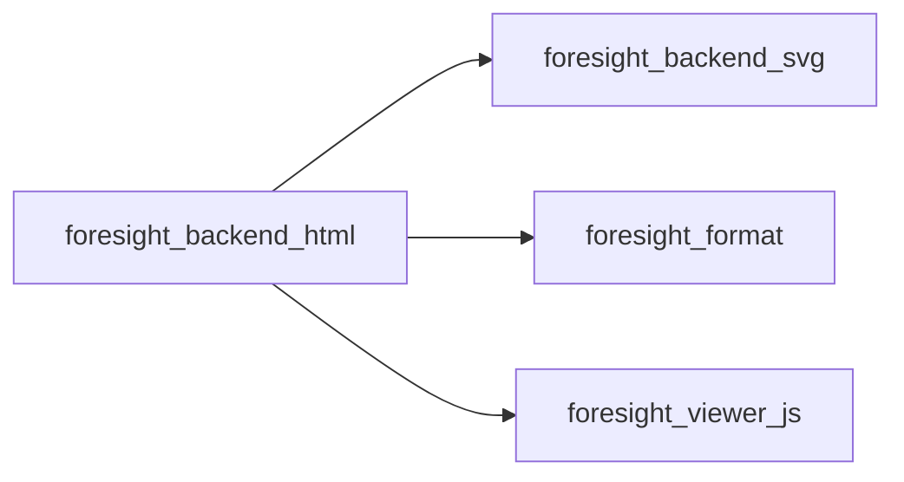
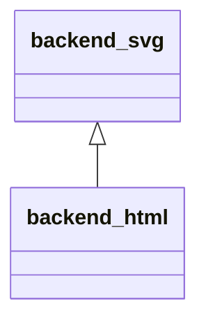
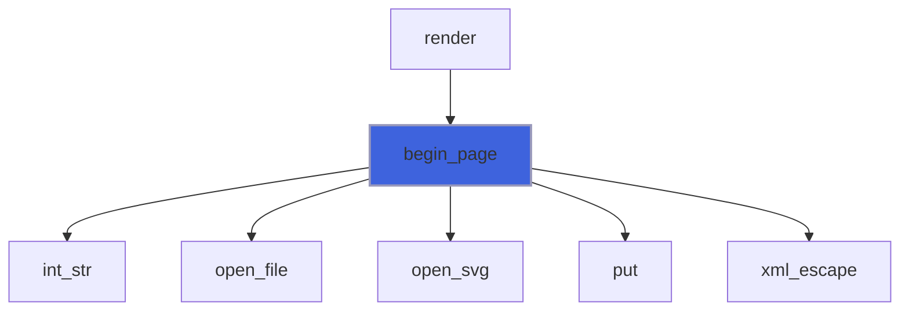
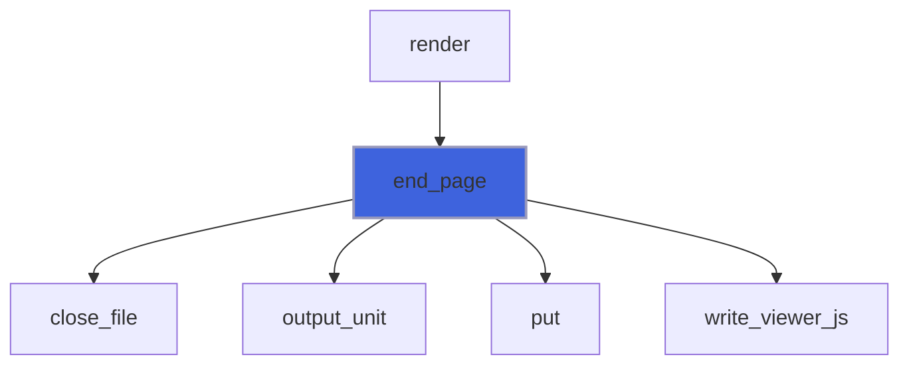

# foresight_backend_html

> foresight_backend_html, interactive HTML output device.

 A self-contained HTML page: the SVG document of `backend_svg` inline, followed by the embedded viewer script
 (zoom, pan, gnuplot-like hotkeys). No external resources: the page works from a local file.

**Source**: `src/lib/foresight_backend_html.F90`

**Dependencies**



## Contents

- [backend_html](#backend-html)
- [begin_page](#begin-page)
- [end_page](#end-page)

## Derived Types

### backend_html

Interactive HTML output device.

**Inheritance**



**Extends**: [`backend_svg`](/api/src/lib/foresight_backend_svg#backend-svg)

#### Components

| Name | Type | Attributes | Description |
|------|------|------------|-------------|
| `title` | character(len=:) | allocatable | Page title, empty for the default. |
| `refresh` | integer(kind=I4P) |  | Page reload period [s], 0 for none (live monitoring). |

#### Type-Bound Procedures

| Name | Attributes | Description |
|------|------------|-------------|
| `begin_axes` | pass(self) |  |
| `end_axes` | pass(self) |  |
| `begin_group` | pass(self) |  |
| `end_group` | pass(self) |  |
| `rect` | pass(self) |  |
| `polyline` | pass(self) |  |
| `dots` | pass(self) |  |
| `text` | pass(self) |  |
| `begin_plot_area` | pass(self) |  |
| `end_plot_area` | pass(self) |  |
| `data_polyline` | pass(self) |  |
| `data_dots` | pass(self) |  |
| `data_bars` | pass(self) |  |
| `text_width` | pass(self) |  |
| `close_file` | pass(self) | Close the stream and publish the file atomically. |
| `open_file` | pass(self) | Open the stream on `.tmp`. |
| `open_svg` | pass(self) | Write the root `` start tag. |
| `output_unit` | pass(self) | Unit of the open stream. |
| `put` | pass(self) | Write a line. |
| `begin_page` | pass(self) |  |
| `end_page` | pass(self) |  |

## Subroutines

### begin_page

Open the output `file`: HTML head, then the inline SVG root of `width` x `height` px.

```fortran
subroutine begin_page(self, file, width, height, font_size)
```

**Arguments**

| Name | Type | Intent | Attributes | Description |
|------|------|--------|------------|-------------|
| `self` | class([backend_html](/api/src/lib/foresight_backend_html#backend-html)) | inout |  | Device. |
| `file` | character(len=*) | in |  | Output file. |
| `width` | real(kind=R8P) | in |  | Page width [px]. |
| `height` | real(kind=R8P) | in |  | Page height [px]. |
| `font_size` | real(kind=R8P) | in |  | Default font size [px]. |

**Call graph**



### end_page

Close the SVG, append the viewer script, close the page and publish it atomically.

```fortran
subroutine end_page(self)
```

**Arguments**

| Name | Type | Intent | Attributes | Description |
|------|------|--------|------------|-------------|
| `self` | class([backend_html](/api/src/lib/foresight_backend_html#backend-html)) | inout |  | Device. |

**Call graph**


