# foresight_backend_svg

> foresight_backend_svg, SVG output device.

 The document is streamed to `<file>.tmp` and renamed over `<file>` when the page ends, so a viewer polling `<file>`
 never reads a partial document. The plot area is a nested `<svg class="fs-plot">` whose `viewBox` is the unit square:
 data geometry lives in unit coordinates, and `vector-effect="non-scaling-stroke"` keeps its line widths in pixels.
 Panels are `<g class="fs-axes">` carrying their geometry and axis ranges as `data-*` attributes; decorations the
 interactive viewer regenerates are `<g class="fs-...">` groups. The second y axis and the mirror settings add their
 attributes only when active or not the default, so a plain panel reads the same as before them.

**Source**: `src/lib/foresight_backend_svg.F90`

**Dependencies**

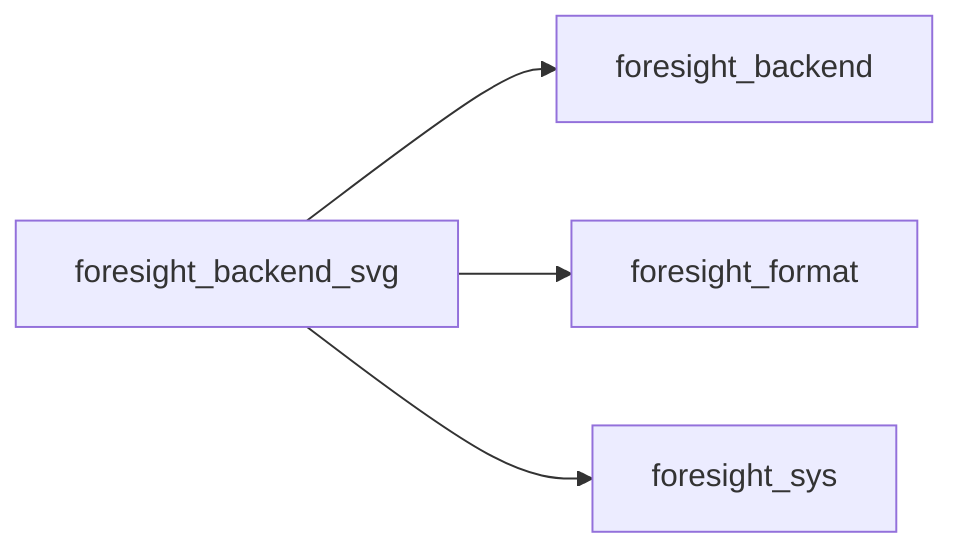

## Contents

- [backend_svg](#backend-svg)
- [begin_page](#begin-page)
- [end_page](#end-page)
- [begin_axes](#begin-axes)
- [end_axes](#end-axes)
- [begin_group](#begin-group)
- [end_group](#end-group)
- [rect](#rect)
- [polyline](#polyline)
- [dots](#dots)
- [text](#text)
- [begin_plot_area](#begin-plot-area)
- [end_plot_area](#end-plot-area)
- [data_polyline](#data-polyline)
- [data_dots](#data-dots)
- [data_bars](#data-bars)
- [close_file](#close-file)
- [open_file](#open-file)
- [open_svg](#open-svg)
- [put](#put)
- [write_pairs](#write-pairs)
- [text_width](#text-width)
- [output_unit](#output-unit)
- [marker_element](#marker-element)
- [marker_path](#marker-path)
- [dash_attribute](#dash-attribute)
- [series_attribute](#series-attribute)
- [flag](#flag)
- [px](#px)

## Variables

| Name | Type | Attributes | Description |
|------|------|------------|-------------|
| `PX_DECIMALS` | integer(kind=I4P) | parameter | Decimals of pixel coordinates. |
| `UNIT_DECIMALS` | integer(kind=I4P) | parameter | Decimals of unit-square coordinates. |
| `PAIRS_PER_LINE` | integer(kind=I4P) | parameter | Coordinate pairs per output line. |
| `FONT_FAMILY` | character(len=*) | parameter | Default font family. |

## Derived Types

### backend_svg

SVG output device.

**Inheritance**

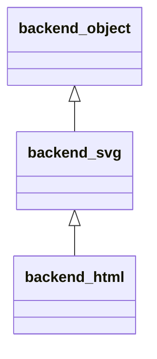

**Extends**: [`backend_object`](/api/src/lib/foresight_backend#backend-object)

#### Components

| Name | Type | Attributes | Description |
|------|------|------------|-------------|
| `unit` | integer(kind=I4P) |  | Output unit. |
| `file` | character(len=:) | allocatable | Final output file. |
| `tmp_file` | character(len=:) | allocatable | File being written. |
| `area` | real(kind=R8P) |  | Current plot area: left, top, width, height [px]. |
| `caps` | character(len=:) | allocatable | Error bar caps of the current plot area, pixel overlay. |
| `marks` | character(len=:) | allocatable | Point type markers of the current plot area, pixel overlay. |
| `series` | integer(kind=I4P) |  | Series of the open group, 0 for none. |

#### Type-Bound Procedures

| Name | Attributes | Description |
|------|------------|-------------|
| `begin_page` | pass(self) |  |
| `end_page` | pass(self) |  |
| `begin_axes` | pass(self) |  |
| `end_axes` | pass(self) |  |
| `begin_group` | pass(self) |  |
| `end_group` | pass(self) |  |
| `rect` | pass(self) |  |
| `polyline` | pass(self) |  |
| `dots` | pass(self) |  |
| `text` | pass(self) |  |
| `begin_plot_area` | pass(self) |  |
| `end_plot_area` | pass(self) |  |
| `data_polyline` | pass(self) |  |
| `data_dots` | pass(self) |  |
| `data_bars` | pass(self) |  |
| `text_width` | pass(self) |  |
| `close_file` | pass(self) | Close the stream and publish the file atomically. |
| `open_file` | pass(self) | Open the stream on `.tmp`. |
| `open_svg` | pass(self) | Write the root `` start tag. |
| `output_unit` | pass(self) | Unit of the open stream. |
| `put` | pass(self) | Write a line. |
| `write_pairs` | pass(self) | Write coordinate pairs. |

## Subroutines

### begin_page

Open the output `file` with a page of `width` x `height` px and the default `font_size` [px].

```fortran
subroutine begin_page(self, file, width, height, font_size)
```

**Arguments**

| Name | Type | Intent | Attributes | Description |
|------|------|--------|------------|-------------|
| `self` | class([backend_svg](/api/src/lib/foresight_backend_svg#backend-svg)) | inout |  | Device. |
| `file` | character(len=*) | in |  | Output file. |
| `width` | real(kind=R8P) | in |  | Page width [px]. |
| `height` | real(kind=R8P) | in |  | Page height [px]. |
| `font_size` | real(kind=R8P) | in |  | Default font size [px]. |

**Call graph**

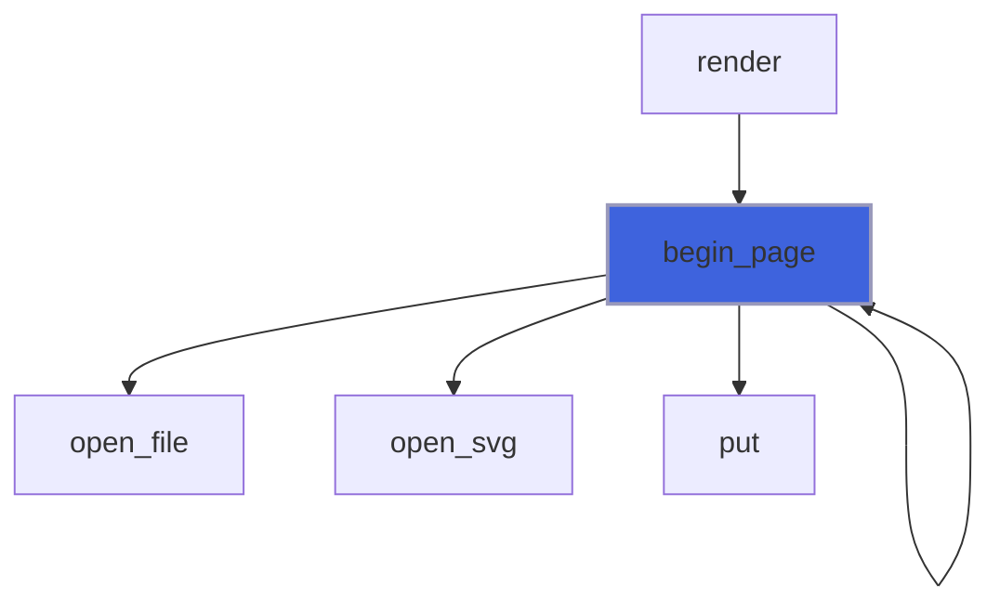

### end_page

Close the document and publish it atomically.

```fortran
subroutine end_page(self)
```

**Arguments**

| Name | Type | Intent | Attributes | Description |
|------|------|--------|------------|-------------|
| `self` | class([backend_svg](/api/src/lib/foresight_backend_svg#backend-svg)) | inout |  | Device. |

**Call graph**

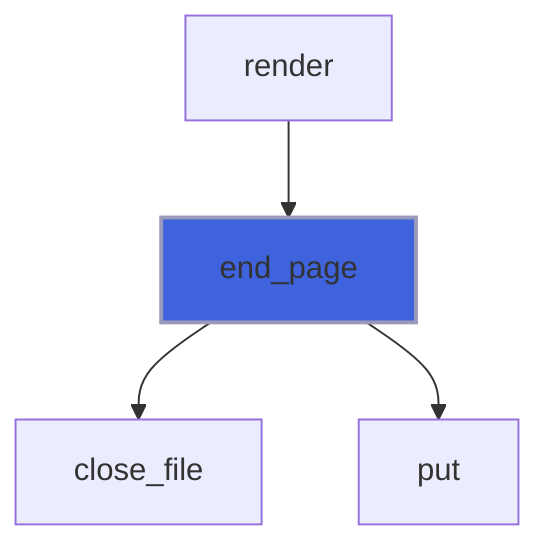

### begin_axes

Open a panel group carrying geometry and axis ranges as `data-*` attributes.

```fortran
subroutine begin_axes(self, view)
```

**Arguments**

| Name | Type | Intent | Attributes | Description |
|------|------|--------|------------|-------------|
| `self` | class([backend_svg](/api/src/lib/foresight_backend_svg#backend-svg)) | inout |  | Device. |
| `view` | type([axes_view](/api/src/lib/foresight_backend#axes-view)) | in |  | Panel geometry and axis ranges. |

**Call graph**

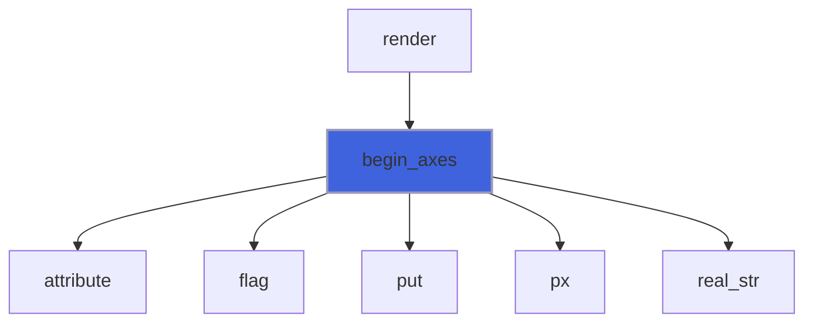

### end_axes

Close the panel group.

```fortran
subroutine end_axes(self)
```

**Arguments**

| Name | Type | Intent | Attributes | Description |
|------|------|--------|------------|-------------|
| `self` | class([backend_svg](/api/src/lib/foresight_backend_svg#backend-svg)) | inout |  | Device. |

**Call graph**

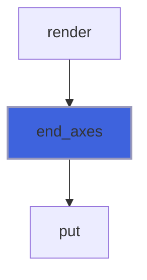

### begin_group

Open the group of class `name`; hidden with `display="none"` when `visible` is false; a series group carries its
 number as `data-series`, as do its overlay markers and caps.

```fortran
subroutine begin_group(self, name, visible, series)
```

**Arguments**

| Name | Type | Intent | Attributes | Description |
|------|------|--------|------------|-------------|
| `self` | class([backend_svg](/api/src/lib/foresight_backend_svg#backend-svg)) | inout |  | Device. |
| `name` | character(len=*) | in |  | Group name. |
| `visible` | logical | in | optional | Group shown. |
| `series` | integer(kind=I4P) | in | optional | Series number. |

**Call graph**

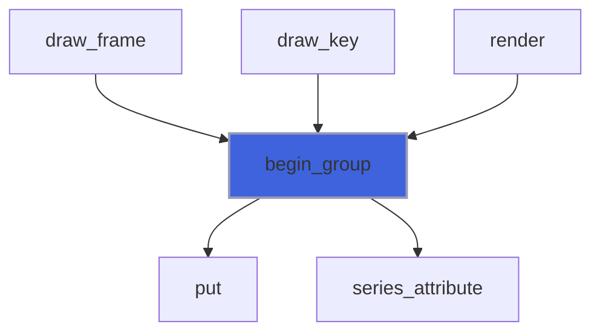

### end_group

Close the group.

```fortran
subroutine end_group(self)
```

**Arguments**

| Name | Type | Intent | Attributes | Description |
|------|------|--------|------------|-------------|
| `self` | class([backend_svg](/api/src/lib/foresight_backend_svg#backend-svg)) | inout |  | Device. |

**Call graph**

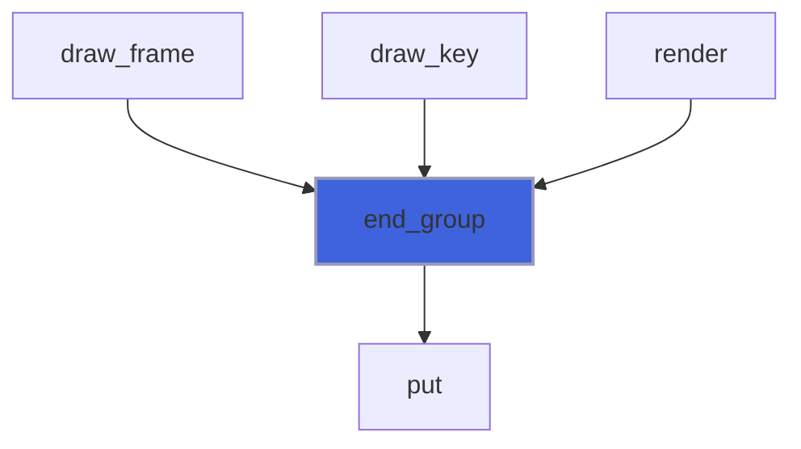

### rect

Rectangle of top-left corner (`x`, `y`) [px].

```fortran
subroutine rect(self, x, y, width, height, stroke, fill, line_width)
```

**Arguments**

| Name | Type | Intent | Attributes | Description |
|------|------|--------|------------|-------------|
| `self` | class([backend_svg](/api/src/lib/foresight_backend_svg#backend-svg)) | inout |  | Device. |
| `x` | real(kind=R8P) | in |  | Left side [px]. |
| `y` | real(kind=R8P) | in |  | Top side [px]. |
| `width` | real(kind=R8P) | in |  | Width [px]. |
| `height` | real(kind=R8P) | in |  | Height [px]. |
| `stroke` | character(len=*) | in |  | Stroke color. |
| `fill` | character(len=*) | in |  | Fill color. |
| `line_width` | real(kind=R8P) | in |  | Stroke width [px]. |

**Call graph**

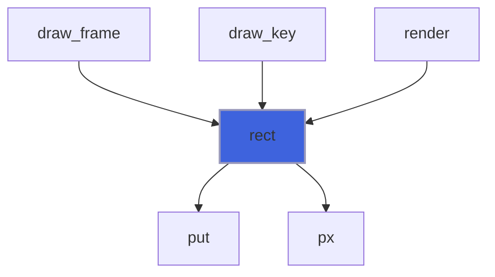

### polyline

Open polyline through the points (`x`, `y`) [px].

```fortran
subroutine polyline(self, x, y, color, line_width, dasharray)
```

**Arguments**

| Name | Type | Intent | Attributes | Description |
|------|------|--------|------------|-------------|
| `self` | class([backend_svg](/api/src/lib/foresight_backend_svg#backend-svg)) | inout |  | Device. |
| `x` | real(kind=R8P) | in |  | Abscissae [px]. |
| `y` | real(kind=R8P) | in |  | Ordinates [px]. |
| `color` | character(len=*) | in |  | Stroke color. |
| `line_width` | real(kind=R8P) | in |  | Stroke width [px]. |
| `dasharray` | character(len=*) | in |  | SVG dash array, empty for solid. |

**Call graph**

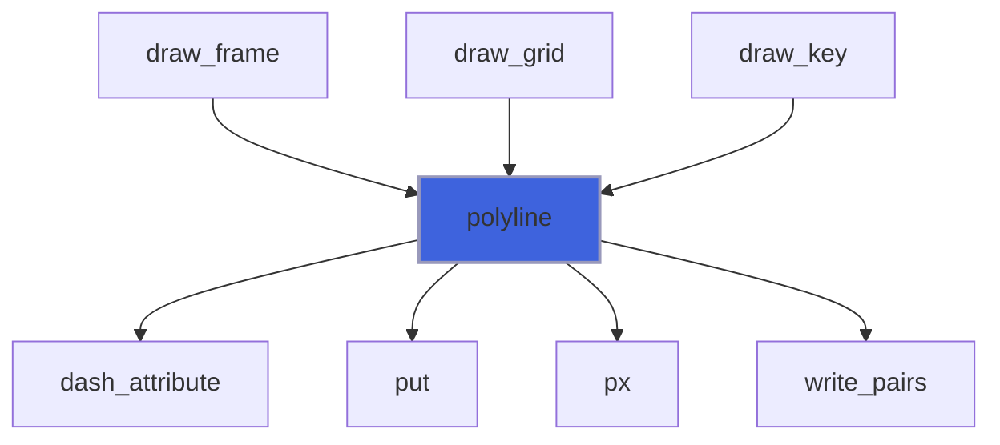

### dots

Filled round dots centred on the points (`x`, `y`) [px], or point type markers.

```fortran
subroutine dots(self, x, y, color, diameter, pt, line_width)
```

**Arguments**

| Name | Type | Intent | Attributes | Description |
|------|------|--------|------------|-------------|
| `self` | class([backend_svg](/api/src/lib/foresight_backend_svg#backend-svg)) | inout |  | Device. |
| `x` | real(kind=R8P) | in |  | Abscissae [px]. |
| `y` | real(kind=R8P) | in |  | Ordinates [px]. |
| `color` | character(len=*) | in |  | Fill color. |
| `diameter` | real(kind=R8P) | in |  | Dot diameter, or marker width [px]. |
| `pt` | integer(kind=I4P) | in | optional | gnuplot point type; negative or absent: round dots. |
| `line_width` | real(kind=R8P) | in | optional | Marker line width [px]. |

**Call graph**

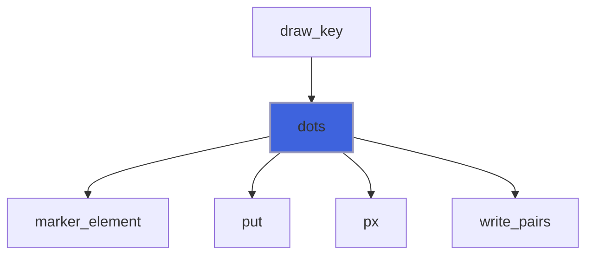

### text

Text whose baseline passes through the anchor point (`x`, `y`) [px].

```fortran
subroutine text(self, x, y, string, anchor, sup, rotate)
```

**Arguments**

| Name | Type | Intent | Attributes | Description |
|------|------|--------|------------|-------------|
| `self` | class([backend_svg](/api/src/lib/foresight_backend_svg#backend-svg)) | inout |  | Device. |
| `x` | real(kind=R8P) | in |  | Anchor abscissa [px]. |
| `y` | real(kind=R8P) | in |  | Anchor ordinate (baseline) [px]. |
| `string` | character(len=*) | in |  | Text. |
| `anchor` | character(len=*) | in |  | Horizontal anchor: `start`, `middle` or `end`. |
| `sup` | character(len=*) | in | optional | Superscript appended to `string`. |
| `rotate` | real(kind=R8P) | in | optional | Rotation about the anchor point [deg, clockwise]. |

**Call graph**

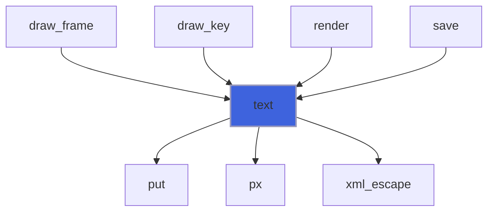

### begin_plot_area

Open the clipped plot area; its user space is the unit square, y upward.

```fortran
subroutine begin_plot_area(self, x, y, width, height)
```

**Arguments**

| Name | Type | Intent | Attributes | Description |
|------|------|--------|------------|-------------|
| `self` | class([backend_svg](/api/src/lib/foresight_backend_svg#backend-svg)) | inout |  | Device. |
| `x` | real(kind=R8P) | in |  | Left side [px]. |
| `y` | real(kind=R8P) | in |  | Top side [px]. |
| `width` | real(kind=R8P) | in |  | Width [px]. |
| `height` | real(kind=R8P) | in |  | Height [px]. |

**Call graph**

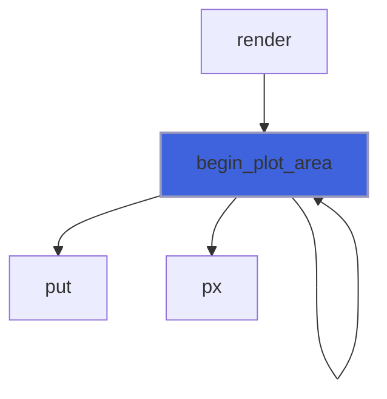

### end_plot_area

Close the plot area, then write the overlays of error bar caps and point type markers (pixel space, clipped to the
 plot area): they keep their pixel size under zoom, the interactive viewer regenerates them from the data.

```fortran
subroutine end_plot_area(self)
```

**Arguments**

| Name | Type | Intent | Attributes | Description |
|------|------|--------|------------|-------------|
| `self` | class([backend_svg](/api/src/lib/foresight_backend_svg#backend-svg)) | inout |  | Device. |

**Call graph**

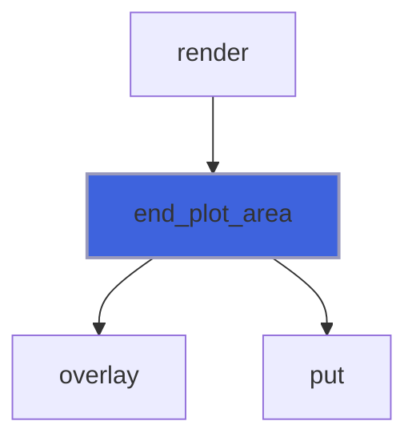

### data_polyline

Open polyline through the points (`x`, `y`) [unit square].

```fortran
subroutine data_polyline(self, x, y, color, line_width, dasharray)
```

**Arguments**

| Name | Type | Intent | Attributes | Description |
|------|------|--------|------------|-------------|
| `self` | class([backend_svg](/api/src/lib/foresight_backend_svg#backend-svg)) | inout |  | Device. |
| `x` | real(kind=R8P) | in |  | Abscissae [unit]. |
| `y` | real(kind=R8P) | in |  | Ordinates [unit]. |
| `color` | character(len=*) | in |  | Stroke color. |
| `line_width` | real(kind=R8P) | in |  | Stroke width [px]. |
| `dasharray` | character(len=*) | in |  | SVG dash array, empty for solid. |

**Call graph**

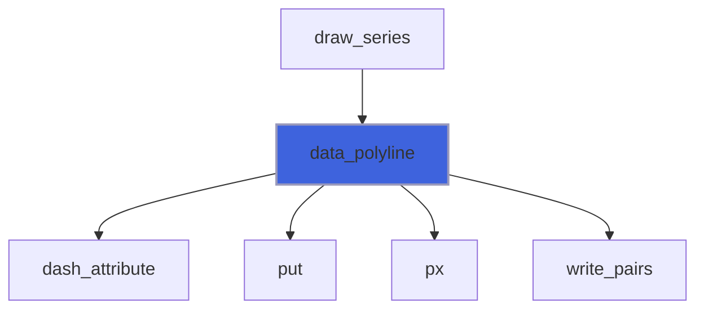

### data_dots

Filled round dots centred on the points (`x`, `y`) [unit square], or point type markers.

 Markers keep their shape only in pixels: the plot area holds their centres as an invisible `fs-pts` path of
 `M` moves (unit square) carrying the marker as `data-*` attributes, and the markers are queued for the pixel
 overlay written by `end_plot_area`, which the interactive viewer regenerates from the centres after a zoom.

```fortran
subroutine data_dots(self, x, y, color, diameter, pt, line_width)
```

**Arguments**

| Name | Type | Intent | Attributes | Description |
|------|------|--------|------------|-------------|
| `self` | class([backend_svg](/api/src/lib/foresight_backend_svg#backend-svg)) | inout |  | Device. |
| `x` | real(kind=R8P) | in |  | Abscissae [unit]. |
| `y` | real(kind=R8P) | in |  | Ordinates [unit]. |
| `color` | character(len=*) | in |  | Fill color. |
| `diameter` | real(kind=R8P) | in |  | Dot diameter, or marker width [px]. |
| `pt` | integer(kind=I4P) | in | optional | gnuplot point type; negative or absent: round dots. |
| `line_width` | real(kind=R8P) | in | optional | Marker line width [px]. |

**Call graph**

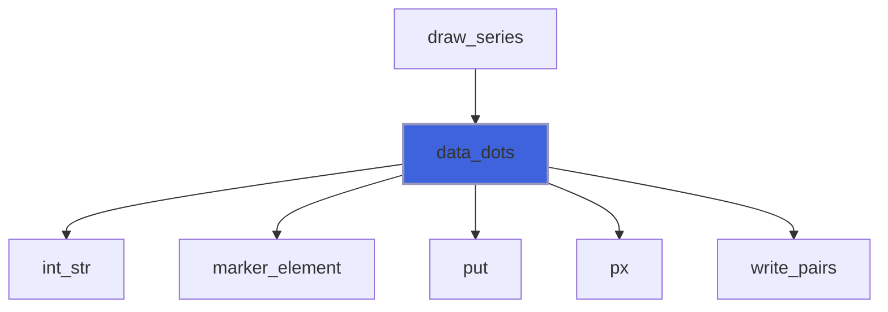

### data_bars

Error bars [unit square] as one path of `Mx1,y1Lx2,y2` segments, classed `fs-ybars`/`fs-xbars` with the cap length
 in `data-cap`; caps are queued for the pixel overlay written by `end_plot_area`.

```fortran
subroutine data_bars(self, x1, y1, x2, y2, color, line_width, cap, vertical)
```

**Arguments**

| Name | Type | Intent | Attributes | Description |
|------|------|--------|------------|-------------|
| `self` | class([backend_svg](/api/src/lib/foresight_backend_svg#backend-svg)) | inout |  | Device. |
| `x1` | real(kind=R8P) | in |  | Bar start abscissae. |
| `y1` | real(kind=R8P) | in |  | Bar start ordinates. |
| `x2` | real(kind=R8P) | in |  | Bar end abscissae. |
| `y2` | real(kind=R8P) | in |  | Bar end ordinates. |
| `color` | character(len=*) | in |  | Stroke color. |
| `line_width` | real(kind=R8P) | in |  | Stroke width [px]. |
| `cap` | real(kind=R8P) | in |  | Cap length [px]. |
| `vertical` | logical | in |  | Vertical bars (horizontal caps), else horizontal. |

**Call graph**

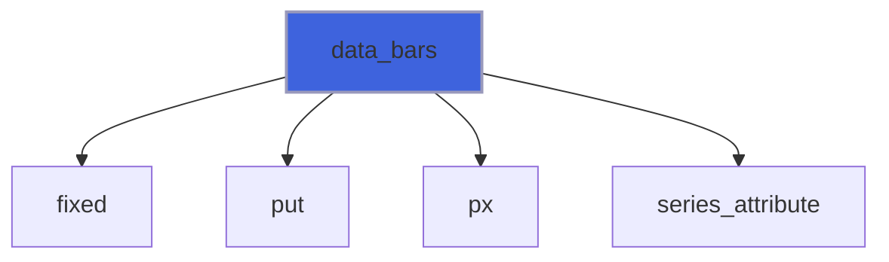

### close_file

Close the stream and rename `<file>.tmp` over `<file>`.

```fortran
subroutine close_file(self)
```

**Arguments**

| Name | Type | Intent | Attributes | Description |
|------|------|--------|------------|-------------|
| `self` | class([backend_svg](/api/src/lib/foresight_backend_svg#backend-svg)) | inout |  | Device. |

**Call graph**

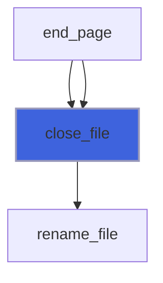

### open_file

Open the output stream on `<file>.tmp`.

```fortran
subroutine open_file(self, file)
```

**Arguments**

| Name | Type | Intent | Attributes | Description |
|------|------|--------|------------|-------------|
| `self` | class([backend_svg](/api/src/lib/foresight_backend_svg#backend-svg)) | inout |  | Device. |
| `file` | character(len=*) | in |  | Output file. |

**Call graph**

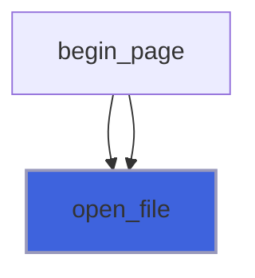

### open_svg

Write the root `<svg>` start tag, with optional extra `attributes` (a leading space included).

```fortran
subroutine open_svg(self, width, height, font_size, attributes)
```

**Arguments**

| Name | Type | Intent | Attributes | Description |
|------|------|--------|------------|-------------|
| `self` | class([backend_svg](/api/src/lib/foresight_backend_svg#backend-svg)) | inout |  | Device. |
| `width` | real(kind=R8P) | in |  | Page width [px]. |
| `height` | real(kind=R8P) | in |  | Page height [px]. |
| `font_size` | real(kind=R8P) | in |  | Default font size [px]. |
| `attributes` | character(len=*) | in | optional | Extra attributes. |

**Call graph**

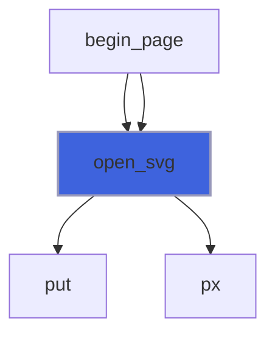

### put

Write a complete line.

```fortran
subroutine put(self, line)
```

**Arguments**

| Name | Type | Intent | Attributes | Description |
|------|------|--------|------------|-------------|
| `self` | class([backend_svg](/api/src/lib/foresight_backend_svg#backend-svg)) | inout |  | Device. |
| `line` | character(len=*) | in |  | Line. |

**Call graph**

```mermaid
flowchart TD
  begin_axes["begin_axes"] --> put["put"]
  begin_group["begin_group"] --> put["put"]
  begin_page["begin_page"] --> put["put"]
  begin_page["begin_page"] --> put["put"]
  begin_plot_area["begin_plot_area"] --> put["put"]
  data_bars["data_bars"] --> put["put"]
  data_dots["data_dots"] --> put["put"]
  data_polyline["data_polyline"] --> put["put"]
  dots["dots"] --> put["put"]
  end_axes["end_axes"] --> put["put"]
  end_group["end_group"] --> put["put"]
  end_page["end_page"] --> put["put"]
  end_page["end_page"] --> put["put"]
  end_plot_area["end_plot_area"] --> put["put"]
  open_svg["open_svg"] --> put["put"]
  polyline["polyline"] --> put["put"]
  polyline["polyline"] --> put["put"]
  px_point["px_point"] --> put["put"]
  rect["rect"] --> put["put"]
  rect["rect"] --> put["put"]
  segment["segment"] --> put["put"]
  text["text"] --> put["put"]
  text["text"] --> put["put"]
  style put fill:#3e63dd,stroke:#99b,stroke-width:2px
```

### write_pairs

Write `prefix x,y suffix` for each point, space separated, `PAIRS_PER_LINE` per line, without final newline.

```fortran
subroutine write_pairs(self, x, y, ndec, prefix, suffix)
```

**Arguments**

| Name | Type | Intent | Attributes | Description |
|------|------|--------|------------|-------------|
| `self` | class([backend_svg](/api/src/lib/foresight_backend_svg#backend-svg)) | inout |  | Device. |
| `x` | real(kind=R8P) | in |  | Abscissae. |
| `y` | real(kind=R8P) | in |  | Ordinates. |
| `ndec` | integer(kind=I4P) | in |  | Decimals. |
| `prefix` | character(len=*) | in |  | Text before each pair. |
| `suffix` | character(len=*) | in |  | Text after each pair. |

**Call graph**

```mermaid
flowchart TD
  data_dots["data_dots"] --> write_pairs["write_pairs"]
  data_polyline["data_polyline"] --> write_pairs["write_pairs"]
  dots["dots"] --> write_pairs["write_pairs"]
  polyline["polyline"] --> write_pairs["write_pairs"]
  write_pairs["write_pairs"] --> fixed["fixed"]
  style write_pairs fill:#3e63dd,stroke:#99b,stroke-width:2px
```

## Functions

### text_width

Estimated width of `string` with its superscript `sup` [px]: the viewer renders the glyphs, so a mean advance of
 0.55 font sizes (Arial digits: 0.556) is assumed, superscripts at 0.75 size.

**Attributes**: pure

**Returns**: `real(kind=R8P)`

```fortran
function text_width(self, string, sup, font_size) result(width)
```

**Arguments**

| Name | Type | Intent | Attributes | Description |
|------|------|--------|------------|-------------|
| `self` | class([backend_svg](/api/src/lib/foresight_backend_svg#backend-svg)) | in |  | Device. |
| `string` | character(len=*) | in |  | Text. |
| `sup` | character(len=*) | in |  | Superscript. |
| `font_size` | real(kind=R8P) | in |  | Font size [px]. |

**Call graph**

```mermaid
flowchart TD
  key_layout["key_layout"] --> text_width["text_width"]
  place_plot_area["place_plot_area"] --> text_width["text_width"]
  style text_width fill:#3e63dd,stroke:#99b,stroke-width:2px
```

### output_unit

Unit of the open output stream.

**Attributes**: pure

**Returns**: `integer(kind=I4P)`

```fortran
function output_unit(self) result(unit)
```

**Arguments**

| Name | Type | Intent | Attributes | Description |
|------|------|--------|------------|-------------|
| `self` | class([backend_svg](/api/src/lib/foresight_backend_svg#backend-svg)) | in |  | Device. |

**Call graph**

```mermaid
flowchart TD
  end_page["end_page"] --> output_unit["output_unit"]
  style output_unit fill:#3e63dd,stroke:#99b,stroke-width:2px
```

### marker_element

One `<path>` of the markers of gnuplot point type `pt`, `width_px` px wide, centred on the points (`x`, `y`) [px]:
 the filled shapes (the odd types from 5, and the dot) are filled with `color`, the others stroked only.

**Returns**: `character(len=:)`

```fortran
function marker_element(x, y, color, width_px, pt, line_width, series) result(element)
```

**Arguments**

| Name | Type | Intent | Attributes | Description |
|------|------|--------|------------|-------------|
| `x` | real(kind=R8P) | in |  | Abscissae [px]. |
| `y` | real(kind=R8P) | in |  | Ordinates [px]. |
| `color` | character(len=*) | in |  | Color. |
| `width_px` | real(kind=R8P) | in |  | Marker width [px]. |
| `pt` | integer(kind=I4P) | in |  | gnuplot point type, >= 0. |
| `line_width` | real(kind=R8P) | in | optional | Line width [px], default 1. |
| `series` | integer(kind=I4P) | in | optional | Series number, 0 or absent for none. |

**Call graph**

```mermaid
flowchart TD
  data_dots["data_dots"] --> marker_element["marker_element"]
  dots["dots"] --> marker_element["marker_element"]
  marker_element["marker_element"] --> append["append"]
  marker_element["marker_element"] --> marker_path["marker_path"]
  marker_element["marker_element"] --> px["px"]
  marker_element["marker_element"] --> series_attribute["series_attribute"]
  style marker_element fill:#3e63dd,stroke:#99b,stroke-width:2px
```

### marker_path

Path data of a marker of half width `r` centred on (`x`, `y`) [px]: gnuplot's svg shapes, 1 plus, 2 cross, 3 star,
 4-5 square, 6-7 circle, 8-9 triangle, 10-11 inverted triangle, 12-13 diamond, 14-15 pentagon, 0 a 1 px dot.

**Attributes**: pure

**Returns**: `character(len=:)`

```fortran
function marker_path(x, y, r, shape) result(d)
```

**Arguments**

| Name | Type | Intent | Attributes | Description |
|------|------|--------|------------|-------------|
| `x` | real(kind=R8P) | in |  | Centre abscissa [px]. |
| `y` | real(kind=R8P) | in |  | Centre ordinate [px]. |
| `r` | real(kind=R8P) | in |  | Half width [px]. |
| `shape` | integer(kind=I4P) | in |  | Shape, 0..15. |

**Call graph**

```mermaid
flowchart TD
  marker_element["marker_element"] --> marker_path["marker_path"]
  marker_path["marker_path"] --> circle["circle"]
  marker_path["marker_path"] --> cross["cross"]
  marker_path["marker_path"] --> plus["plus"]
  marker_path["marker_path"] --> polygon["polygon"]
  style marker_path fill:#3e63dd,stroke:#99b,stroke-width:2px
```

### dash_attribute

` stroke-dasharray="..."` attribute, empty for solid lines.

**Attributes**: pure

**Returns**: `character(len=:)`

```fortran
function dash_attribute(dasharray) result(attribute)
```

**Arguments**

| Name | Type | Intent | Attributes | Description |
|------|------|--------|------------|-------------|
| `dasharray` | character(len=*) | in |  | SVG dash array. |

**Call graph**

```mermaid
flowchart TD
  data_polyline["data_polyline"] --> dash_attribute["dash_attribute"]
  polyline["polyline"] --> dash_attribute["dash_attribute"]
  style dash_attribute fill:#3e63dd,stroke:#99b,stroke-width:2px
```

### series_attribute

` data-series="N"` attribute.

**Attributes**: pure

**Returns**: `character(len=:)`

```fortran
function series_attribute(series) result(attribute)
```

**Arguments**

| Name | Type | Intent | Attributes | Description |
|------|------|--------|------------|-------------|
| `series` | integer(kind=I4P) | in |  | Series number. |

**Call graph**

```mermaid
flowchart TD
  begin_group["begin_group"] --> series_attribute["series_attribute"]
  data_bars["data_bars"] --> series_attribute["series_attribute"]
  marker_element["marker_element"] --> series_attribute["series_attribute"]
  series_attribute["series_attribute"] --> int_str["int_str"]
  style series_attribute fill:#3e63dd,stroke:#99b,stroke-width:2px
```

### flag

`1` or `0`.

**Attributes**: pure

**Returns**: `character(len=:)`

```fortran
function flag(value) result(str)
```

**Arguments**

| Name | Type | Intent | Attributes | Description |
|------|------|--------|------------|-------------|
| `value` | logical | in |  | Flag. |

**Call graph**

```mermaid
flowchart TD
  begin_axes["begin_axes"] --> flag["flag"]
  style flag fill:#3e63dd,stroke:#99b,stroke-width:2px
```

### px

Pixel coordinate text.

**Attributes**: pure

**Returns**: `character(len=:)`

```fortran
function px(v) result(str)
```

**Arguments**

| Name | Type | Intent | Attributes | Description |
|------|------|--------|------------|-------------|
| `v` | real(kind=R8P) | in |  | Value [px]. |

**Call graph**

```mermaid
flowchart TD
  begin_axes["begin_axes"] --> px["px"]
  begin_plot_area["begin_plot_area"] --> px["px"]
  data_bars["data_bars"] --> px["px"]
  data_dots["data_dots"] --> px["px"]
  data_polyline["data_polyline"] --> px["px"]
  dots["dots"] --> px["px"]
  marker_element["marker_element"] --> px["px"]
  open_svg["open_svg"] --> px["px"]
  polyline["polyline"] --> px["px"]
  rect["rect"] --> px["px"]
  text["text"] --> px["px"]
  px["px"] --> fixed["fixed"]
  style px fill:#3e63dd,stroke:#99b,stroke-width:2px
```
