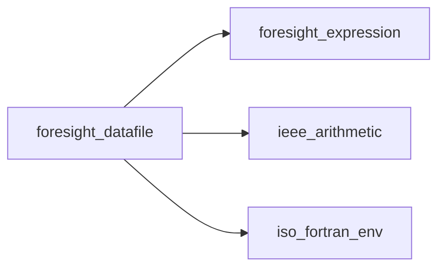
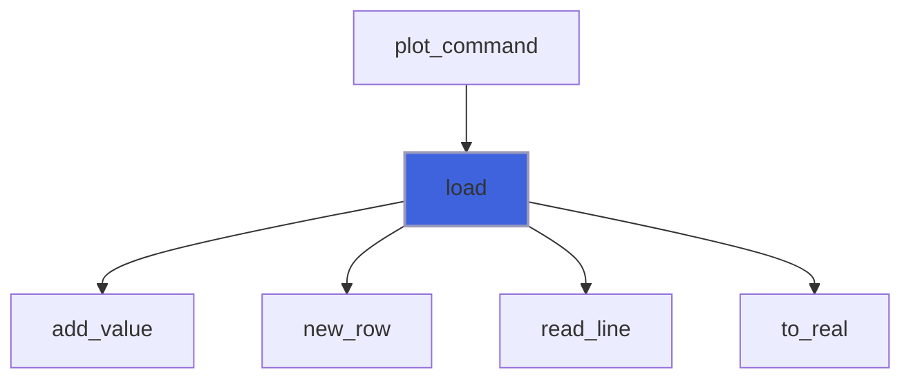
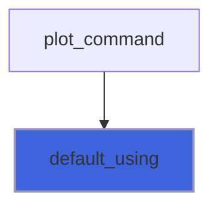
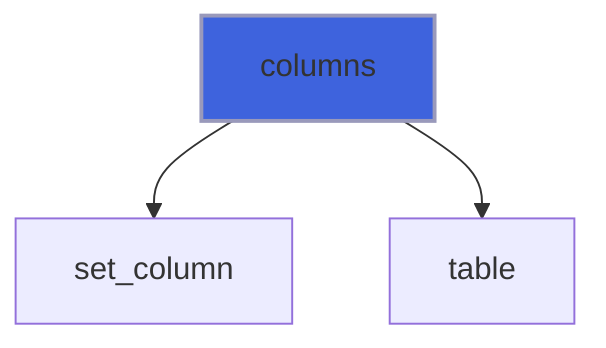
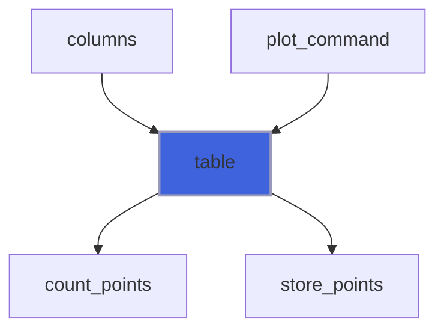
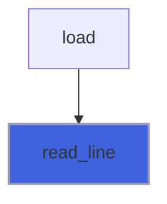
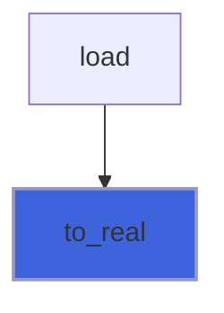

# foresight_datafile

> foresight_datafile, gnuplot-style text data files.

 Format, as gnuplot's default: whitespace separated numeric columns; `#` starts a comment; one blank line ends a
 block (plotted lines are broken there), two blank lines end a dataset (selected by `index`, 0-based); cells that
 are `?`, `NaN` or not numbers are missing values (gaps). Pseudo-column 0 is the point number within the dataset.

 Values are stored flattened, rows by offsets, with capacities doubled on growth: a large monitoring log costs one
 real per value plus three integers per row.

**Source**: `src/lib/foresight_datafile.F90`

**Dependencies**



## Contents

- [datafile_object](#datafile-object)
- [load](#load)
- [default_using](#default-using)
- [columns](#columns)
- [table](#table)
- [read_line](#read-line)
- [to_real](#to-real)

## Derived Types

### datafile_object

Data file content.

#### Components

| Name | Type | Attributes | Description |
|------|------|------------|-------------|
| `file` | character(len=:) | allocatable | File name. |
| `values` | real(kind=R8P) | allocatable | Row values, flattened. |
| `first` | integer(kind=I4P) | allocatable | Index in `values` of the first value of each row (+1 sentinel). |
| `dataset` | integer(kind=I4P) | allocatable | Dataset (0-based) of each row. |
| `block` | integer(kind=I4P) | allocatable | Block (global counter) of each row. |
| `nrows` | integer(kind=I4P) |  | Number of data rows. |
| `nvalues` | integer(kind=I4P) |  | Number of stored values. |

#### Type-Bound Procedures

| Name | Attributes | Description |
|------|------------|-------------|
| `columns` | pass(self) | Extract a (x, y) series. |
| `default_using` | pass(self) | gnuplot default columns. |
| `load` | pass(self) | Read a file. |
| `table` | pass(self) | Evaluate `using` fields. |

## Subroutines

### load

Read `file`, replacing the current content.

```fortran
subroutine load(self, file, iostat, iomsg)
```

**Arguments**

| Name | Type | Intent | Attributes | Description |
|------|------|--------|------------|-------------|
| `self` | class([datafile_object](/api/src/lib/foresight_datafile#datafile-object)) | inout |  | Data. |
| `file` | character(len=*) | in |  | File name. |
| `iostat` | integer(kind=I4P) | out |  | 0 on success. |
| `iomsg` | character(len=:) | out | allocatable | Error message. |

**Call graph**



### default_using

gnuplot default columns: `1:2`, or `0:1` for single-column data.

**Attributes**: pure

```fortran
subroutine default_using(self, ux, uy)
```

**Arguments**

| Name | Type | Intent | Attributes | Description |
|------|------|--------|------------|-------------|
| `self` | class([datafile_object](/api/src/lib/foresight_datafile#datafile-object)) | in |  | Data. |
| `ux` | integer(kind=I4P) | out |  | Abscissa column. |
| `uy` | integer(kind=I4P) | out |  | Ordinate column. |

**Call graph**



### columns

Series of columns (`ux`, `uy`) of dataset `index` (all if negative), one point every `every` in each block.

```fortran
subroutine columns(self, ux, uy, index, every, x, y)
```

**Arguments**

| Name | Type | Intent | Attributes | Description |
|------|------|--------|------------|-------------|
| `self` | class([datafile_object](/api/src/lib/foresight_datafile#datafile-object)) | in |  | Data. |
| `ux` | integer(kind=I4P) | in |  | Abscissa column, 0 for the point number. |
| `uy` | integer(kind=I4P) | in |  | Ordinate column, 0 for the point number. |
| `index` | integer(kind=I4P) | in |  | Dataset, 0-based; negative for all. |
| `every` | integer(kind=I4P) | in |  | Point stride within each block. |
| `x` | real(kind=R8P) | out | allocatable | Abscissae. |
| `y` | real(kind=R8P) | out | allocatable | Ordinates. |

**Call graph**



### table

Values of the `using` `fields` on the rows of dataset `index` (all if negative), one row every `every` in each
 block: `values(point, field)`.

 A NaN point is inserted where a block or dataset changes, so that lines are broken as in gnuplot. Missing cells,
 rows too short for a column and undefined expressions give NaN values (gaps).

```fortran
subroutine table(self, fields, index, every, values)
```

**Arguments**

| Name | Type | Intent | Attributes | Description |
|------|------|--------|------------|-------------|
| `self` | class([datafile_object](/api/src/lib/foresight_datafile#datafile-object)) | in |  | Data. |
| `fields` | type([expression_object](/api/src/lib/foresight_expression#expression-object)) | in |  | `using` fields. |
| `index` | integer(kind=I4P) | in |  | Dataset, 0-based; negative for all. |
| `every` | integer(kind=I4P) | in |  | Point stride within each block. |
| `values` | real(kind=R8P) | out | allocatable | Points. |

**Call graph**



### read_line

Read a whole line of any length; `eof` is set on the last one, which may still carry text.

```fortran
subroutine read_line(unit, line, eof, iostat)
```

**Arguments**

| Name | Type | Intent | Attributes | Description |
|------|------|--------|------------|-------------|
| `unit` | integer(kind=I4P) | in |  | File unit. |
| `line` | character(len=:) | out | allocatable | Line. |
| `eof` | logical | out |  | End of file reached. |
| `iostat` | integer(kind=I4P) | out |  | 0, or an I/O error code. |

**Call graph**



## Functions

### to_real

Number in `token`; NaN if missing (`?`) or not a number.

**Returns**: `real(kind=R8P)`

```fortran
function to_real(token) result(v)
```

**Arguments**

| Name | Type | Intent | Attributes | Description |
|------|------|--------|------------|-------------|
| `token` | character(len=*) | in |  | Cell text. |

**Call graph**


