# foresight_datafile

> foresight_datafile, gnuplot-style text data files.

 Format, as gnuplot's default: whitespace separated numeric columns; `#` starts a comment; one blank line ends a
 block (plotted lines are broken there), two blank lines end a dataset (selected by `index`, 0-based); cells that
 are `?`, `NaN`, `inf`, empty or not numbers are missing values (gaps). Pseudo-column 0 numbers the selected points of
 each dataset from 0 (with `every`, only the points it keeps are counted, as gnuplot).

 The first row of each dataset is kept as text too: with headers in use (`table(..., header=.true.)`) it names the
 columns, for `using 1:"name"` and `title columnhead`, and is not data; else it is a row as any other.

 A cell is read as gnuplot does, by C `strtod`: its longest leading number counts and the rest is ignored (`3abc` is
 3, `1.2.3` is 1.2, `1d3` is 1), hexadecimal included (`0x10` is 16, `0x1.8p1` is 3); a value beyond the real range
 is a gap.

 With a separator (gnuplot `set datafile separator`, e.g. `,` for CSV) every one of its characters ends a cell:
 two separators in a row leave an empty cell, a trailing one an empty last cell; blanks around a cell are ignored and
 a cell in double quotes is read without them (`"7"` is 7), its separators kept. Without one, a double quoted cell
 may hold blanks and is not a number, as gnuplot.

 Values are stored flattened, rows by offsets, with capacities doubled on growth: a large monitoring log costs one
 real per value plus three integers per row.

**Source**: `src/lib/foresight_datafile.F90`

**Dependencies**

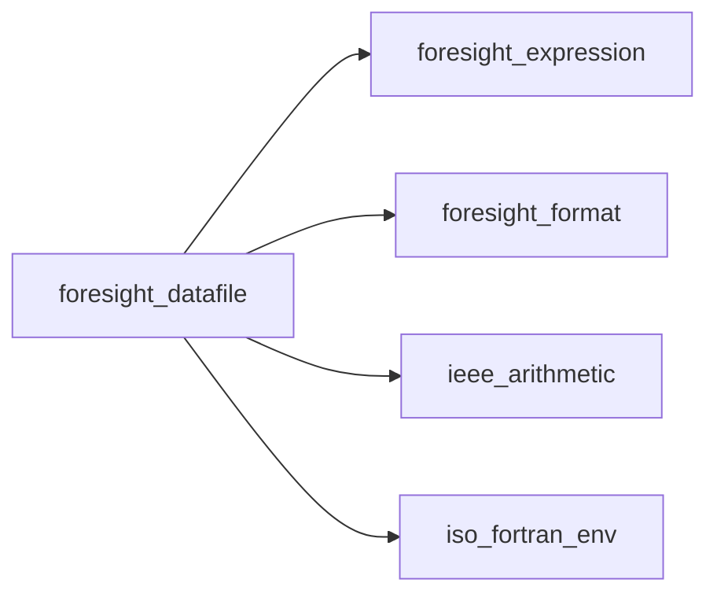

## Contents

- [text_object](#text-object)
- [header_object](#header-object)
- [datafile_object](#datafile-object)
- [load](#load)
- [default_using](#default-using)
- [columns](#columns)
- [table](#table)
- [header_names](#header-names)
- [read_line](#read-line)
- [column_header](#column-header)
- [missing_name](#missing-name)
- [cell_value](#cell-value)
- [to_real](#to-real)
- [hexadecimal](#hexadecimal)

## Variables

| Name | Type | Attributes | Description |
|------|------|------------|-------------|
| `TAB` | character(len=1) | parameter | Tab character. |

## Derived Types

### text_object

Cell text.

#### Components

| Name | Type | Attributes | Description |
|------|------|------------|-------------|
| `text` | character(len=:) | allocatable | Text, unquoted. |

### header_object

First row of a dataset, as text.

#### Components

| Name | Type | Attributes | Description |
|------|------|------------|-------------|
| `cells` | type([text_object](/api/src/lib/foresight_datafile#text-object)) | allocatable | Cells. |

### datafile_object

Data file content.

#### Components

| Name | Type | Attributes | Description |
|------|------|------------|-------------|
| `file` | character(len=:) | allocatable | File name. |
| `values` | real(kind=R8P) | allocatable | Row values, flattened. |
| `first` | integer(kind=I4P) | allocatable | Index in `values` of the first value of each row (+1 sentinel). |
| `dataset` | integer(kind=I4P) | allocatable | Dataset (0-based) of each row. |
| `block` | integer(kind=I4P) | allocatable | Block (global counter) of each row. |
| `headers` | type([header_object](/api/src/lib/foresight_datafile#header-object)) | allocatable | First row of each dataset as text, by dataset from 1. |
| `nrows` | integer(kind=I4P) |  | Number of data rows. |
| `nvalues` | integer(kind=I4P) |  | Number of stored values. |

#### Type-Bound Procedures

| Name | Attributes | Description |
|------|------------|-------------|
| `column_header` | pass(self) | Header name of a column. |
| `columns` | pass(self) | Extract a (x, y) series. |
| `default_using` | pass(self) | gnuplot default columns. |
| `header_names` | pass(self) | Header names of a dataset. |
| `load` | pass(self) | Read a file. |
| `missing_name` | pass(self) | A header name of the fields found nowhere. |
| `table` | pass(self) | Evaluate `using` fields. |

## Subroutines

### load

Read `file`, replacing the current content; cells are separated by whitespace, or by any of the `separator`
 characters when given and not empty.

```fortran
subroutine load(self, file, iostat, iomsg, separator)
```

**Arguments**

| Name | Type | Intent | Attributes | Description |
|------|------|--------|------------|-------------|
| `self` | class([datafile_object](/api/src/lib/foresight_datafile#datafile-object)) | inout |  | Data. |
| `file` | character(len=*) | in |  | File name. |
| `iostat` | integer(kind=I4P) | out |  | 0 on success. |
| `iomsg` | character(len=:) | out | allocatable | Error message. |
| `separator` | character(len=*) | in | optional | Cell separator characters. |

**Call graph**

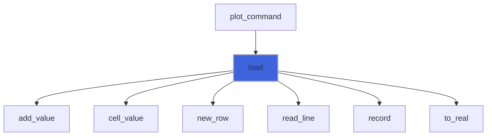

### default_using

gnuplot default columns: `1:2`, or `0:1` for single-column data.

**Attributes**: pure

```fortran
subroutine default_using(self, ux, uy)
```

**Arguments**

| Name | Type | Intent | Attributes | Description |
|------|------|--------|------------|-------------|
| `self` | class([datafile_object](/api/src/lib/foresight_datafile#datafile-object)) | in |  | Data. |
| `ux` | integer(kind=I4P) | out |  | Abscissa column. |
| `uy` | integer(kind=I4P) | out |  | Ordinate column. |

**Call graph**

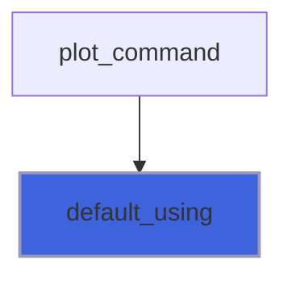

### columns

Series of columns (`ux`, `uy`) of dataset `index` (all if negative), one point every `every` in each block.

```fortran
subroutine columns(self, ux, uy, index, every, x, y)
```

**Arguments**

| Name | Type | Intent | Attributes | Description |
|------|------|--------|------------|-------------|
| `self` | class([datafile_object](/api/src/lib/foresight_datafile#datafile-object)) | in |  | Data. |
| `ux` | integer(kind=I4P) | in |  | Abscissa column, 0 for the point number. |
| `uy` | integer(kind=I4P) | in |  | Ordinate column, 0 for the point number. |
| `index` | integer(kind=I4P) | in |  | Dataset, 0-based; negative for all. |
| `every` | integer(kind=I4P) | in |  | Point stride within each block. |
| `x` | real(kind=R8P) | out | allocatable | Abscissae. |
| `y` | real(kind=R8P) | out | allocatable | Ordinates. |

**Call graph**

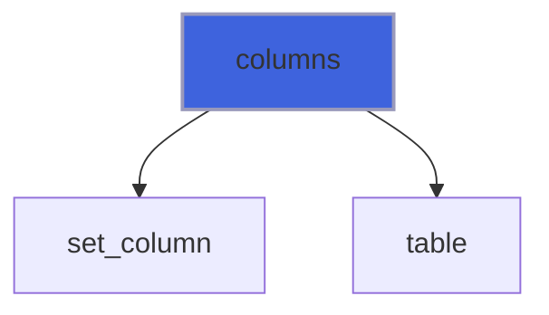

### table

Values of the `using` `fields` on the rows of dataset `index` (all if negative) selected by `every`:
 `values(point, field)`.

 With `header` the first row of each dataset names the columns: it is skipped, neither a point nor counted, and
 the column header names of the fields are resolved on the header of each dataset.

 `every` is gnuplot's `point_incr:block_incr:start_point:start_block:end_point:end_block`, an end negative for
 none. Points are numbered within their block, blocks within their dataset, from 0.

 A NaN point is inserted where a block or dataset changes, so that lines are broken as in gnuplot. Missing cells,
 rows too short for a column and undefined expressions give NaN values (gaps).

```fortran
subroutine table(self, fields, index, every, values, header)
```

**Arguments**

| Name | Type | Intent | Attributes | Description |
|------|------|--------|------------|-------------|
| `self` | class([datafile_object](/api/src/lib/foresight_datafile#datafile-object)) | in |  | Data. |
| `fields` | type([expression_object](/api/src/lib/foresight_expression#expression-object)) | in |  | `using` fields. |
| `index` | integer(kind=I4P) | in |  | Dataset, 0-based; negative for all. |
| `every` | integer(kind=I4P) | in |  | gnuplot `every` fields. |
| `values` | real(kind=R8P) | out | allocatable | Points. |
| `header` | logical | in | optional | The first row of each dataset is a header. |

**Call graph**

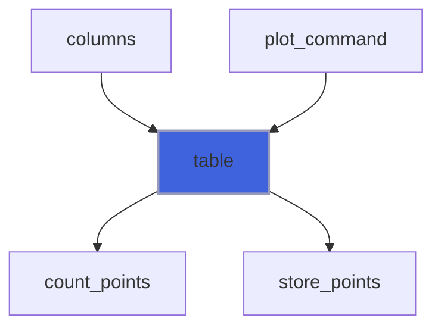

### header_names

Header names of the columns of dataset `set` (from 0), blank padded; none if no such dataset.

 A subroutine: a function with this deferred length array result, called in an internal procedure, is an internal
 compiler error of gfortran 16.

**Attributes**: pure

```fortran
subroutine header_names(self, set, names)
```

**Arguments**

| Name | Type | Intent | Attributes | Description |
|------|------|--------|------------|-------------|
| `self` | class([datafile_object](/api/src/lib/foresight_datafile#datafile-object)) | in |  | Data. |
| `set` | integer(kind=I4P) | in |  | Dataset. |
| `names` | character(len=:) | out | allocatable | Names of columns 1, 2, ... |

**Call graph**

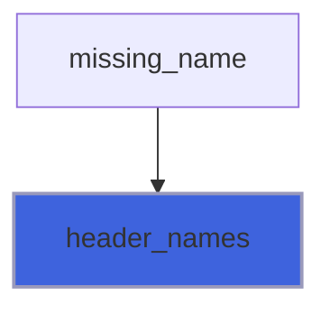

### read_line

Read a whole line of any length; `eof` is set on the last one, which may still carry text.

```fortran
subroutine read_line(unit, line, eof, iostat)
```

**Arguments**

| Name | Type | Intent | Attributes | Description |
|------|------|--------|------------|-------------|
| `unit` | integer(kind=I4P) | in |  | File unit. |
| `line` | character(len=:) | out | allocatable | Line. |
| `eof` | logical | out |  | End of file reached. |
| `iostat` | integer(kind=I4P) | out |  | 0, or an I/O error code. |

**Call graph**

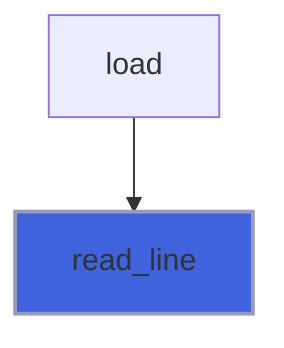

## Functions

### column_header

Header name of column `c` (from 1) of dataset `set` (from 0), empty if none.

**Attributes**: pure

**Returns**: `character(len=:)`

```fortran
function column_header(self, set, c) result(name)
```

**Arguments**

| Name | Type | Intent | Attributes | Description |
|------|------|--------|------------|-------------|
| `self` | class([datafile_object](/api/src/lib/foresight_datafile#datafile-object)) | in |  | Data. |
| `set` | integer(kind=I4P) | in |  | Dataset. |
| `c` | integer(kind=I4P) | in |  | Column. |

### missing_name

First column header name of the `fields` that no header of dataset `index` (all if negative) has, empty if none.

**Attributes**: pure

**Returns**: `character(len=:)`

```fortran
function missing_name(self, fields, index) result(name)
```

**Arguments**

| Name | Type | Intent | Attributes | Description |
|------|------|--------|------------|-------------|
| `self` | class([datafile_object](/api/src/lib/foresight_datafile#datafile-object)) | in |  | Data. |
| `fields` | type([expression_object](/api/src/lib/foresight_expression#expression-object)) | in |  | `using` fields. |
| `index` | integer(kind=I4P) | in |  | Dataset, 0-based; negative for all. |

**Call graph**

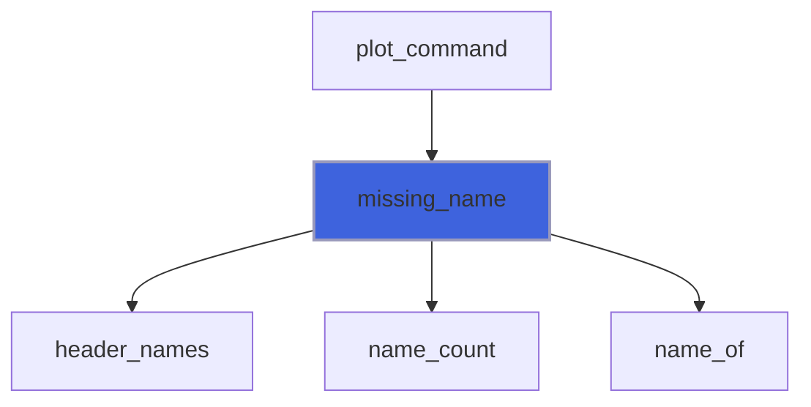

### cell_value

Number in a separated `cell`: blanks around it ignored, then double quotes around it; NaN if empty or not a number.

**Returns**: `real(kind=R8P)`

```fortran
function cell_value(cell) result(v)
```

**Arguments**

| Name | Type | Intent | Attributes | Description |
|------|------|--------|------------|-------------|
| `cell` | character(len=*) | in |  | Cell text. |

**Call graph**

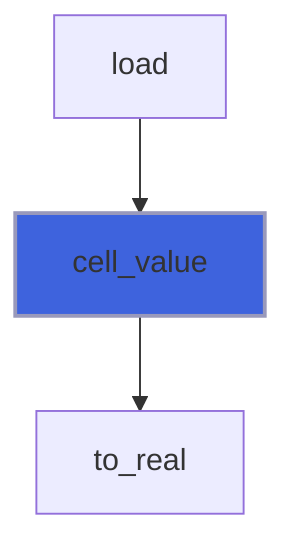

### to_real

Value of the longest number at the start of `token`, as C `strtod`: `[+-]` then decimal `D[.D][e[+-]D]` or `.D...`,
 or hexadecimal `0xH[.H][p[+-]D]`; NaN if there is none (empty, `?`, `NaN`, `inf`) or it is out of range.

**Returns**: `real(kind=R8P)`

```fortran
function to_real(token) result(v)
```

**Arguments**

| Name | Type | Intent | Attributes | Description |
|------|------|--------|------------|-------------|
| `token` | character(len=*) | in |  | Cell text. |

**Call graph**

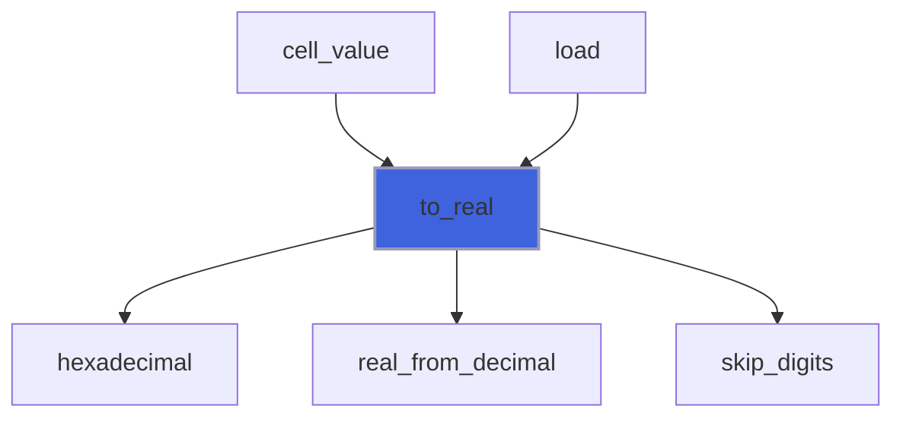

### hexadecimal

Value of the hexadecimal number at the start of `text` (after `0x`): digits, an optional point and digits, an
 optional binary exponent `p[+-]D`; false if no digit follows the `0x`. Out of range is NaN, never an IEEE overflow.

**Returns**: `logical`

```fortran
function hexadecimal(text, v) result(found)
```

**Arguments**

| Name | Type | Intent | Attributes | Description |
|------|------|--------|------------|-------------|
| `text` | character(len=*) | in |  | Text after `0x`. |
| `v` | real(kind=R8P) | out |  | Value. |

**Call graph**

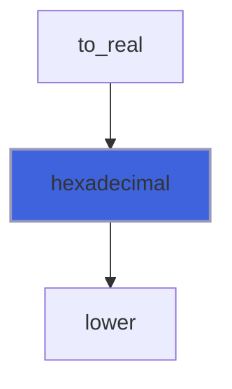
