# foresight_expression

> foresight_expression, arithmetic expressions of gnuplot `using` fields and plotted functions.

 An expression such as `($2*1e3)` or `($3 > 0 ? log10($3) : 1/0)` is compiled once into stack code and evaluated on
 each data row; compiled with a dummy variable, `sin(x)/x` is a function evaluated at sample abscissae (`value_at`),
 where columns are errors. The semantics are gnuplot's:

 - operators, loosest first: `?:`, `||`, `&&`, `== !=`, `< <= > >=`, `+ -`, `* / %`, unary `- + !`, `**` (right
   associative, so `-2**2` is -4 and `2**3**2` is 512); `&&`, `||` and `?:` evaluate only what they need;
 - operands: numbers, `$N` and `column(N)` (column N of the row, 0 is the point number), `column("name")` (the column
   of that header, see `resolve`), `pi`, and the functions
   `abs acos asin atan atan2 ceil cos cosh exp floor int log log10 sgn sin sinh sqrt tan tanh`;
 - integer constants are integers: `1/2` is 0, `-5/2` is -2, `7/2.` is 3.5; an integer overflow gives a real;
   columns are real; `floor`, `ceil`, `int`, `sgn`, comparisons and logical operators give integers;
 - a missing cell, a division by zero, a domain error (`sqrt(-1)`, `log(0)`) or an overflow make the whole value
   undefined: NaN, a gap in the plot, as gnuplot's `1/0`.

 Accepted beyond gnuplot: `%` and the logical operators on reals (gnuplot rejects them), and overflows give a gap
 where gnuplot stops the plot. Every floating point operation is checked beforehand, so evaluation never raises an
 IEEE invalid, division by zero or overflow exception.

**Source**: `src/lib/foresight_expression.F90`

**Dependencies**

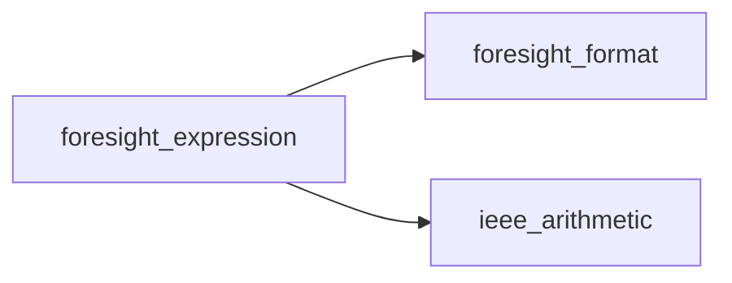

## Contents

- [value_object](#value-object)
- [instruction_object](#instruction-object)
- [name_object](#name-object)
- [expression_object](#expression-object)
- [compile](#compile)
- [set_column](#set-column)
- [set_name](#set-name)
- [binary](#binary)
- [integer_binary](#integer-binary)
- [unary](#unary)
- [safe_add](#safe-add)
- [safe_power](#safe-power)
- [evaluate](#evaluate)
- [first_column](#first-column)
- [name_count](#name-count)
- [name_of](#name-of)
- [resolve](#resolve)
- [value_at](#value-at)
- [in_level](#in-level)
- [binary_code](#binary-code)
- [real_of](#real-of)
- [truth](#truth)
- [logical_value](#logical-value)
- [int_value](#int-value)
- [fits_product](#fits-product)
- [divisible](#divisible)

## Variables

| Name | Type | Attributes | Description |
|------|------|------------|-------------|
| `OP_CONSTANT` | integer(kind=I4P) | parameter | Push the constant. |
| `OP_COLUMN` | integer(kind=I4P) | parameter | Push column `arg`. |
| `OP_COLUMN_OF` | integer(kind=I4P) | parameter | Replace the top with the column it numbers. |
| `OP_NEGATE` | integer(kind=I4P) | parameter | Unary minus. |
| `OP_NOT` | integer(kind=I4P) | parameter | Logical not. |
| `OP_TRUTH` | integer(kind=I4P) | parameter | Replace the top with 0 or 1. |
| `OP_ADD` | integer(kind=I4P) | parameter | `+`; binary operators run from here to OP_NE. |
| `OP_SUBTRACT` | integer(kind=I4P) | parameter | `-`. |
| `OP_MULTIPLY` | integer(kind=I4P) | parameter | `*`. |
| `OP_DIVIDE` | integer(kind=I4P) | parameter | `/`. |
| `OP_MODULO` | integer(kind=I4P) | parameter | `%`. |
| `OP_POWER` | integer(kind=I4P) | parameter | `**`. |
| `OP_ATAN2` | integer(kind=I4P) | parameter | `atan2(y, x)`. |
| `OP_LT` | integer(kind=I4P) | parameter | `<`. |
| `OP_LE` | integer(kind=I4P) | parameter | `<=`. |
| `OP_GT` | integer(kind=I4P) | parameter | `>`. |
| `OP_GE` | integer(kind=I4P) | parameter | `>=`. |
| `OP_EQ` | integer(kind=I4P) | parameter | `==`. |
| `OP_NE` | integer(kind=I4P) | parameter | `!=`. |
| `OP_FUNCTION` | integer(kind=I4P) | parameter | Function `arg` of the top. |
| `OP_JUMP` | integer(kind=I4P) | parameter | Jump to `arg`. |
| `OP_JUMP_UNLESS` | integer(kind=I4P) | parameter | Pop; jump to `arg` if false. |
| `OP_AND_JUMP` | integer(kind=I4P) | parameter | If the top is false: make it 0, jump to `arg`; else pop. |
| `OP_OR_JUMP` | integer(kind=I4P) | parameter | If the top is true: make it 1, jump to `arg`; else pop. |
| `OP_COLUMN_NAMED` | integer(kind=I4P) | parameter | Push the column of header `names(arg)`: undefined until resolved. |
| `FUNCTIONS` | character(len=*) | parameter |  |
| `LEVELS` | character(len=*) | parameter |  |
| `MAX_NESTING` | integer(kind=I4P) | parameter | Deepest parentheses and unary chains. |
| `MOST` | integer(kind=I8P) | parameter | Largest integer. |
| `LEAST` | integer(kind=I8P) | parameter | Smallest integer. |
| `HUGE_REAL` | real(kind=R8P) | parameter | Largest real. |
| `LOG_HUGE` | real(kind=R8P) | parameter | Largest safe `exp` argument. |
| `LOG_TINY` | real(kind=R8P) | parameter | `exp` of less is 0. |
| `INT_LIMIT` | real(kind=R8P) | parameter | Reals from here on are not I8P integers. |
| `PI` | real(kind=R8P) | parameter | pi. |

## Derived Types

### value_object

Stack value: an integer or a real, as in gnuplot.

#### Components

| Name | Type | Attributes | Description |
|------|------|------------|-------------|
| `r` | real(kind=R8P) |  | Real value. |
| `i` | integer(kind=I8P) |  | Integer value. |
| `is_int` | logical |  | Integer. |

### instruction_object

Stack code instruction.

#### Components

| Name | Type | Attributes | Description |
|------|------|------------|-------------|
| `op` | integer(kind=I4P) |  | Operation code. |
| `arg` | integer(kind=I4P) |  | Column, function or jump target. |
| `v` | type([value_object](/api/src/lib/foresight_expression#value-object)) |  | Constant. |

### name_object

Column header name.

#### Components

| Name | Type | Attributes | Description |
|------|------|------------|-------------|
| `text` | character(len=:) | allocatable | Name. |

### expression_object

Compiled expression.

#### Components

| Name | Type | Attributes | Description |
|------|------|------------|-------------|
| `text` | character(len=:) | allocatable | Source text. |
| `code` | type([instruction_object](/api/src/lib/foresight_expression#instruction-object)) | allocatable | Stack code. |
| `names` | type([name_object](/api/src/lib/foresight_expression#name-object)) | allocatable | Column header names, `column("name")`. |
| `depth` | integer(kind=I4P) |  | Stack size needed. |

#### Type-Bound Procedures

| Name | Attributes | Description |
|------|------------|-------------|
| `compile` | pass(self) | Compile an expression. |
| `evaluate` | pass(self) | Value on a data row. |
| `first_column` | pass(self) | First data column read. |
| `name_count` | pass(self) | Number of column header names. |
| `name_of` | pass(self) | A column header name. |
| `resolve` | pass(self) | Header names to column numbers. |
| `set_column` | pass(self) | Plain column. |
| `set_name` | pass(self) | Plain column of a header name. |
| `value_at` | pass(self) | Value of a function at its variable value. |

## Subroutines

### compile

Compile `text`; on error `iostat` is not 0 and `iomsg` names the problem and its position.

 With `variable` (gnuplot's dummy `x`) the expression is a function of it, evaluated by `value_at`; columns are
 then errors. The variable is held as the only cell of the row `evaluate` receives.

```fortran
subroutine compile(self, text, iostat, iomsg, variable)
```

**Arguments**

| Name | Type | Intent | Attributes | Description |
|------|------|--------|------------|-------------|
| `self` | class([expression_object](/api/src/lib/foresight_expression#expression-object)) | inout |  | Expression. |
| `text` | character(len=*) | in |  | Source text. |
| `iostat` | integer(kind=I4P) | out |  | 0 on success. |
| `iomsg` | character(len=:) | out | allocatable | Error message. |
| `variable` | character(len=*) | in | optional | Dummy variable name, for a function. |

**Call graph**

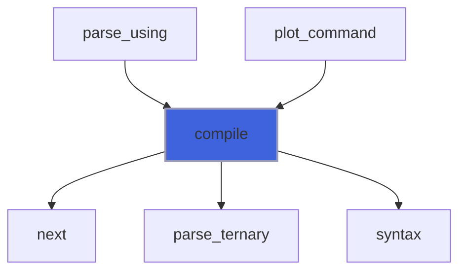

### set_column

Make the expression the plain column `c` (0 is the point number).

**Attributes**: pure

```fortran
subroutine set_column(self, c)
```

**Arguments**

| Name | Type | Intent | Attributes | Description |
|------|------|--------|------------|-------------|
| `self` | class([expression_object](/api/src/lib/foresight_expression#expression-object)) | inout |  | Expression. |
| `c` | integer(kind=I4P) | in |  | Column. |

**Call graph**

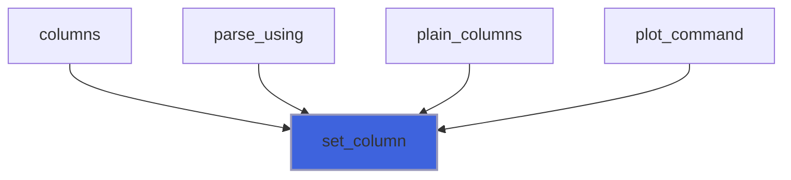

### set_name

Make the expression the plain column of header `name`, as gnuplot `using 1:"name"`.

**Attributes**: pure

```fortran
subroutine set_name(self, name)
```

**Arguments**

| Name | Type | Intent | Attributes | Description |
|------|------|--------|------------|-------------|
| `self` | class([expression_object](/api/src/lib/foresight_expression#expression-object)) | inout |  | Expression. |
| `name` | character(len=*) | in |  | Column header name. |

**Call graph**

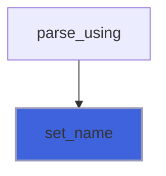

### binary

c = a op b: an integer when both are and the result fits, else a real; `ok` false if undefined.

**Attributes**: pure

```fortran
subroutine binary(op, a, b, c, ok)
```

**Arguments**

| Name | Type | Intent | Attributes | Description |
|------|------|--------|------------|-------------|
| `op` | integer(kind=I4P) | in |  | Operation code. |
| `a` | type([value_object](/api/src/lib/foresight_expression#value-object)) | in |  | Left operand. |
| `b` | type([value_object](/api/src/lib/foresight_expression#value-object)) | in |  | Right operand. |
| `c` | type([value_object](/api/src/lib/foresight_expression#value-object)) | out |  | Result. |
| `ok` | logical | inout |  | Defined. |

**Call graph**

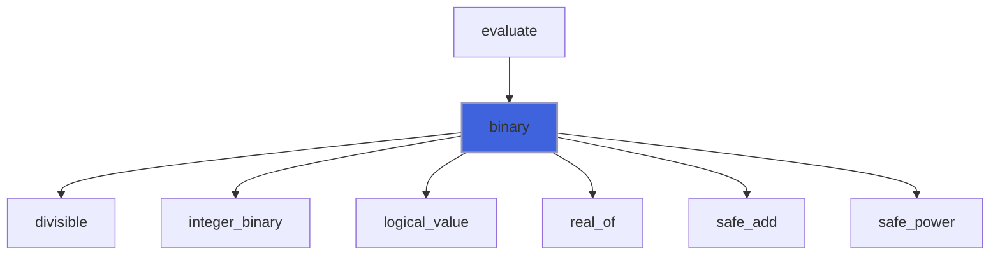

### integer_binary

c = i op j on integers; `done` false when the result is not an integer (overflow, negative power, atan2).

**Attributes**: pure

```fortran
subroutine integer_binary(op, i, j, c, done, ok)
```

**Arguments**

| Name | Type | Intent | Attributes | Description |
|------|------|--------|------------|-------------|
| `op` | integer(kind=I4P) | in |  | Operation code. |
| `i` | integer(kind=I8P) | in |  | Left operand. |
| `j` | integer(kind=I8P) | in |  | Right operand. |
| `c` | type([value_object](/api/src/lib/foresight_expression#value-object)) | inout |  | Result. |
| `done` | logical | out |  | Integer result computed. |
| `ok` | logical | inout |  | Defined. |

**Call graph**

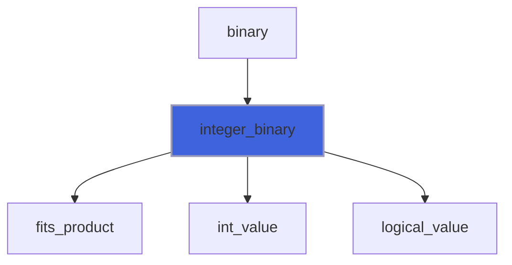

### unary

c = FUNCTIONS(f)(a); `ok` false if undefined.

**Attributes**: pure

```fortran
subroutine unary(f, a, c, ok)
```

**Arguments**

| Name | Type | Intent | Attributes | Description |
|------|------|--------|------------|-------------|
| `f` | integer(kind=I4P) | in |  | Function index. |
| `a` | type([value_object](/api/src/lib/foresight_expression#value-object)) | in |  | Argument. |
| `c` | type([value_object](/api/src/lib/foresight_expression#value-object)) | out |  | Result. |
| `ok` | logical | inout |  | Defined. |

**Call graph**

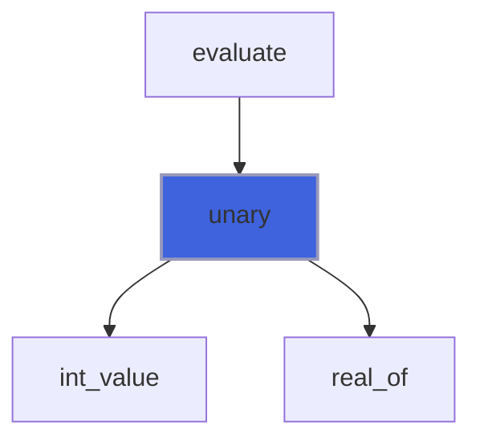

### safe_add

z = x + y, undefined on overflow.

**Attributes**: pure

```fortran
subroutine safe_add(x, y, z, ok)
```

**Arguments**

| Name | Type | Intent | Attributes | Description |
|------|------|--------|------------|-------------|
| `x` | real(kind=R8P) | in |  | Addend. |
| `y` | real(kind=R8P) | in |  | Addend. |
| `z` | real(kind=R8P) | out |  | Sum. |
| `ok` | logical | inout |  | Defined. |

**Call graph**

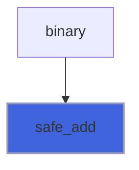

### safe_power

z = x ** y on reals; undefined when complex (negative base, fractional exponent), infinite or overflowing.

**Attributes**: pure

```fortran
subroutine safe_power(x, y, z, ok)
```

**Arguments**

| Name | Type | Intent | Attributes | Description |
|------|------|--------|------------|-------------|
| `x` | real(kind=R8P) | in |  | Base. |
| `y` | real(kind=R8P) | in |  | Exponent. |
| `z` | real(kind=R8P) | out |  | Power. |
| `ok` | logical | inout |  | Defined. |

**Call graph**

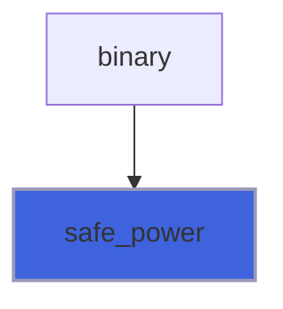

## Functions

### evaluate

Value on a data row: `row` holds its cells (NaN if missing), `point` is its point number (column 0).

 NaN if undefined. Every floating point operation is checked beforehand, so no IEEE exception is raised.

**Attributes**: pure

**Returns**: `real(kind=R8P)`

```fortran
function evaluate(self, row, point) result(v)
```

**Arguments**

| Name | Type | Intent | Attributes | Description |
|------|------|--------|------------|-------------|
| `self` | class([expression_object](/api/src/lib/foresight_expression#expression-object)) | in |  | Expression. |
| `row` | real(kind=R8P) | in |  | Row cells. |
| `point` | integer(kind=I4P) | in |  | Point number. |

**Call graph**

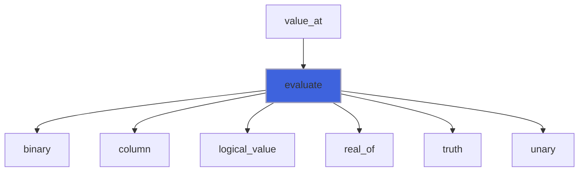

### first_column

First data column (from 1) the expression reads, 0 if none (an unresolved name is none): the column whose header
 titles the item, as gnuplot `title columnhead`.

**Attributes**: pure

**Returns**: `integer(kind=I4P)`

```fortran
function first_column(self) result(c)
```

**Arguments**

| Name | Type | Intent | Attributes | Description |
|------|------|--------|------------|-------------|
| `self` | class([expression_object](/api/src/lib/foresight_expression#expression-object)) | in |  | Expression. |

### name_count

Number of column header names used.

**Attributes**: elemental

**Returns**: `integer(kind=I4P)`

```fortran
function name_count(self) result(n)
```

**Arguments**

| Name | Type | Intent | Attributes | Description |
|------|------|--------|------------|-------------|
| `self` | class([expression_object](/api/src/lib/foresight_expression#expression-object)) | in |  | Expression. |

**Call graph**

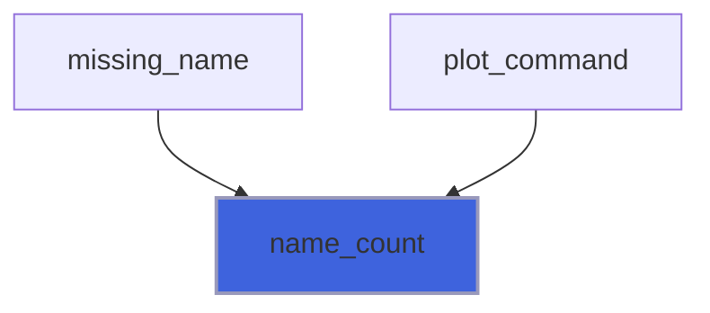

### name_of

The `k`-th column header name.

**Attributes**: pure

**Returns**: `character(len=:)`

```fortran
function name_of(self, k) result(name)
```

**Arguments**

| Name | Type | Intent | Attributes | Description |
|------|------|--------|------------|-------------|
| `self` | class([expression_object](/api/src/lib/foresight_expression#expression-object)) | in |  | Expression. |
| `k` | integer(kind=I4P) | in |  | Name index. |

**Call graph**

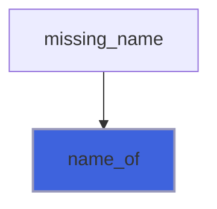

### resolve

The expression with its column header names replaced by their column numbers in `header` (the names of columns
 1, 2, ...; trailing blanks ignored); a name not in it reads no column: undefined.

**Attributes**: pure

**Returns**: type([expression_object](/api/src/lib/foresight_expression#expression-object))

```fortran
function resolve(self, header) result(resolved)
```

**Arguments**

| Name | Type | Intent | Attributes | Description |
|------|------|--------|------------|-------------|
| `self` | class([expression_object](/api/src/lib/foresight_expression#expression-object)) | in |  | Expression. |
| `header` | character(len=*) | in |  | Column names. |

### value_at

Value of an expression compiled with a dummy variable at the variable value `x`; NaN if undefined.

**Attributes**: pure

**Returns**: `real(kind=R8P)`

```fortran
function value_at(self, x) result(v)
```

**Arguments**

| Name | Type | Intent | Attributes | Description |
|------|------|--------|------------|-------------|
| `self` | class([expression_object](/api/src/lib/foresight_expression#expression-object)) | in |  | Expression. |
| `x` | real(kind=R8P) | in |  | Variable value. |

**Call graph**

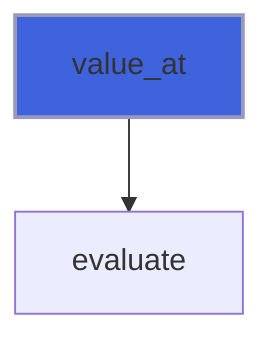

### in_level

Whether `operator` is a binary operator of grammar level `level`.

**Attributes**: pure

**Returns**: `logical`

```fortran
function in_level(operator, level) result(yes)
```

**Arguments**

| Name | Type | Intent | Attributes | Description |
|------|------|--------|------------|-------------|
| `operator` | character(len=*) | in |  | Operator. |
| `level` | integer(kind=I4P) | in |  | Level in `LEVELS`. |

### binary_code

Operation code of a binary operator.

**Attributes**: pure

**Returns**: `integer(kind=I4P)`

```fortran
function binary_code(operator) result(op)
```

**Arguments**

| Name | Type | Intent | Attributes | Description |
|------|------|--------|------------|-------------|
| `operator` | character(len=*) | in |  | Operator. |

### real_of

Real value of `a`.

**Attributes**: pure

**Returns**: `real(kind=R8P)`

```fortran
function real_of(a) result(r)
```

**Arguments**

| Name | Type | Intent | Attributes | Description |
|------|------|--------|------------|-------------|
| `a` | type([value_object](/api/src/lib/foresight_expression#value-object)) | in |  | Value. |

**Call graph**

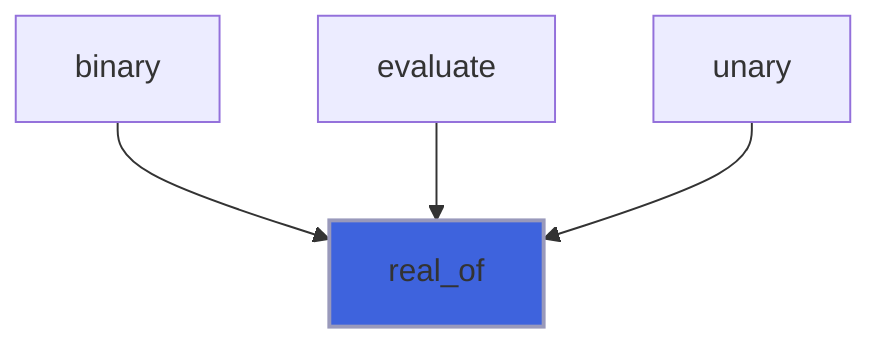

### truth

Whether `a` is not zero.

**Attributes**: pure

**Returns**: `logical`

```fortran
function truth(a) result(yes)
```

**Arguments**

| Name | Type | Intent | Attributes | Description |
|------|------|--------|------------|-------------|
| `a` | type([value_object](/api/src/lib/foresight_expression#value-object)) | in |  | Value. |

**Call graph**

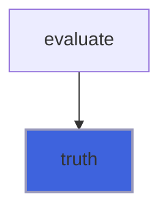

### logical_value

Integer 1 or 0.

**Attributes**: pure

**Returns**: type([value_object](/api/src/lib/foresight_expression#value-object))

```fortran
function logical_value(yes) result(a)
```

**Arguments**

| Name | Type | Intent | Attributes | Description |
|------|------|--------|------------|-------------|
| `yes` | logical | in |  | Truth. |

**Call graph**

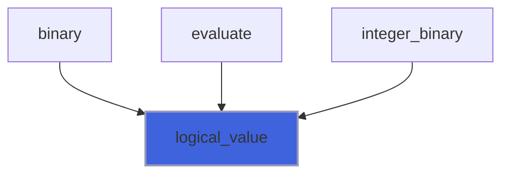

### int_value

Integer value.

**Attributes**: pure

**Returns**: type([value_object](/api/src/lib/foresight_expression#value-object))

```fortran
function int_value(i) result(a)
```

**Arguments**

| Name | Type | Intent | Attributes | Description |
|------|------|--------|------------|-------------|
| `i` | integer(kind=I8P) | in |  | Integer. |

**Call graph**

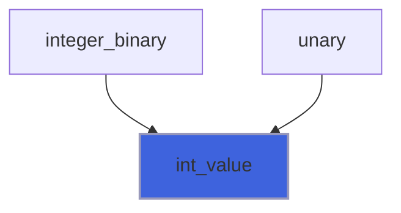

### fits_product

Whether i*j fits an I8P integer.

**Attributes**: pure

**Returns**: `logical`

```fortran
function fits_product(i, j) result(yes)
```

**Arguments**

| Name | Type | Intent | Attributes | Description |
|------|------|--------|------------|-------------|
| `i` | integer(kind=I8P) | in |  | Factor. |
| `j` | integer(kind=I8P) | in |  | Factor. |

**Call graph**

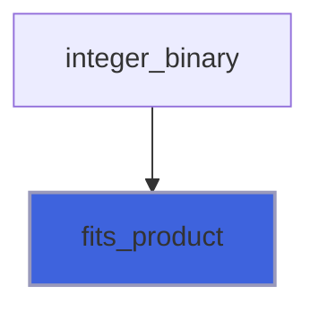

### divisible

Whether x / y is finite.

**Attributes**: pure

**Returns**: `logical`

```fortran
function divisible(x, y) result(ok)
```

**Arguments**

| Name | Type | Intent | Attributes | Description |
|------|------|--------|------------|-------------|
| `x` | real(kind=R8P) | in |  | Dividend. |
| `y` | real(kind=R8P) | in |  | Divisor. |

**Call graph**

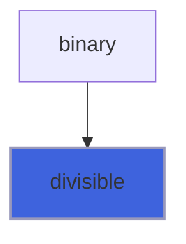
