# foresight_figure

> foresight_figure, a figure: page, font and a grid of plot panels, driven by a gnuplot-like API.

 Every method mirrors a gnuplot command (`plot`, `set title`, `set xrange`, `set logscale`, `set multiplot`, ...)
 so that the command line interpreter maps one-to-one onto this API. Settings and plots apply to the current panel;
 a figure has one panel unless `set_multiplot` lays out a grid, filled panel by panel with `next_panel`.
```fortran
 type(figure_object) :: fig
 real(R8P)           :: x(3), y(3)
 x = [1.0_R8P, 2.0_R8P, 3.0_R8P]
 y = x**2
 call fig%set_title('parabola')
 call fig%plot(x, y, title='x^2', with='linespoints')
 call fig%save('parabola.svg')
```

**Source**: `src/lib/foresight_figure.F90`

**Dependencies**

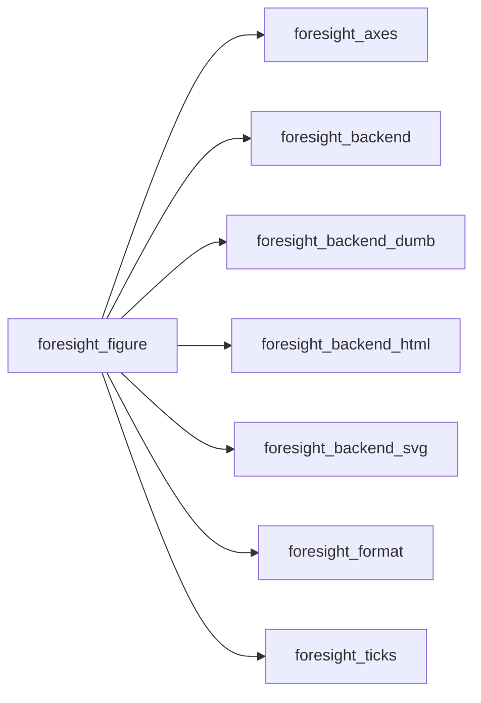

## Contents

- [figure_object](#figure-object)
- [clear](#clear)
- [init](#init)
- [next_panel](#next-panel)
- [plot](#plot)
- [save](#save)
- [set_format](#set-format)
- [set_grid](#set-grid)
- [set_key](#set-key)
- [set_logscale](#set-logscale)
- [set_multiplot](#set-multiplot)
- [set_origin](#set-origin)
- [set_refresh](#set-refresh)
- [set_size](#set-size)
- [set_title](#set-title)
- [set_xlabel](#set-xlabel)
- [set_xrange](#set-xrange)
- [set_xtics](#set-xtics)
- [set_ylabel](#set-ylabel)
- [set_yrange](#set-yrange)
- [set_ytics](#set-ytics)
- [unset_logscale](#unset-logscale)
- [unset_multiplot](#unset-multiplot)
- [unset_xtics](#unset-xtics)
- [unset_ytics](#unset-ytics)
- [ensure_panels](#ensure-panels)
- [render](#render)
- [set_tics](#set-tics)
- [extension](#extension)

## Variables

| Name | Type | Attributes | Description |
|------|------|------------|-------------|
| `PAD` | real(kind=R8P) | parameter | Outer padding [px]. |
| `GAP` | real(kind=R8P) | parameter | Gap below the multiplot title [px]. |
| `LINE_HEIGHT` | real(kind=R8P) | parameter | Text line height [font size]. |

## Derived Types

### figure_object

Figure.

#### Components

| Name | Type | Attributes | Description |
|------|------|------------|-------------|
| `width` | real(kind=R8P) |  | Page width [px], gnuplot svg terminal default. |
| `height` | real(kind=R8P) |  | Page height [px], gnuplot svg terminal default. |
| `font_size` | real(kind=R8P) |  | Font size [px]. |
| `refresh` | integer(kind=I4P) |  | HTML page reload period [s], 0 for none. |
| `clear_screen` | logical |  | Clear the terminal before text output (live view). |
| `rows` | integer(kind=I4P) |  | Panel grid rows. |
| `cols` | integer(kind=I4P) |  | Panel grid columns. |
| `current` | integer(kind=I4P) |  | Current panel, filled row by row. |
| `layout` | logical |  | Multiplot grid: panels in cells, else in their |
| `manual` | logical |  | Manual multiplot: panels added on demand. |
| `title` | character(len=:) | allocatable | Multiplot title, empty for none. |
| `panels` | type([axes_object](/api/src/lib/foresight_axes#axes-object)) | allocatable | Plot panels. |

#### Type-Bound Procedures

| Name | Attributes | Description |
|------|------------|-------------|
| `clear` | pass(self) | Remove the series of the current panel, keeping the settings. |
| `init` | pass(self) | Reset the figure, optionally resizing it. |
| `next_panel` | pass(self) | Move to the next multiplot panel, carrying the settings over. |
| `plot` | pass(self) | gnuplot `plot`, one series per call. |
| `save` | pass(self) | Render to a file; the format follows the extension. |
| `set_format` | pass(self) | gnuplot `set format`. |
| `set_grid` | pass(self) | gnuplot `set grid` / `unset grid`. |
| `set_key` | pass(self) | gnuplot `set key` / `unset key`. |
| `set_logscale` | pass(self) | gnuplot `set logscale`. |
| `set_multiplot` | pass(self) | gnuplot `set multiplot layout rows,cols title "..."`. |
| `set_origin` | pass(self) | gnuplot `set origin`. |
| `set_refresh` | pass(self) | HTML page reload period, for live monitoring. |
| `set_size` | pass(self) | gnuplot `set size`. |
| `set_title` | pass(self) | gnuplot `set title`. |
| `set_xlabel` | pass(self) | gnuplot `set xlabel`. |
| `set_xrange` | pass(self) | gnuplot `set xrange`. |
| `set_xtics` | pass(self) | gnuplot `set xtics`. |
| `set_ylabel` | pass(self) | gnuplot `set ylabel`. |
| `set_yrange` | pass(self) | gnuplot `set yrange`. |
| `set_ytics` | pass(self) | gnuplot `set ytics`. |
| `unset_logscale` | pass(self) | gnuplot `unset logscale`. |
| `unset_multiplot` | pass(self) | gnuplot `unset multiplot`. |
| `unset_xtics` | pass(self) | gnuplot `unset xtics`. |
| `unset_ytics` | pass(self) | gnuplot `unset ytics`. |
| `ensure_panels` | pass(self) | Allocate the single default panel if needed. |
| `render` | pass(self) | Render on a device. |

## Subroutines

### clear

Remove the series of the current panel, keeping every setting: a new gnuplot `plot` replaces the previous one.

```fortran
subroutine clear(self)
```

**Arguments**

| Name | Type | Intent | Attributes | Description |
|------|------|--------|------------|-------------|
| `self` | class([figure_object](/api/src/lib/foresight_figure#figure-object)) | inout |  | Figure. |

**Call graph**

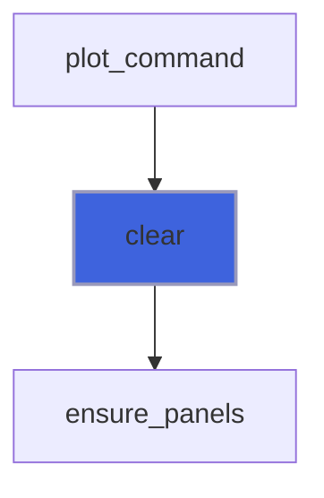

### init

Reset the figure to gnuplot defaults, optionally resizing it.

```fortran
subroutine init(self, width, height, font_size)
```

**Arguments**

| Name | Type | Intent | Attributes | Description |
|------|------|--------|------------|-------------|
| `self` | class([figure_object](/api/src/lib/foresight_figure#figure-object)) | inout |  | Figure. |
| `width` | integer(kind=I4P) | in | optional | Page width [px]. |
| `height` | integer(kind=I4P) | in | optional | Page height [px]. |
| `font_size` | real(kind=R8P) | in | optional | Font size [px]. |

**Call graph**

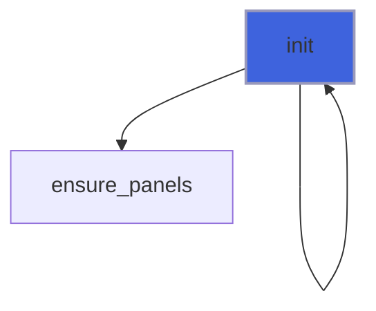

### next_panel

Move to the next panel of the multiplot: the next grid cell, or a new panel in a manual multiplot; the settings
 of the current panel carry over, as in gnuplot.

```fortran
subroutine next_panel(self)
```

**Arguments**

| Name | Type | Intent | Attributes | Description |
|------|------|--------|------------|-------------|
| `self` | class([figure_object](/api/src/lib/foresight_figure#figure-object)) | inout |  | Figure. |

**Call graph**

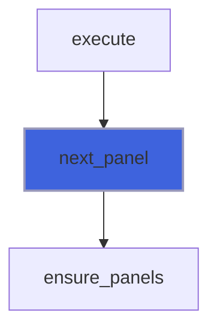

### plot

Add the series (`x`, `y`) to the current panel, as gnuplot `plot ... title ... with ... lc ... lw ... dt ... ps`.

 Error bar styles (`yerrorbars`, `xerrorbars`, `xyerrorbars`) take the bar bounds `ylow`/`yhigh`, `xlow`/`xhigh`.

```fortran
subroutine plot(self, x, y, title, with, lc, lw, dt, ps, xlow, xhigh, ylow, yhigh)
```

**Arguments**

| Name | Type | Intent | Attributes | Description |
|------|------|--------|------------|-------------|
| `self` | class([figure_object](/api/src/lib/foresight_figure#figure-object)) | inout |  | Figure. |
| `x` | real(kind=R8P) | in |  | Abscissae. |
| `y` | real(kind=R8P) | in |  | Ordinates. |
| `title` | character(len=*) | in | optional | Key title, empty or absent for none. |
| `with` | character(len=*) | in | optional | Plotting style: `lines` (default), `points`, .... |
| `lc` | character(len=*) | in | optional | Line color (SVG color); default from the gnuplot palette. |
| `lw` | real(kind=R8P) | in | optional | Line width [px]. |
| `dt` | integer(kind=I4P) | in | optional | Dash type, 1..5. |
| `ps` | real(kind=R8P) | in | optional | Point size scale factor. |
| `xlow` | real(kind=R8P) | in | optional | Horizontal error bar starts. |
| `xhigh` | real(kind=R8P) | in | optional | Horizontal error bar ends. |
| `ylow` | real(kind=R8P) | in | optional | Vertical error bar starts. |
| `yhigh` | real(kind=R8P) | in | optional | Vertical error bar ends. |

**Call graph**

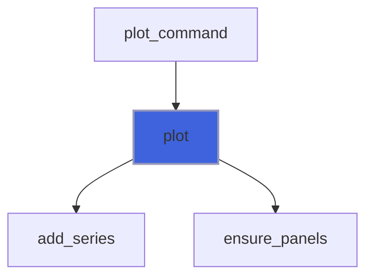

### save

Render the figure to `file`; the format follows the name: `.svg` static, `.html` interactive, `.txt` text (the
 gnuplot `dumb` terminal), `-` text on standard output.

```fortran
subroutine save(self, file)
```

**Arguments**

| Name | Type | Intent | Attributes | Description |
|------|------|--------|------------|-------------|
| `self` | class([figure_object](/api/src/lib/foresight_figure#figure-object)) | inout |  | Figure. |
| `file` | character(len=*) | in |  | Output file. |

**Call graph**

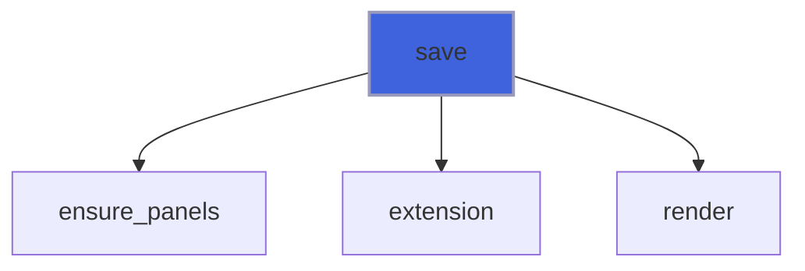

### set_format

Tick label `format` of the `axes` named by the letters `x`, `y` (both when absent), as gnuplot `set format`: text
 with one printf conversion `%[flags][width][.precision]` `f`, `e`, `E`, `g`, `G` or `h` (`g` with a `x10`
 superscript exponent), e.g. `'%.1e'` or `'%g s'`; an empty format restores the default labels.

```fortran
subroutine set_format(self, format, axes)
```

**Arguments**

| Name | Type | Intent | Attributes | Description |
|------|------|--------|------------|-------------|
| `self` | class([figure_object](/api/src/lib/foresight_figure#figure-object)) | inout |  | Figure. |
| `format` | character(len=*) | in |  | Label format. |
| `axes` | character(len=*) | in | optional | Axes letters, e.g. `y` or `xy`. |

**Call graph**

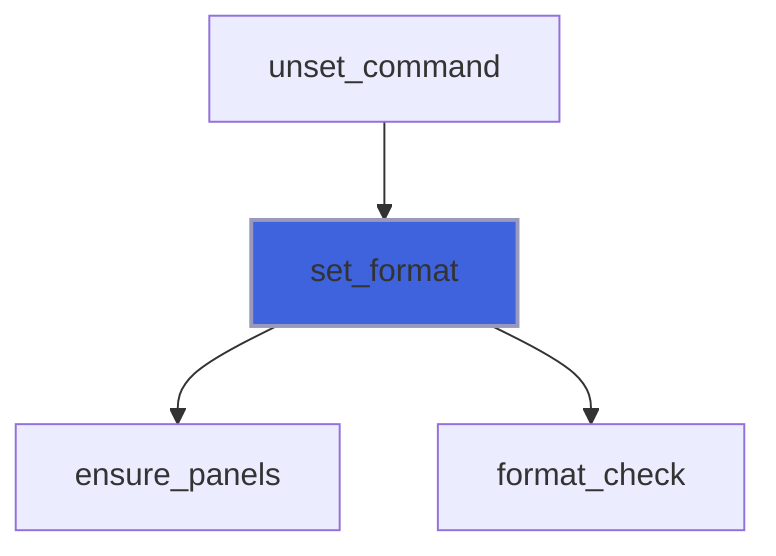

### set_grid

Draw grid lines at the major ticks (`on` absent or true), as gnuplot `set grid`, or not.

```fortran
subroutine set_grid(self, on)
```

**Arguments**

| Name | Type | Intent | Attributes | Description |
|------|------|--------|------------|-------------|
| `self` | class([figure_object](/api/src/lib/foresight_figure#figure-object)) | inout |  | Figure. |
| `on` | logical | in | optional | Grid on. |

**Call graph**

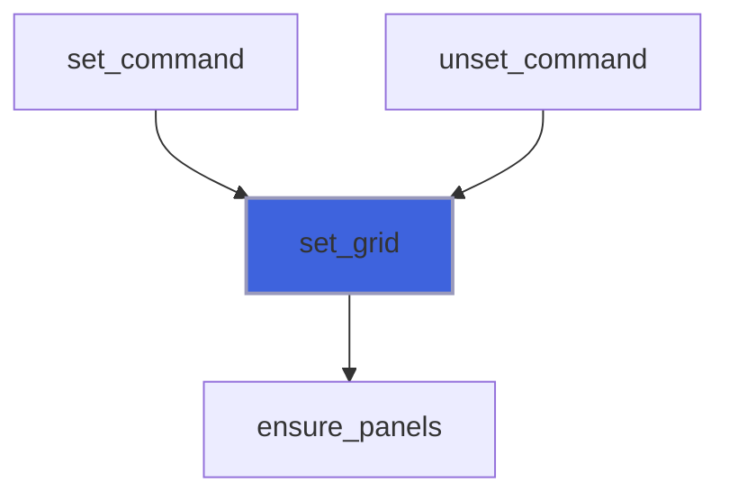

### set_key

Draw the key (`on` absent or true), as gnuplot `set key`, or not; `position` takes gnuplot's words, e.g.
 `'bottom left'` or `'center'` (inside the plot area, top right by default); `box` draws a box around it.

```fortran
subroutine set_key(self, on, position, box)
```

**Arguments**

| Name | Type | Intent | Attributes | Description |
|------|------|--------|------------|-------------|
| `self` | class([figure_object](/api/src/lib/foresight_figure#figure-object)) | inout |  | Figure. |
| `on` | logical | in | optional | Key on. |
| `position` | character(len=*) | in | optional | Position words: left, right, center, top, bottom. |
| `box` | logical | in | optional | Box around the key. |

**Call graph**

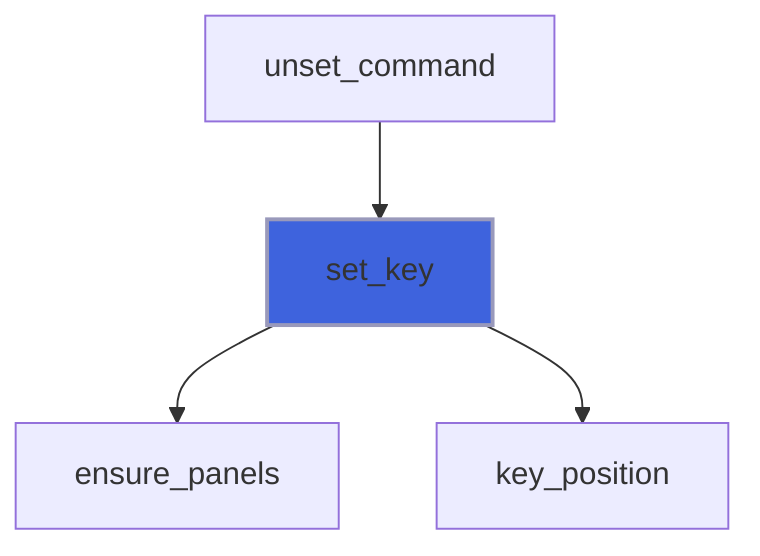

### set_logscale

Base-10 log scale on the `axes` named by the letters `x`, `y`; all axes when absent, as gnuplot.

```fortran
subroutine set_logscale(self, axes)
```

**Arguments**

| Name | Type | Intent | Attributes | Description |
|------|------|--------|------------|-------------|
| `self` | class([figure_object](/api/src/lib/foresight_figure#figure-object)) | inout |  | Figure. |
| `axes` | character(len=*) | in | optional | Axes letters, e.g. `y` or `xy`. |

**Call graph**

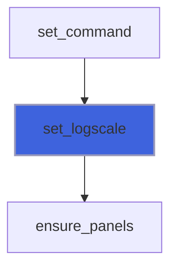

### set_multiplot

Lay out a `rows` x `cols` grid of panels, filled row by row starting from the first; every panel starts from the
 settings of the current one, without its series. Without `rows` and `cols`, a manual multiplot: each panel lies
 in its `set_origin`/`set_size` box, as gnuplot `set multiplot` without layout.

```fortran
subroutine set_multiplot(self, rows, cols, title)
```

**Arguments**

| Name | Type | Intent | Attributes | Description |
|------|------|--------|------------|-------------|
| `self` | class([figure_object](/api/src/lib/foresight_figure#figure-object)) | inout |  | Figure. |
| `rows` | integer(kind=I4P) | in | optional | Grid rows. |
| `cols` | integer(kind=I4P) | in | optional | Grid columns. |
| `title` | character(len=*) | in | optional | Multiplot title. |

**Call graph**

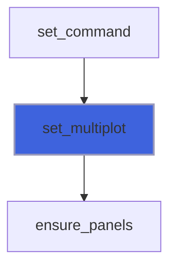

### set_origin

Bottom left corner of the plot as page fractions, as gnuplot `set origin x,y`: for a single plot and the panels
 of a manual multiplot (not with a layout).

```fortran
subroutine set_origin(self, x, y)
```

**Arguments**

| Name | Type | Intent | Attributes | Description |
|------|------|--------|------------|-------------|
| `self` | class([figure_object](/api/src/lib/foresight_figure#figure-object)) | inout |  | Figure. |
| `x` | real(kind=R8P) | in |  | Left side, page width fraction. |
| `y` | real(kind=R8P) | in |  | Bottom side, page height fraction. |

**Call graph**

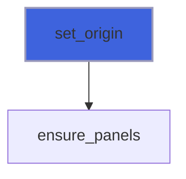

### set_refresh

Make the HTML page reload itself every `seconds` (0 disables): live view of a file rewritten by a running job.

 The zoom survives the reload, being kept in the page URL as data values.

**Attributes**: pure

```fortran
subroutine set_refresh(self, seconds)
```

**Arguments**

| Name | Type | Intent | Attributes | Description |
|------|------|--------|------------|-------------|
| `self` | class([figure_object](/api/src/lib/foresight_figure#figure-object)) | inout |  | Figure. |
| `seconds` | integer(kind=I4P) | in |  | Reload period [s]. |

**Call graph**

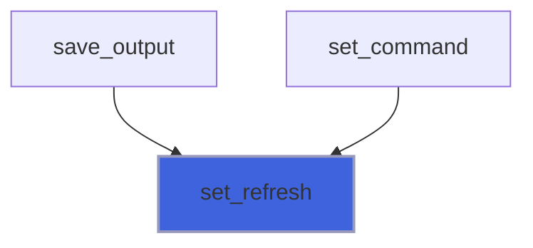

### set_size

Size of the plot as page fractions, as gnuplot `set size w,h`: for a single plot and the panels of a manual
 multiplot (not with a layout).

```fortran
subroutine set_size(self, width, height)
```

**Arguments**

| Name | Type | Intent | Attributes | Description |
|------|------|--------|------------|-------------|
| `self` | class([figure_object](/api/src/lib/foresight_figure#figure-object)) | inout |  | Figure. |
| `width` | real(kind=R8P) | in |  | Width, page width fraction, > 0. |
| `height` | real(kind=R8P) | in |  | Height, page height fraction, > 0. |

**Call graph**

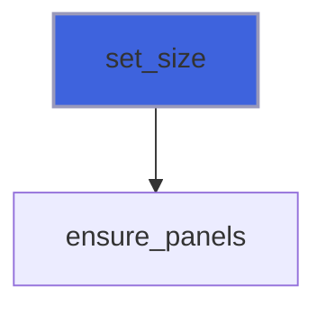

### set_title

Set the title of the current panel, empty for none.

```fortran
subroutine set_title(self, title)
```

**Arguments**

| Name | Type | Intent | Attributes | Description |
|------|------|--------|------------|-------------|
| `self` | class([figure_object](/api/src/lib/foresight_figure#figure-object)) | inout |  | Figure. |
| `title` | character(len=*) | in |  | Title. |

**Call graph**


### set_xlabel

Set the x axis label of the current panel, empty for none.

```fortran
subroutine set_xlabel(self, label)
```

**Arguments**

| Name | Type | Intent | Attributes | Description |
|------|------|--------|------------|-------------|
| `self` | class([figure_object](/api/src/lib/foresight_figure#figure-object)) | inout |  | Figure. |
| `label` | character(len=*) | in |  | Label. |

**Call graph**


### set_xrange

Set the x range as gnuplot `set xrange [min:max]`: an absent end is autoscaled, `min > max` reverses the axis.

```fortran
subroutine set_xrange(self, min, max)
```

**Arguments**

| Name | Type | Intent | Attributes | Description |
|------|------|--------|------------|-------------|
| `self` | class([figure_object](/api/src/lib/foresight_figure#figure-object)) | inout |  | Figure. |
| `min` | real(kind=R8P) | in | optional | Value at the axis start. |
| `max` | real(kind=R8P) | in | optional | Value at the axis end. |

**Call graph**


### set_xtics

x ticks every `step` from `start` to `end` (both optional), as gnuplot `set xtics START,STEP,END`; automatic
 without `step`. On a log axis the step is a factor (> 1): ticks at start * step**k.

```fortran
subroutine set_xtics(self, step, start, end)
```

**Arguments**

| Name | Type | Intent | Attributes | Description |
|------|------|--------|------------|-------------|
| `self` | class([figure_object](/api/src/lib/foresight_figure#figure-object)) | inout |  | Figure. |
| `step` | real(kind=R8P) | in | optional | Tick step, a factor on log axes. |
| `start` | real(kind=R8P) | in | optional | First tick. |
| `end` | real(kind=R8P) | in | optional | Last tick. |

**Call graph**

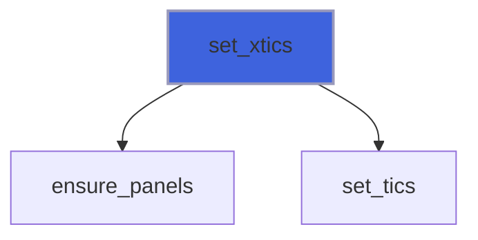

### set_ylabel

Set the y axis label of the current panel, empty for none.

```fortran
subroutine set_ylabel(self, label)
```

**Arguments**

| Name | Type | Intent | Attributes | Description |
|------|------|--------|------------|-------------|
| `self` | class([figure_object](/api/src/lib/foresight_figure#figure-object)) | inout |  | Figure. |
| `label` | character(len=*) | in |  | Label. |

**Call graph**

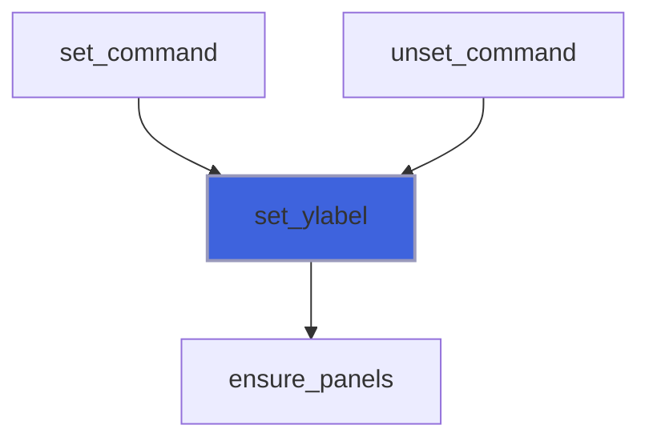

### set_yrange

Set the y range as gnuplot `set yrange [min:max]`: an absent end is autoscaled, `min > max` reverses the axis.

```fortran
subroutine set_yrange(self, min, max)
```

**Arguments**

| Name | Type | Intent | Attributes | Description |
|------|------|--------|------------|-------------|
| `self` | class([figure_object](/api/src/lib/foresight_figure#figure-object)) | inout |  | Figure. |
| `min` | real(kind=R8P) | in | optional | Value at the axis start. |
| `max` | real(kind=R8P) | in | optional | Value at the axis end. |

**Call graph**

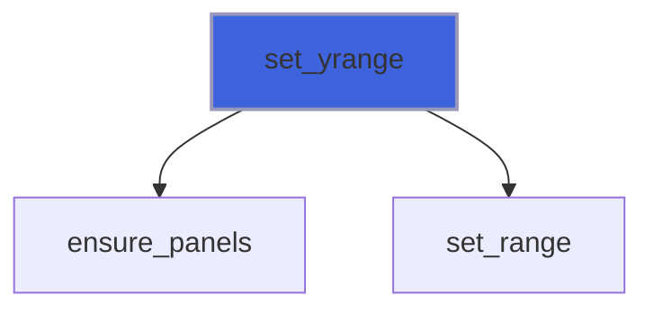

### set_ytics

y ticks every `step` from `start` to `end` (both optional), as gnuplot `set ytics START,STEP,END`; automatic
 without `step`. On a log axis the step is a factor (> 1): ticks at start * step**k.

```fortran
subroutine set_ytics(self, step, start, end)
```

**Arguments**

| Name | Type | Intent | Attributes | Description |
|------|------|--------|------------|-------------|
| `self` | class([figure_object](/api/src/lib/foresight_figure#figure-object)) | inout |  | Figure. |
| `step` | real(kind=R8P) | in | optional | Tick step, a factor on log axes. |
| `start` | real(kind=R8P) | in | optional | First tick. |
| `end` | real(kind=R8P) | in | optional | Last tick. |

**Call graph**

```mermaid
flowchart TD
  set_ytics["set_ytics"] --> ensure_panels["ensure_panels"]
  set_ytics["set_ytics"] --> set_tics["set_tics"]
  style set_ytics fill:#3e63dd,stroke:#99b,stroke-width:2px
```

### unset_logscale

Linear scale on the `axes` named by the letters `x`, `y`; all axes when absent, as gnuplot.

```fortran
subroutine unset_logscale(self, axes)
```

**Arguments**

| Name | Type | Intent | Attributes | Description |
|------|------|--------|------------|-------------|
| `self` | class([figure_object](/api/src/lib/foresight_figure#figure-object)) | inout |  | Figure. |
| `axes` | character(len=*) | in | optional | Axes letters, e.g. `y` or `xy`. |

**Call graph**

```mermaid
flowchart TD
  unset_command["unset_command"] --> unset_logscale["unset_logscale"]
  unset_logscale["unset_logscale"] --> ensure_panels["ensure_panels"]
  style unset_logscale fill:#3e63dd,stroke:#99b,stroke-width:2px
```

### unset_multiplot

Back to a single panel, keeping the settings of the current one without its series.

```fortran
subroutine unset_multiplot(self)
```

**Arguments**

| Name | Type | Intent | Attributes | Description |
|------|------|--------|------------|-------------|
| `self` | class([figure_object](/api/src/lib/foresight_figure#figure-object)) | inout |  | Figure. |

**Call graph**

```mermaid
flowchart TD
  unset_command["unset_command"] --> unset_multiplot["unset_multiplot"]
  unset_multiplot["unset_multiplot"] --> ensure_panels["ensure_panels"]
  style unset_multiplot fill:#3e63dd,stroke:#99b,stroke-width:2px
```

### unset_xtics

No x ticks, tick labels nor grid lines, as gnuplot `unset xtics`; autoscaled ends are then not extended.

```fortran
subroutine unset_xtics(self)
```

**Arguments**

| Name | Type | Intent | Attributes | Description |
|------|------|--------|------------|-------------|
| `self` | class([figure_object](/api/src/lib/foresight_figure#figure-object)) | inout |  | Figure. |

**Call graph**

```mermaid
flowchart TD
  unset_command["unset_command"] --> unset_xtics["unset_xtics"]
  unset_xtics["unset_xtics"] --> ensure_panels["ensure_panels"]
  style unset_xtics fill:#3e63dd,stroke:#99b,stroke-width:2px
```

### unset_ytics

No y ticks, tick labels nor grid lines, as gnuplot `unset ytics`; autoscaled ends are then not extended.

```fortran
subroutine unset_ytics(self)
```

**Arguments**

| Name | Type | Intent | Attributes | Description |
|------|------|--------|------------|-------------|
| `self` | class([figure_object](/api/src/lib/foresight_figure#figure-object)) | inout |  | Figure. |

**Call graph**

```mermaid
flowchart TD
  unset_command["unset_command"] --> unset_ytics["unset_ytics"]
  unset_ytics["unset_ytics"] --> ensure_panels["ensure_panels"]
  style unset_ytics fill:#3e63dd,stroke:#99b,stroke-width:2px
```

### ensure_panels

Allocate the single default panel of a fresh figure.

```fortran
subroutine ensure_panels(self)
```

**Arguments**

| Name | Type | Intent | Attributes | Description |
|------|------|--------|------------|-------------|
| `self` | class([figure_object](/api/src/lib/foresight_figure#figure-object)) | inout |  | Figure. |

**Call graph**

```mermaid
flowchart TD
  clear["clear"] --> ensure_panels["ensure_panels"]
  init["init"] --> ensure_panels["ensure_panels"]
  next_panel["next_panel"] --> ensure_panels["ensure_panels"]
  plot["plot"] --> ensure_panels["ensure_panels"]
  save["save"] --> ensure_panels["ensure_panels"]
  set_format["set_format"] --> ensure_panels["ensure_panels"]
  set_grid["set_grid"] --> ensure_panels["ensure_panels"]
  set_key["set_key"] --> ensure_panels["ensure_panels"]
  set_logscale["set_logscale"] --> ensure_panels["ensure_panels"]
  set_multiplot["set_multiplot"] --> ensure_panels["ensure_panels"]
  set_origin["set_origin"] --> ensure_panels["ensure_panels"]
  set_size["set_size"] --> ensure_panels["ensure_panels"]
  set_title["set_title"] --> ensure_panels["ensure_panels"]
  set_xlabel["set_xlabel"] --> ensure_panels["ensure_panels"]
  set_xrange["set_xrange"] --> ensure_panels["ensure_panels"]
  set_xtics["set_xtics"] --> ensure_panels["ensure_panels"]
  set_ylabel["set_ylabel"] --> ensure_panels["ensure_panels"]
  set_yrange["set_yrange"] --> ensure_panels["ensure_panels"]
  set_ytics["set_ytics"] --> ensure_panels["ensure_panels"]
  unset_logscale["unset_logscale"] --> ensure_panels["ensure_panels"]
  unset_multiplot["unset_multiplot"] --> ensure_panels["ensure_panels"]
  unset_xtics["unset_xtics"] --> ensure_panels["ensure_panels"]
  unset_ytics["unset_ytics"] --> ensure_panels["ensure_panels"]
  style ensure_panels fill:#3e63dd,stroke:#99b,stroke-width:2px
```

### render

Render the figure on `backend`, writing `file`: the multiplot title on top, panels in grid cells of a layout or
 else in their `origin`/`size` boxes; in a multiplot the panels never plotted stay blank, as in gnuplot.

```fortran
subroutine render(self, backend, file)
```

**Arguments**

| Name | Type | Intent | Attributes | Description |
|------|------|--------|------------|-------------|
| `self` | class([figure_object](/api/src/lib/foresight_figure#figure-object)) | inout |  | Figure. |
| `backend` | class([backend_object](/api/src/lib/foresight_backend#backend-object)) | inout |  | Output device. |
| `file` | character(len=*) | in |  | Output file. |

**Call graph**

```mermaid
flowchart TD
  render["render"] --> render["render"]
  save["save"] --> render["render"]
  render["render"] --> begin_page["begin_page"]
  render["render"] --> end_page["end_page"]
  render["render"] --> rect["rect"]
  render["render"] --> render["render"]
  render["render"] --> text["text"]
  style render fill:#3e63dd,stroke:#99b,stroke-width:2px
```

### set_tics

Fixed ticks from real settings, or automatic ones without `step`; invalid settings stop.

```fortran
subroutine set_tics(tics, caller, step, start, end)
```

**Arguments**

| Name | Type | Intent | Attributes | Description |
|------|------|--------|------------|-------------|
| `tics` | type([tics_object](/api/src/lib/foresight_ticks#tics-object)) | inout |  | Axis tick settings. |
| `caller` | character(len=*) | in |  | Procedure name, for messages. |
| `step` | real(kind=R8P) | in | optional | Tick step. |
| `start` | real(kind=R8P) | in | optional | First tick. |
| `end` | real(kind=R8P) | in | optional | Last tick. |

**Call graph**

```mermaid
flowchart TD
  set_xtics["set_xtics"] --> set_tics["set_tics"]
  set_ytics["set_ytics"] --> set_tics["set_tics"]
  set_tics["set_tics"] --> real_str["real_str"]
  set_tics["set_tics"] --> set_fixed["set_fixed"]
  style set_tics fill:#3e63dd,stroke:#99b,stroke-width:2px
```

## Functions

### extension

Lower case extension of `file`, empty if none.

**Attributes**: pure

**Returns**: `character(len=:)`

```fortran
function extension(file) result(ext)
```

**Arguments**

| Name | Type | Intent | Attributes | Description |
|------|------|--------|------------|-------------|
| `file` | character(len=*) | in |  | File name. |

**Call graph**

```mermaid
flowchart TD
  save["save"] --> extension["extension"]
  save_output["save_output"] --> extension["extension"]
  style extension fill:#3e63dd,stroke:#99b,stroke-width:2px
```
