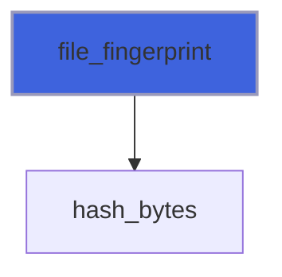

# foresight_fingerprint

> foresight_fingerprint, cheap change detection of files, for the watch mode.

 A fingerprint is the file size and a 32-bit FNV-1a hash of its content: of the whole file up to `FULL_LIMIT`
 bytes, of its first and last `EDGE` bytes beyond. Standard Fortran has no modification time, and the POSIX one
 needs the platform layout of `struct stat` and has a coarse resolution on some filesystems (network, WSL); the
 content is portable and exact. It catches appends (size), rewrites of the same size (a restarted job, an edit of
 `lw 2` into `lw 3` in a script) and, beyond `FULL_LIMIT`, any change of the first or last `EDGE` bytes: only a
 same-size change in the middle of a large file goes unnoticed, which append-only logs never do.

**Source**: `src/lib/foresight_fingerprint.F90`

## Contents

- [file_fingerprint](#file-fingerprint)

## Variables

| Name | Type | Attributes | Description |
|------|------|------------|-------------|
| `FULL_LIMIT` | integer(kind=I8P) | parameter | Files up to this size [bytes] are hashed whole. |
| `EDGE` | integer(kind=I8P) | parameter | Bytes hashed at each end of larger files. |
| `FNV_OFFSET` | integer(kind=I8P) | parameter | FNV-1a 32-bit offset basis. |
| `FNV_PRIME` | integer(kind=I8P) | parameter | FNV-1a 32-bit prime. |
| `MODULUS` | integer(kind=I8P) | parameter | 2**32: the hash stays below, so products fit I8P. |

## Functions

### file_fingerprint

Size and content hash of `file`; `[-1, 0]` if it is missing or unnamed.

**Returns**: `integer(kind=I8P)`

```fortran
function file_fingerprint(file) result(fingerprint)
```

**Arguments**

| Name | Type | Intent | Attributes | Description |
|------|------|--------|------------|-------------|
| `file` | character(len=*) | in |  | File name. |

**Call graph**


