# foresight_format

> foresight_format, deterministic number-to-text conversion and XML escaping.

 Output files are compared byte-for-byte against reference files, and the processor-dependent details of Fortran edit
 descriptors (optional leading zero of `F0.d`, signed zero, exponent layout) differ between compilers. Every number
 written by foresight therefore goes through integer arithmetic here: a value is rounded once to an integer count of
 `10**(-ndec)` units and the decimal string is assembled from its digits.

 User tick formats (gnuplot `set format`, a printf subset) are applied the same way, to the exact decimal value of a
 tick: `format_decimal` works on digit strings and rounds half to even, so the interactive viewer, which mirrors it,
 prints identical labels.

**Source**: `src/lib/foresight_format.F90`

## Contents

- [decimal_of](#decimal-of)
- [parse_decimal](#parse-decimal)
- [format_decimal](#format-decimal)
- [split_format](#split-format)
- [exp_digits](#exp-digits)
- [int_str](#int-str)
- [decimal_str](#decimal-str)
- [fixed](#fixed)
- [real_str](#real-str)
- [xml_escape](#xml-escape)
- [format_check](#format-check)
- [scale10](#scale10)
- [round_digits](#round-digits)
- [fixed_digits](#fixed-digits)
- [exp_text](#exp-text)
- [strip_zeros](#strip-zeros)

## Variables

| Name | Type | Attributes | Description |
|------|------|------------|-------------|
| `FIXED_CLAMP` | real(kind=R8P) | parameter | Magnitude clamp keeping `v * 10**ndec` inside I8P for `ndec <= 7`. |

## Subroutines

### decimal_of

Finite `v` rounded to 15 significant digits, as the exact decimal `n * 10**e` without trailing zeros in `n`.

**Attributes**: pure

```fortran
subroutine decimal_of(v, n, e)
```

**Arguments**

| Name | Type | Intent | Attributes | Description |
|------|------|--------|------------|-------------|
| `v` | real(kind=R8P) | in |  | Value. |
| `n` | integer(kind=I8P) | out |  | Mantissa. |
| `e` | integer(kind=I4P) | out |  | Exponent. |

**Call graph**

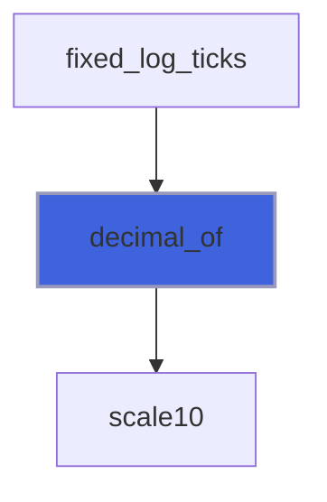

### parse_decimal

Exact value of the decimal number `text` (`[sign]digits[.digits][e[sign]digits]`) as `n * 10**e`, without
 trailing zeros in `n`; `ok` false if malformed or beyond 18 significant digits.

**Attributes**: pure

```fortran
subroutine parse_decimal(text, n, e, ok)
```

**Arguments**

| Name | Type | Intent | Attributes | Description |
|------|------|--------|------------|-------------|
| `text` | character(len=*) | in |  | Number. |
| `n` | integer(kind=I8P) | out |  | Mantissa. |
| `e` | integer(kind=I4P) | out |  | Exponent. |
| `ok` | logical | out |  | Well formed. |

**Call graph**

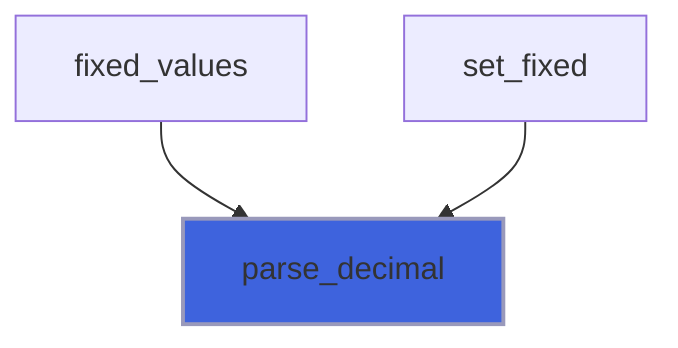

### format_decimal

Apply the tick `format` (see `format_check`; the format itself is returned if invalid) to the exact value
 `n * 10**e`, as C printf would to that decimal, rounding half to even. `sup` is the exponent of the `%h` form.

**Attributes**: pure

```fortran
subroutine format_decimal(format, n, e, label, sup)
```

**Arguments**

| Name | Type | Intent | Attributes | Description |
|------|------|--------|------------|-------------|
| `format` | character(len=*) | in |  | Format. |
| `n` | integer(kind=I8P) | in |  | Mantissa. |
| `e` | integer(kind=I4P) | in |  | Exponent. |
| `label` | character(len=:) | out | allocatable | Label. |
| `sup` | character(len=:) | out | allocatable | Superscript, empty if none. |

**Call graph**

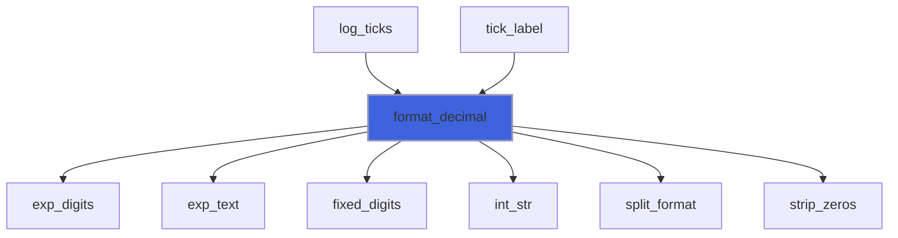

### split_format

Split a tick format into its text around the one conversion and the conversion fields.

**Attributes**: pure

```fortran
subroutine split_format(format, prefix, flags, width, prec, type, suffix, message)
```

**Arguments**

| Name | Type | Intent | Attributes | Description |
|------|------|--------|------------|-------------|
| `format` | character(len=*) | in |  | Format. |
| `prefix` | character(len=:) | out | allocatable | Text before the conversion, `%%` resolved. |
| `flags` | character(len=:) | out | allocatable | Flags. |
| `width` | integer(kind=I4P) | out |  | Field width, 0 if absent. |
| `prec` | integer(kind=I4P) | out |  | Precision, -1 if absent. |
| `type` | character(len=1) | out |  | Conversion type. |
| `suffix` | character(len=:) | out | allocatable | Text after the conversion, `%%` resolved. |
| `message` | character(len=:) | out | allocatable | Problem, empty if none. |

**Call graph**

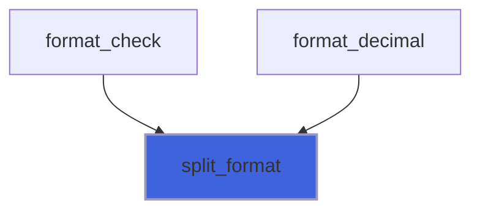

### exp_digits

Mantissa of `digits * 10**e` in exponent form with `prec` decimals (printf `%.<prec>e`), and its exponent.

**Attributes**: pure

```fortran
subroutine exp_digits(digits, e, prec, mantissa, x)
```

**Arguments**

| Name | Type | Intent | Attributes | Description |
|------|------|--------|------------|-------------|
| `digits` | character(len=*) | in |  | Decimal integer, no sign. |
| `e` | integer(kind=I4P) | in |  | Exponent. |
| `prec` | integer(kind=I4P) | in |  | Decimals of the mantissa. |
| `mantissa` | character(len=:) | out | allocatable | Mantissa. |
| `x` | integer(kind=I4P) | out |  | Exponent of the leading digit. |

**Call graph**

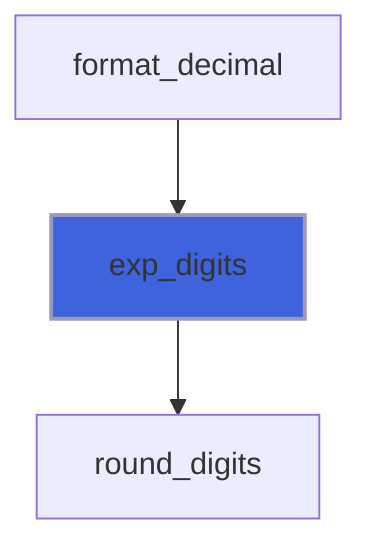

## Functions

### int_str

Integer to minimal-width decimal string.

**Attributes**: pure

**Returns**: `character(len=:)`

```fortran
function int_str(n) result(str)
```

**Arguments**

| Name | Type | Intent | Attributes | Description |
|------|------|--------|------------|-------------|
| `n` | integer(kind=I8P) | in |  | Integer. |

**Call graph**

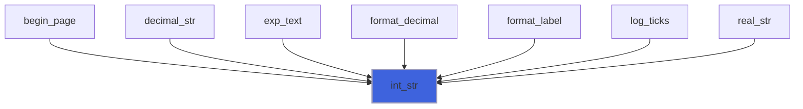

### decimal_str

Exact decimal string of the value `n * 10**(-ndec)`, without trailing fractional zeros.

 A negative `ndec` appends zeros: `decimal_str(15_I8P, -2_I4P)` is `1500`.

**Attributes**: pure

**Returns**: `character(len=:)`

```fortran
function decimal_str(n, ndec) result(str)
```

**Arguments**

| Name | Type | Intent | Attributes | Description |
|------|------|--------|------------|-------------|
| `n` | integer(kind=I8P) | in |  | Integer mantissa. |
| `ndec` | integer(kind=I4P) | in |  | Number of decimal digits of the mantissa. |

**Call graph**

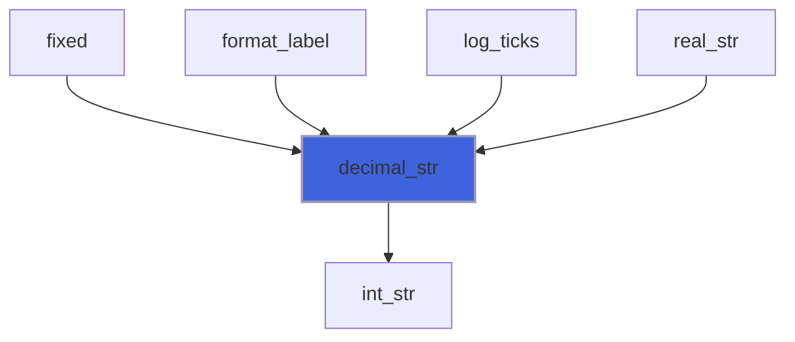

### fixed

Value rounded to `ndec <= 7` decimals, trailing zeros stripped; `-0` prints as `0`.

 Magnitudes are clamped to 1e11: callers format pixel and unit-square coordinates only, where larger values lie far
 outside any clip region. `v` must not be NaN.

**Attributes**: pure

**Returns**: `character(len=:)`

```fortran
function fixed(v, ndec) result(str)
```

**Arguments**

| Name | Type | Intent | Attributes | Description |
|------|------|--------|------------|-------------|
| `v` | real(kind=R8P) | in |  | Value. |
| `ndec` | integer(kind=I4P) | in |  | Number of decimals. |

**Call graph**

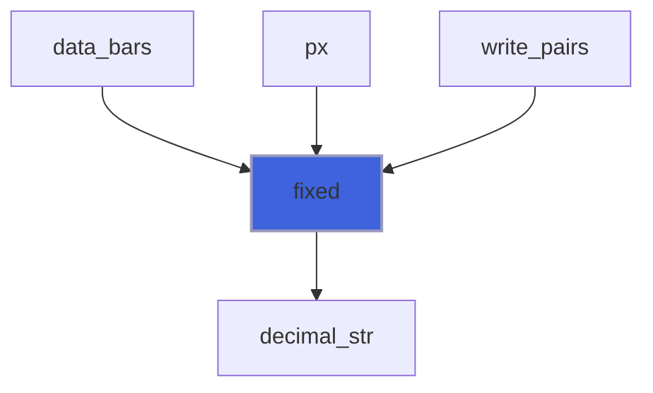

### real_str

Finite `v` with 15 significant digits, as `d.ddde<exp>` (trailing zeros stripped) or `0`.

 Readable back by any language to within 1e-15 relative: used for metadata consumed by the interactive viewer.

**Attributes**: pure

**Returns**: `character(len=:)`

```fortran
function real_str(v) result(str)
```

**Arguments**

| Name | Type | Intent | Attributes | Description |
|------|------|--------|------------|-------------|
| `v` | real(kind=R8P) | in |  | Value. |

**Call graph**

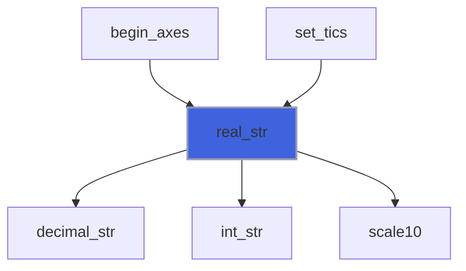

### xml_escape

Escape the XML special characters `&`, `<`, `>` and `"`.

**Attributes**: pure

**Returns**: `character(len=:)`

```fortran
function xml_escape(text) result(escaped)
```

**Arguments**

| Name | Type | Intent | Attributes | Description |
|------|------|--------|------------|-------------|
| `text` | character(len=*) | in |  | Raw text. |

**Call graph**

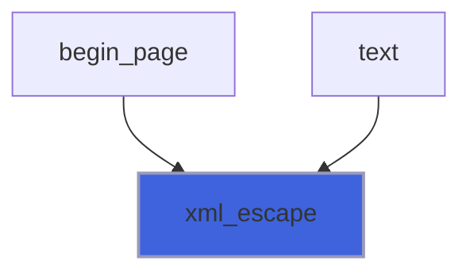

### format_check

Empty if `format` is a supported tick format: text with one conversion `%[flags][width][.precision]type`, flags
 among `-+ 0`, type `f`, `e`, `E`, `g`, `G` or `h` (gnuplot: `g` with a `x10` superscript exponent), and `%%` for `%`.

**Attributes**: pure

**Returns**: `character(len=:)`

```fortran
function format_check(format) result(message)
```

**Arguments**

| Name | Type | Intent | Attributes | Description |
|------|------|--------|------------|-------------|
| `format` | character(len=*) | in |  | Format. |

**Call graph**

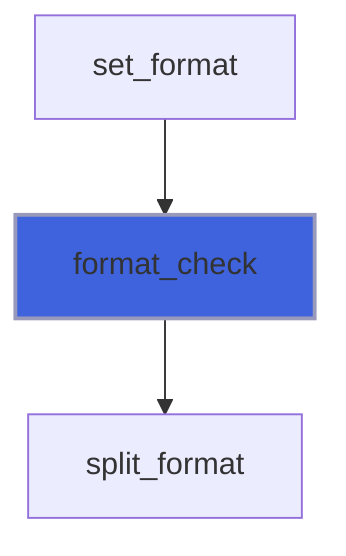

### scale10

`x * 10**e`, in steps of at most 10**22 (exact powers of ten) to never overflow an intermediate.

**Attributes**: pure

**Returns**: `real(kind=R8P)`

```fortran
function scale10(x, e) result(y)
```

**Arguments**

| Name | Type | Intent | Attributes | Description |
|------|------|--------|------------|-------------|
| `x` | real(kind=R8P) | in |  | Value. |
| `e` | integer(kind=I4P) | in |  | Decimal exponent. |

**Call graph**

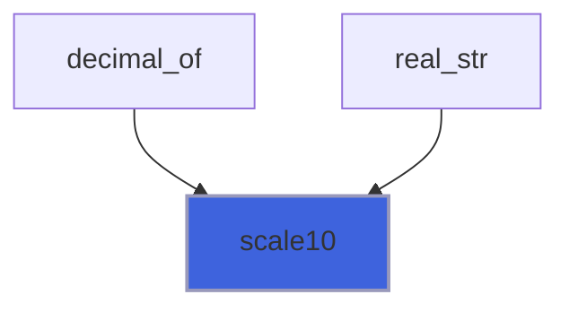

### round_digits

The decimal integer `digits` with its last `drop` digits removed, rounded half to even; `drop <= 0` appends
 `-drop` zeros. No leading zeros, except for `0`.

**Attributes**: pure

**Returns**: `character(len=:)`

```fortran
function round_digits(digits, drop) result(rounded)
```

**Arguments**

| Name | Type | Intent | Attributes | Description |
|------|------|--------|------------|-------------|
| `digits` | character(len=*) | in |  | Decimal integer. |
| `drop` | integer(kind=I4P) | in |  | Digits to remove. |

**Call graph**

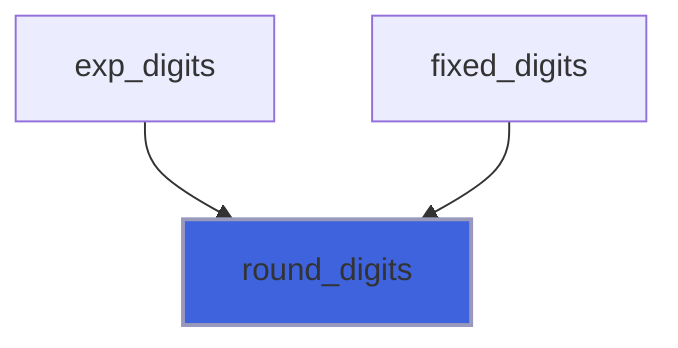

### fixed_digits

`digits * 10**e` with `prec` decimals (printf `%.<prec>f`), rounded half to even.

**Attributes**: pure

**Returns**: `character(len=:)`

```fortran
function fixed_digits(digits, e, prec) result(text)
```

**Arguments**

| Name | Type | Intent | Attributes | Description |
|------|------|--------|------------|-------------|
| `digits` | character(len=*) | in |  | Decimal integer, no sign. |
| `e` | integer(kind=I4P) | in |  | Exponent. |
| `prec` | integer(kind=I4P) | in |  | Decimals. |

**Call graph**

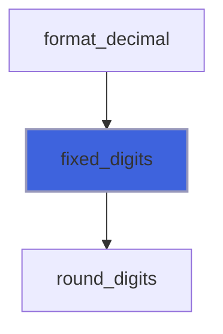

### exp_text

C exponent text: letter, sign, at least two digits.

**Attributes**: pure

**Returns**: `character(len=:)`

```fortran
function exp_text(letter, x) result(text)
```

**Arguments**

| Name | Type | Intent | Attributes | Description |
|------|------|--------|------------|-------------|
| `letter` | character(len=1) | in |  | `e` or `E`. |
| `x` | integer(kind=I4P) | in |  | Exponent. |

**Call graph**

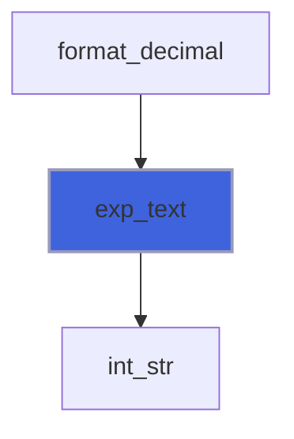

### strip_zeros

Remove trailing zeros of a fraction, and the point if nothing remains after it.

**Attributes**: pure

**Returns**: `character(len=:)`

```fortran
function strip_zeros(text) result(stripped)
```

**Arguments**

| Name | Type | Intent | Attributes | Description |
|------|------|--------|------------|-------------|
| `text` | character(len=*) | in |  | Number without exponent. |

**Call graph**

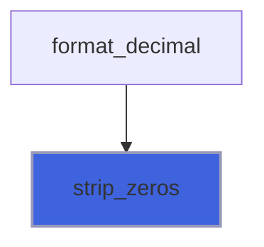
