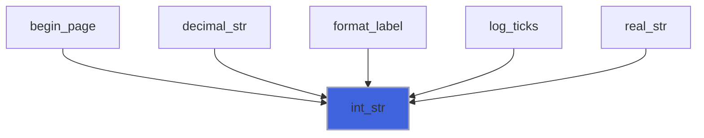
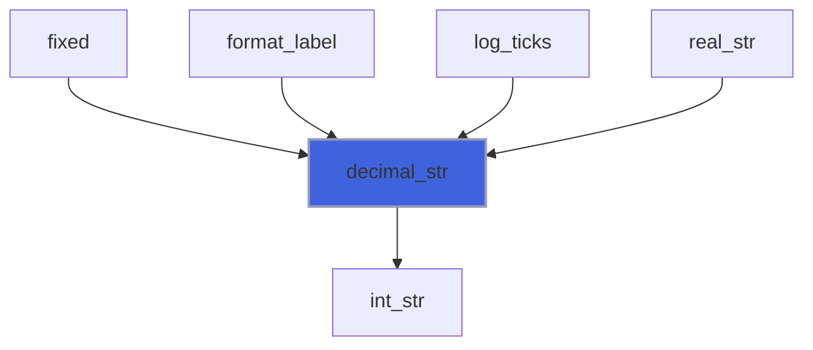
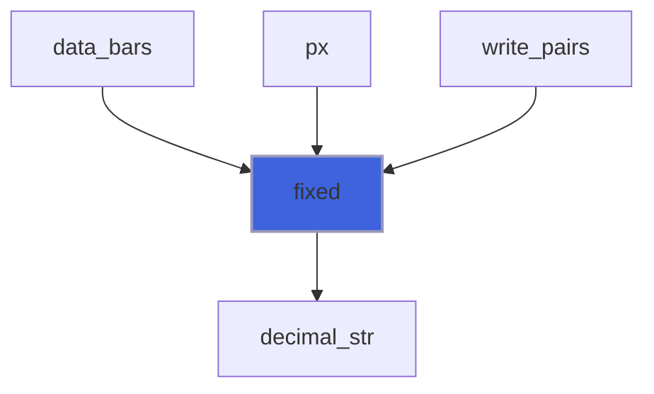
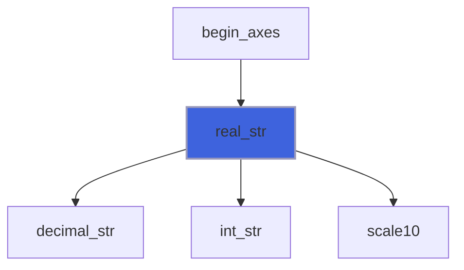
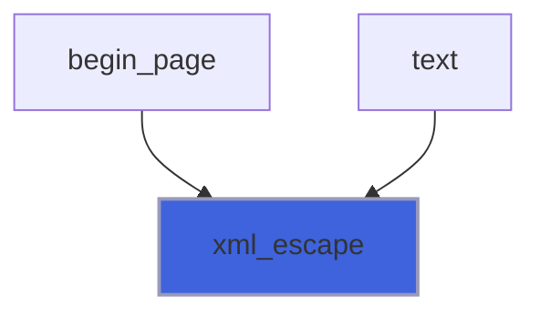
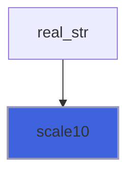

# foresight_format

> foresight_format, deterministic number-to-text conversion and XML escaping.

 Output files are compared byte-for-byte against reference files, and the processor-dependent details of Fortran edit
 descriptors (optional leading zero of `F0.d`, signed zero, exponent layout) differ between compilers. Every number
 written by foresight therefore goes through integer arithmetic here: a value is rounded once to an integer count of
 `10**(-ndec)` units and the decimal string is assembled from its digits.

**Source**: `src/lib/foresight_format.F90`

## Contents

- [int_str](#int-str)
- [decimal_str](#decimal-str)
- [fixed](#fixed)
- [real_str](#real-str)
- [xml_escape](#xml-escape)
- [scale10](#scale10)

## Variables

| Name | Type | Attributes | Description |
|------|------|------------|-------------|
| `FIXED_CLAMP` | real(kind=R8P) | parameter | Magnitude clamp keeping `v * 10**ndec` inside I8P for `ndec <= 7`. |

## Functions

### int_str

Integer to minimal-width decimal string.

**Attributes**: pure

**Returns**: `character(len=:)`

```fortran
function int_str(n) result(str)
```

**Arguments**

| Name | Type | Intent | Attributes | Description |
|------|------|--------|------------|-------------|
| `n` | integer(kind=I8P) | in |  | Integer. |

**Call graph**



### decimal_str

Exact decimal string of the value `n * 10**(-ndec)`, without trailing fractional zeros.

 A negative `ndec` appends zeros: `decimal_str(15_I8P, -2_I4P)` is `1500`.

**Attributes**: pure

**Returns**: `character(len=:)`

```fortran
function decimal_str(n, ndec) result(str)
```

**Arguments**

| Name | Type | Intent | Attributes | Description |
|------|------|--------|------------|-------------|
| `n` | integer(kind=I8P) | in |  | Integer mantissa. |
| `ndec` | integer(kind=I4P) | in |  | Number of decimal digits of the mantissa. |

**Call graph**



### fixed

Value rounded to `ndec <= 7` decimals, trailing zeros stripped; `-0` prints as `0`.

 Magnitudes are clamped to 1e11: callers format pixel and unit-square coordinates only, where larger values lie far
 outside any clip region. `v` must not be NaN.

**Attributes**: pure

**Returns**: `character(len=:)`

```fortran
function fixed(v, ndec) result(str)
```

**Arguments**

| Name | Type | Intent | Attributes | Description |
|------|------|--------|------------|-------------|
| `v` | real(kind=R8P) | in |  | Value. |
| `ndec` | integer(kind=I4P) | in |  | Number of decimals. |

**Call graph**



### real_str

Finite `v` with 15 significant digits, as `d.ddde<exp>` (trailing zeros stripped) or `0`.

 Readable back by any language to within 1e-15 relative: used for metadata consumed by the interactive viewer.

**Attributes**: pure

**Returns**: `character(len=:)`

```fortran
function real_str(v) result(str)
```

**Arguments**

| Name | Type | Intent | Attributes | Description |
|------|------|--------|------------|-------------|
| `v` | real(kind=R8P) | in |  | Value. |

**Call graph**



### xml_escape

Escape the XML special characters `&`, `<`, `>` and `"`.

**Attributes**: pure

**Returns**: `character(len=:)`

```fortran
function xml_escape(text) result(escaped)
```

**Arguments**

| Name | Type | Intent | Attributes | Description |
|------|------|--------|------------|-------------|
| `text` | character(len=*) | in |  | Raw text. |

**Call graph**



### scale10

`x * 10**e`, in steps of at most 10**22 (exact powers of ten) to never overflow an intermediate.

**Attributes**: pure

**Returns**: `real(kind=R8P)`

```fortran
function scale10(x, e) result(y)
```

**Arguments**

| Name | Type | Intent | Attributes | Description |
|------|------|--------|------------|-------------|
| `x` | real(kind=R8P) | in |  | Value. |
| `e` | integer(kind=I4P) | in |  | Decimal exponent. |

**Call graph**


