# foresight_script

> foresight_script, interpreter of a gnuplot command subset.

 Supported (with gnuplot abbreviations):

 - `set|unset title|xlabel|ylabel ["text"]`, `set xrange|yrange [min:max]` (`*` or empty autoscales an end),
   `set|unset logscale [x|y|xy]`, `set|unset grid`, `set|unset key`, `set output "file"`,
   `set terminal svg|html [size W,H] [refresh SECONDS]`;
 - `set terminal dumb [size COLS,ROWS]` (text, default 79x24 on standard output `-`);
 - `set|unset multiplot [layout ROWS,COLS] [title "t"]`: each `plot` fills the next panel, settings carry over;
 - `set xtics|ytics [auto|STEP|START,STEP[,END]]`, `unset xtics|ytics`, `set format [x|y|xy] ["fmt"]`,
   `unset format`, `set key [on|off] [left|right|center] [top|bottom|center] [box|nobox]`,
   `set style data STYLE`, `set style line N [lc ...] [lt N] [lw W] [dt N] [ps S]`;
 - `plot 'file' [using [X:]Y[:...]] [index N] [every I:J:K:L:M:N] [with STYLE] [title "t"|notitle] [lc [rgb] "color"|N] [lw W]
   [dt N] [ps S], ...` (`''` repeats the previous file), STYLE `lines|points|linespoints|yerrorbars|xerrorbars|
   xyerrorbars` (error bars: `x:y:dy` or `x:y:low:high`, `x:y:dx:dy` or `x:y:xlow:xhigh:ylow:yhigh`); `replot [items]`;
   a `using` field is a column number or a parenthesized expression, `($2*1e3)` (see foresight_expression);
   `ls N`, `lt N` in an item apply a line style, a palette color.

 Anything else is an error naming the command, never silently ignored. Errors are returned (`iostat`, `iomsg` with
 `source:line:`), not stopped on, so a watch loop can survive a bad cycle.

**Source**: `src/lib/foresight_script.F90`

**Dependencies**

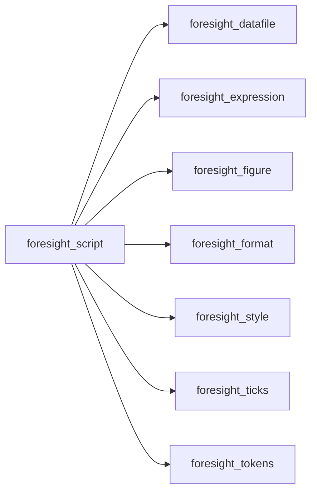

## Contents

- [line_style_object](#line-style-object)
- [script_object](#script-object)
- [init](#init)
- [run_file](#run-file)
- [run_text](#run-text)
- [execute](#execute)
- [plot_command](#plot-command)
- [register_file](#register-file)
- [save_output](#save-output)
- [set_command](#set-command)
- [unset_command](#unset-command)
- [fail](#fail)
- [parse_using](#parse-using)
- [apply_line_style](#apply-line-style)
- [parse_every](#parse-every)
- [after_command](#after-command)
- [axes_argument](#axes-argument)
- [canonical_style](#canonical-style)
- [change_extension](#change-extension)
- [extension](#extension)
- [is_multiplot_option](#is-multiplot-option)
- [keyword](#keyword)
- [next_integer](#next-integer)
- [next_real](#next-real)
- [next_word](#next-word)
- [no_more](#no-more)
- [is_line_option](#is-line-option)
- [line_option](#line-option)
- [plain_columns](#plain-columns)
- [string_argument](#string-argument)
- [to_number](#to-number)

## Variables

| Name | Type | Attributes | Description |
|------|------|------------|-------------|
| `DUMB_CELL` | real(kind=R8P) | parameter | Text device cell size [font size]. |

## Derived Types

### line_style_object

Line properties: a `set style line`, or the options of a plot item; unallocated means the default.

#### Components

| Name | Type | Attributes | Description |
|------|------|------------|-------------|
| `id` | integer(kind=I4P) |  | Style number. |
| `lc` | character(len=:) | allocatable | Color. |
| `lw` | real(kind=R8P) | allocatable | Line width. |
| `dt` | integer(kind=I4P) | allocatable | Dash type. |
| `ps` | real(kind=R8P) | allocatable | Point size. |

### script_object

Script interpreter state.

#### Components

| Name | Type | Attributes | Description |
|------|------|------------|-------------|
| `figure` | type([figure_object](/api/src/lib/foresight_figure#figure-object)) |  | Figure being built. |
| `output` | character(len=:) | allocatable | Current output file. |
| `output_set` | logical |  | Output set by `set output`. |
| `previous_file` | character(len=:) | allocatable | File of the last plot item, for `''`. |
| `last_plot` | character(len=:) | allocatable | Items of the last plot, for `replot`. |
| `data_files` | type([token_object](/api/src/lib/foresight_tokens#token-object)) | allocatable | Data files read, for watching. |
| `live_refresh` | integer(kind=I4P) |  | HTML reload period applied when none is set [s]. |
| `multiplot` | logical |  | Inside `set multiplot`. |
| `advance_pending` | logical |  | A multiplot panel was plotted: the next command |
| `data_style` | character(len=:) | allocatable | Default plot style, `set style data`. |
| `line_styles` | type([line_style_object](/api/src/lib/foresight_script#line-style-object)) | allocatable | `set style line` definitions. |

#### Type-Bound Procedures

| Name | Attributes | Description |
|------|------------|-------------|
| `execute` | pass(self) | Execute one statement. |
| `init` | pass(self) | Reset the interpreter. |
| `run_file` | pass(self) | Run a script file. |
| `run_text` | pass(self) | Run script text. |
| `plot_command` | pass(self) | `plot`. |
| `register_file` | pass(self) | Remember a data file. |
| `save_output` | pass(self) | Render to the current output. |
| `set_command` | pass(self) | `set`. |
| `unset_command` | pass(self) | `unset`. |

## Subroutines

### init

Reset the interpreter; plots go to `output` until `set output`.

```fortran
subroutine init(self, output)
```

**Arguments**

| Name | Type | Intent | Attributes | Description |
|------|------|--------|------------|-------------|
| `self` | class([script_object](/api/src/lib/foresight_script#script-object)) | inout |  | Interpreter. |
| `output` | character(len=*) | in |  | Default output file. |

**Call graph**

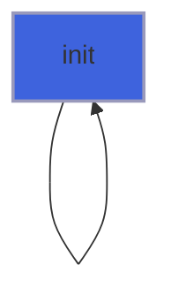

### run_file

Run the script `file`.

```fortran
subroutine run_file(self, file, iostat, iomsg)
```

**Arguments**

| Name | Type | Intent | Attributes | Description |
|------|------|--------|------------|-------------|
| `self` | class([script_object](/api/src/lib/foresight_script#script-object)) | inout |  | Interpreter. |
| `file` | character(len=*) | in |  | Script file. |
| `iostat` | integer(kind=I4P) | out |  | 0 on success. |
| `iomsg` | character(len=:) | out | allocatable | Error message. |

**Call graph**

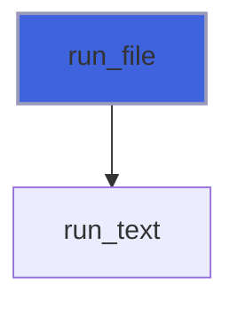

### run_text

Run script `text`: lines ending in `\` continue on the next one; the first error stops the run.

```fortran
subroutine run_text(self, text, iostat, iomsg, source)
```

**Arguments**

| Name | Type | Intent | Attributes | Description |
|------|------|--------|------------|-------------|
| `self` | class([script_object](/api/src/lib/foresight_script#script-object)) | inout |  | Interpreter. |
| `text` | character(len=*) | in |  | Script text. |
| `iostat` | integer(kind=I4P) | out |  | 0 on success. |
| `iomsg` | character(len=:) | out | allocatable | Error message, `source:line: ...`. |
| `source` | character(len=*) | in | optional | Source name for messages. |

**Call graph**

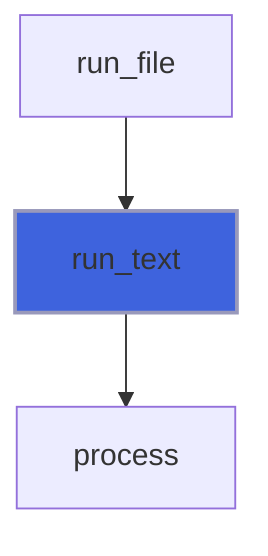

### execute

Execute one statement.

```fortran
subroutine execute(self, statement, iostat, iomsg)
```

**Arguments**

| Name | Type | Intent | Attributes | Description |
|------|------|--------|------------|-------------|
| `self` | class([script_object](/api/src/lib/foresight_script#script-object)) | inout |  | Interpreter. |
| `statement` | character(len=*) | in |  | Statement. |
| `iostat` | integer(kind=I4P) | out |  | 0 on success. |
| `iomsg` | character(len=:) | out | allocatable | Error message. |

**Call graph**

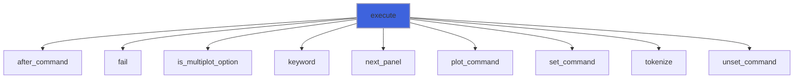

### plot_command

`plot` items: each a data file with modifiers, comma separated; replaces the previous plot and renders it.

```fortran
subroutine plot_command(self, tokens, iostat, iomsg)
```

**Arguments**

| Name | Type | Intent | Attributes | Description |
|------|------|--------|------------|-------------|
| `self` | class([script_object](/api/src/lib/foresight_script#script-object)) | inout |  | Interpreter. |
| `tokens` | type([token_object](/api/src/lib/foresight_tokens#token-object)) | in |  | Items tokens. |
| `iostat` | integer(kind=I4P) | out |  | 0 on success. |
| `iomsg` | character(len=:) | out | allocatable | Error message. |

**Call graph**

```mermaid
flowchart TD
  execute["execute"] --> plot_command["plot_command"]
  plot_command["plot_command"] --> apply_line_style["apply_line_style"]
  plot_command["plot_command"] --> canonical_style["canonical_style"]
  plot_command["plot_command"] --> clear["clear"]
  plot_command["plot_command"] --> default_using["default_using"]
  plot_command["plot_command"] --> fail["fail"]
  plot_command["plot_command"] --> is_line_option["is_line_option"]
  plot_command["plot_command"] --> keyword["keyword"]
  plot_command["plot_command"] --> line_option["line_option"]
  plot_command["plot_command"] --> load["load"]
  plot_command["plot_command"] --> next_integer["next_integer"]
  plot_command["plot_command"] --> next_word["next_word"]
  plot_command["plot_command"] --> parse_every["parse_every"]
  plot_command["plot_command"] --> parse_using["parse_using"]
  plot_command["plot_command"] --> plain_columns["plain_columns"]
  plot_command["plot_command"] --> plot["plot"]
  plot_command["plot_command"] --> register_file["register_file"]
  plot_command["plot_command"] --> save_output["save_output"]
  plot_command["plot_command"] --> set_column["set_column"]
  plot_command["plot_command"] --> table["table"]
  style plot_command fill:#3e63dd,stroke:#99b,stroke-width:2px
```

### register_file

Remember `file` among the data files read (once).

```fortran
subroutine register_file(self, file)
```

**Arguments**

| Name | Type | Intent | Attributes | Description |
|------|------|--------|------------|-------------|
| `self` | class([script_object](/api/src/lib/foresight_script#script-object)) | inout |  | Interpreter. |
| `file` | character(len=*) | in |  | Data file. |

**Call graph**

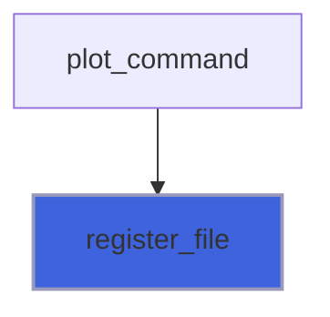

### save_output

Render the figure to the current output; the format follows its extension.

```fortran
subroutine save_output(self, iostat, iomsg)
```

**Arguments**

| Name | Type | Intent | Attributes | Description |
|------|------|--------|------------|-------------|
| `self` | class([script_object](/api/src/lib/foresight_script#script-object)) | inout |  | Interpreter. |
| `iostat` | integer(kind=I4P) | out |  | 0 on success. |
| `iomsg` | character(len=:) | out | allocatable | Error message. |

**Call graph**

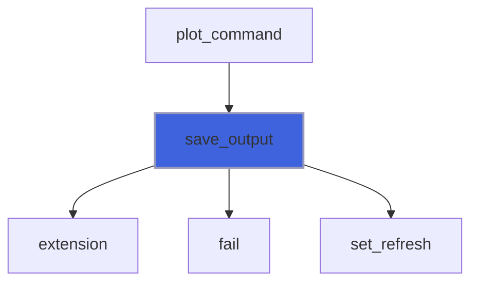

### set_command

`set` options.

```fortran
subroutine set_command(self, tokens, iostat, iomsg)
```

**Arguments**

| Name | Type | Intent | Attributes | Description |
|------|------|--------|------------|-------------|
| `self` | class([script_object](/api/src/lib/foresight_script#script-object)) | inout |  | Interpreter. |
| `tokens` | type([token_object](/api/src/lib/foresight_tokens#token-object)) | in |  | Option tokens. |
| `iostat` | integer(kind=I4P) | out |  | 0 on success. |
| `iomsg` | character(len=:) | out | allocatable | Error message. |

**Call graph**

```mermaid
flowchart TD
  execute["execute"] --> set_command["set_command"]
  set_command["set_command"] --> axes_argument["axes_argument"]
  set_command["set_command"] --> change_extension["change_extension"]
  set_command["set_command"] --> fail["fail"]
  set_command["set_command"] --> format_option["format_option"]
  set_command["set_command"] --> key_option["key_option"]
  set_command["set_command"] --> keyword["keyword"]
  set_command["set_command"] --> next_integer["next_integer"]
  set_command["set_command"] --> no_more["no_more"]
  set_command["set_command"] --> set_grid["set_grid"]
  set_command["set_command"] --> set_logscale["set_logscale"]
  set_command["set_command"] --> set_multiplot["set_multiplot"]
  set_command["set_command"] --> set_range["set_range"]
  set_command["set_command"] --> set_refresh["set_refresh"]
  set_command["set_command"] --> set_title["set_title"]
  set_command["set_command"] --> set_xlabel["set_xlabel"]
  set_command["set_command"] --> set_ylabel["set_ylabel"]
  set_command["set_command"] --> string_argument["string_argument"]
  set_command["set_command"] --> style_option["style_option"]
  set_command["set_command"] --> tics_option["tics_option"]
  style set_command fill:#3e63dd,stroke:#99b,stroke-width:2px
```

### unset_command

`unset` options.

```fortran
subroutine unset_command(self, tokens, iostat, iomsg)
```

**Arguments**

| Name | Type | Intent | Attributes | Description |
|------|------|--------|------------|-------------|
| `self` | class([script_object](/api/src/lib/foresight_script#script-object)) | inout |  | Interpreter. |
| `tokens` | type([token_object](/api/src/lib/foresight_tokens#token-object)) | in |  | Option tokens. |
| `iostat` | integer(kind=I4P) | out |  | 0 on success. |
| `iomsg` | character(len=:) | out | allocatable | Error message. |

**Call graph**

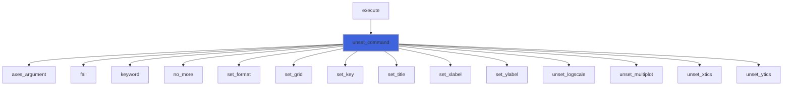

### fail

Set an error.

**Attributes**: pure

```fortran
subroutine fail(message, iostat, iomsg)
```

**Arguments**

| Name | Type | Intent | Attributes | Description |
|------|------|--------|------------|-------------|
| `message` | character(len=*) | in |  | Error message. |
| `iostat` | integer(kind=I4P) | out |  | Set to 1. |
| `iomsg` | character(len=:) | out | allocatable | Set to `message`. |

**Call graph**

```mermaid
flowchart TD
  axes_argument["axes_argument"] --> fail["fail"]
  execute["execute"] --> fail["fail"]
  line_option["line_option"] --> fail["fail"]
  next_integer["next_integer"] --> fail["fail"]
  next_real["next_real"] --> fail["fail"]
  next_word["next_word"] --> fail["fail"]
  no_more["no_more"] --> fail["fail"]
  parse_every["parse_every"] --> fail["fail"]
  parse_using["parse_using"] --> fail["fail"]
  plot_command["plot_command"] --> fail["fail"]
  save_output["save_output"] --> fail["fail"]
  set_command["set_command"] --> fail["fail"]
  string_argument["string_argument"] --> fail["fail"]
  unset_command["unset_command"] --> fail["fail"]
  style fail fill:#3e63dd,stroke:#99b,stroke-width:2px
```

### parse_using

`using` specification: 1 to 6 colon separated fields, each a column number (0 is the point number) or a
 parenthesized expression, as in gnuplot.

```fortran
subroutine parse_using(spec, fields, iostat, iomsg)
```

**Arguments**

| Name | Type | Intent | Attributes | Description |
|------|------|--------|------------|-------------|
| `spec` | character(len=*) | in |  | Specification. |
| `fields` | type([expression_object](/api/src/lib/foresight_expression#expression-object)) | out | allocatable | Fields. |
| `iostat` | integer(kind=I4P) | out |  | 0 on success. |
| `iomsg` | character(len=:) | out | allocatable | Error message. |

**Call graph**

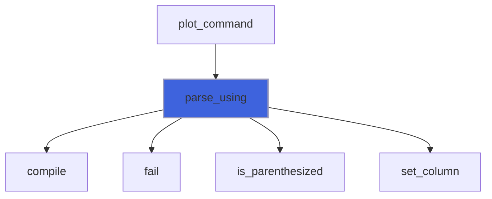

### apply_line_style

Apply the line style `id` to `line`: its defined properties; an undefined style is the linetype `id`, as gnuplot.

**Attributes**: pure

```fortran
subroutine apply_line_style(styles, id, line)
```

**Arguments**

| Name | Type | Intent | Attributes | Description |
|------|------|--------|------------|-------------|
| `styles` | type([line_style_object](/api/src/lib/foresight_script#line-style-object)) | in |  | Defined styles. |
| `id` | integer(kind=I4P) | in |  | Style number. |
| `line` | type([line_style_object](/api/src/lib/foresight_script#line-style-object)) | inout |  | Line properties. |

**Call graph**

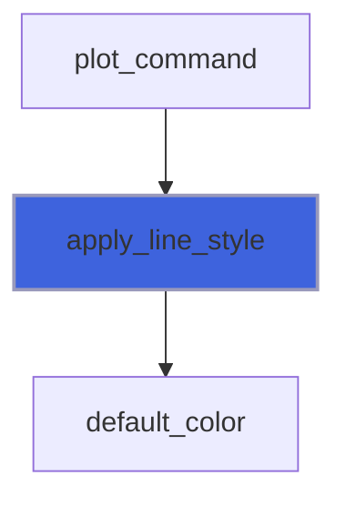

### parse_every

gnuplot `every point_incr:block_incr:start_point:start_block:end_point:end_block`; empty or missing fields keep
 their defaults (1, 1, 0, 0, no end, no end).

```fortran
subroutine parse_every(spec, every, iostat, iomsg)
```

**Arguments**

| Name | Type | Intent | Attributes | Description |
|------|------|--------|------------|-------------|
| `spec` | character(len=*) | in |  | Specification. |
| `every` | integer(kind=I4P) | out |  | Fields, ends -1 for none. |
| `iostat` | integer(kind=I4P) | out |  | 0 on success. |
| `iomsg` | character(len=:) | out | allocatable | Error message. |

**Call graph**

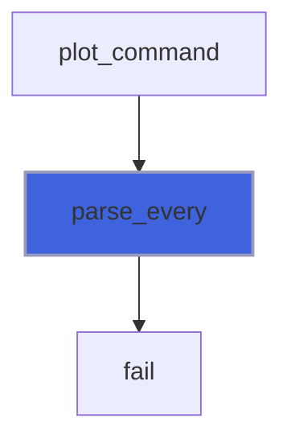

## Functions

### after_command

Text of `statement` after its first word.

**Attributes**: pure

**Returns**: `character(len=:)`

```fortran
function after_command(statement) result(rest)
```

**Arguments**

| Name | Type | Intent | Attributes | Description |
|------|------|--------|------------|-------------|
| `statement` | character(len=*) | in |  | Statement. |

**Call graph**

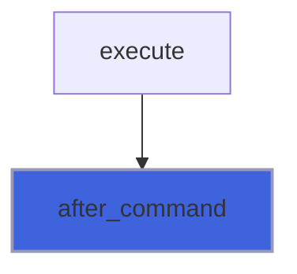

### axes_argument

Optional axes letters after a `logscale` option (default `xy`); a base other than 10 is an error.

**Returns**: `logical`

```fortran
function axes_argument(tokens, axes, iostat, iomsg) result(ok)
```

**Arguments**

| Name | Type | Intent | Attributes | Description |
|------|------|--------|------------|-------------|
| `tokens` | type([token_object](/api/src/lib/foresight_tokens#token-object)) | in |  | Option tokens. |
| `axes` | character(len=:) | out | allocatable | Axes letters. |
| `iostat` | integer(kind=I4P) | out |  | 0 on success. |
| `iomsg` | character(len=:) | out | allocatable | Error message. |

**Call graph**

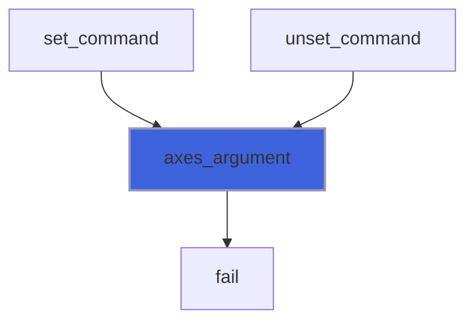

### canonical_style

Full gnuplot style name of `word` (full or abbreviated), empty if unsupported.

**Attributes**: pure

**Returns**: `character(len=:)`

```fortran
function canonical_style(word) result(style)
```

**Arguments**

| Name | Type | Intent | Attributes | Description |
|------|------|--------|------------|-------------|
| `word` | character(len=*) | in |  | Style word. |

**Call graph**

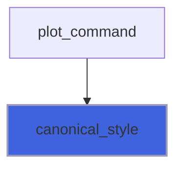

### change_extension

`file` with its extension replaced by `ext` (appended if none).

**Attributes**: pure

**Returns**: `character(len=:)`

```fortran
function change_extension(file, ext) result(renamed)
```

**Arguments**

| Name | Type | Intent | Attributes | Description |
|------|------|--------|------------|-------------|
| `file` | character(len=*) | in |  | File name. |
| `ext` | character(len=*) | in |  | New extension. |

**Call graph**

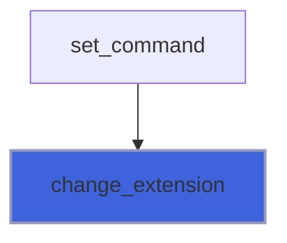

### extension

Lower case extension of `file`, empty if none.

**Attributes**: pure

**Returns**: `character(len=:)`

```fortran
function extension(file) result(ext)
```

**Arguments**

| Name | Type | Intent | Attributes | Description |
|------|------|--------|------------|-------------|
| `file` | character(len=*) | in |  | File name. |

**Call graph**

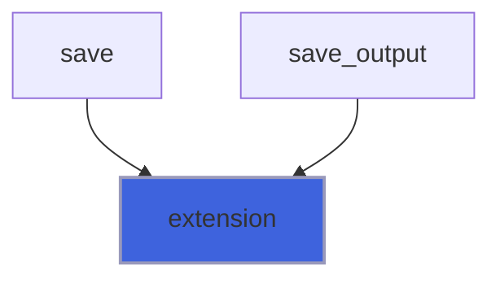

### is_multiplot_option

Whether the statement is `set|unset multiplot ...`.

**Attributes**: pure

**Returns**: `logical`

```fortran
function is_multiplot_option(tokens) result(is)
```

**Arguments**

| Name | Type | Intent | Attributes | Description |
|------|------|--------|------------|-------------|
| `tokens` | type([token_object](/api/src/lib/foresight_tokens#token-object)) | in |  | Statement tokens. |

**Call graph**

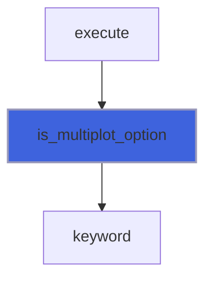

### keyword

Whether `word` abbreviates `full` with at least `minimum` characters, as gnuplot keywords.

**Attributes**: pure

**Returns**: `logical`

```fortran
function keyword(word, full, minimum) result(match)
```

**Arguments**

| Name | Type | Intent | Attributes | Description |
|------|------|--------|------------|-------------|
| `word` | character(len=*) | in |  | Word. |
| `full` | character(len=*) | in |  | Full keyword. |
| `minimum` | integer(kind=I4P) | in |  | Shortest accepted abbreviation. |

**Call graph**

```mermaid
flowchart TD
  execute["execute"] --> keyword["keyword"]
  is_line_option["is_line_option"] --> keyword["keyword"]
  is_multiplot_option["is_multiplot_option"] --> keyword["keyword"]
  line_option["line_option"] --> keyword["keyword"]
  plot_command["plot_command"] --> keyword["keyword"]
  set_command["set_command"] --> keyword["keyword"]
  unset_command["unset_command"] --> keyword["keyword"]
  style keyword fill:#3e63dd,stroke:#99b,stroke-width:2px
```

### next_integer

Advance `i` to the next token, which must be an integer.

**Returns**: `logical`

```fortran
function next_integer(tokens, i, value, iostat, iomsg) result(ok)
```

**Arguments**

| Name | Type | Intent | Attributes | Description |
|------|------|--------|------------|-------------|
| `tokens` | type([token_object](/api/src/lib/foresight_tokens#token-object)) | in |  | Tokens. |
| `i` | integer(kind=I4P) | inout |  | Token counter. |
| `value` | integer(kind=I4P) | out |  | Integer. |
| `iostat` | integer(kind=I4P) | out |  | 0 on success. |
| `iomsg` | character(len=:) | out | allocatable | Error message. |

**Call graph**

```mermaid
flowchart TD
  line_option["line_option"] --> next_integer["next_integer"]
  plot_command["plot_command"] --> next_integer["next_integer"]
  set_command["set_command"] --> next_integer["next_integer"]
  next_integer["next_integer"] --> fail["fail"]
  next_integer["next_integer"] --> next_word["next_word"]
  style next_integer fill:#3e63dd,stroke:#99b,stroke-width:2px
```

### next_real

Advance `i` to the next token, which must be a number.

**Returns**: `logical`

```fortran
function next_real(tokens, i, value, iostat, iomsg) result(ok)
```

**Arguments**

| Name | Type | Intent | Attributes | Description |
|------|------|--------|------------|-------------|
| `tokens` | type([token_object](/api/src/lib/foresight_tokens#token-object)) | in |  | Tokens. |
| `i` | integer(kind=I4P) | inout |  | Token counter. |
| `value` | real(kind=R8P) | out |  | Number. |
| `iostat` | integer(kind=I4P) | out |  | 0 on success. |
| `iomsg` | character(len=:) | out | allocatable | Error message. |

**Call graph**

```mermaid
flowchart TD
  line_option["line_option"] --> next_real["next_real"]
  next_real["next_real"] --> fail["fail"]
  next_real["next_real"] --> next_word["next_word"]
  next_real["next_real"] --> to_number["to_number"]
  style next_real fill:#3e63dd,stroke:#99b,stroke-width:2px
```

### next_word

Advance `i` to the next token, which must be a bare word.

**Returns**: `logical`

```fortran
function next_word(tokens, i, word, iostat, iomsg) result(ok)
```

**Arguments**

| Name | Type | Intent | Attributes | Description |
|------|------|--------|------------|-------------|
| `tokens` | type([token_object](/api/src/lib/foresight_tokens#token-object)) | in |  | Tokens. |
| `i` | integer(kind=I4P) | inout |  | Token counter. |
| `word` | character(len=:) | out | allocatable | Token text. |
| `iostat` | integer(kind=I4P) | out |  | 0 on success. |
| `iomsg` | character(len=:) | out | allocatable | Error message. |

**Call graph**

```mermaid
flowchart TD
  next_integer["next_integer"] --> next_word["next_word"]
  next_real["next_real"] --> next_word["next_word"]
  plot_command["plot_command"] --> next_word["next_word"]
  next_word["next_word"] --> fail["fail"]
  style next_word fill:#3e63dd,stroke:#99b,stroke-width:2px
```

### no_more

Error if tokens exist from position `from` on (unsupported sub-options).

**Returns**: `logical`

```fortran
function no_more(tokens, from, iostat, iomsg) result(ok)
```

**Arguments**

| Name | Type | Intent | Attributes | Description |
|------|------|--------|------------|-------------|
| `tokens` | type([token_object](/api/src/lib/foresight_tokens#token-object)) | in |  | Tokens. |
| `from` | integer(kind=I4P) | in |  | First position that must be empty. |
| `iostat` | integer(kind=I4P) | out |  | 0 on success. |
| `iomsg` | character(len=:) | out | allocatable | Error message. |

**Call graph**

```mermaid
flowchart TD
  set_command["set_command"] --> no_more["no_more"]
  unset_command["unset_command"] --> no_more["no_more"]
  no_more["no_more"] --> fail["fail"]
  style no_more fill:#3e63dd,stroke:#99b,stroke-width:2px
```

### is_line_option

Whether `word` names a line property: `lc`, `lt`, `lw`, `dt`, `ps` or their long forms.

**Attributes**: pure

**Returns**: `logical`

```fortran
function is_line_option(word) result(is)
```

**Arguments**

| Name | Type | Intent | Attributes | Description |
|------|------|--------|------------|-------------|
| `word` | character(len=*) | in |  | Option word. |

**Call graph**

```mermaid
flowchart TD
  plot_command["plot_command"] --> is_line_option["is_line_option"]
  is_line_option["is_line_option"] --> keyword["keyword"]
  style is_line_option fill:#3e63dd,stroke:#99b,stroke-width:2px
```

### line_option

Parse the line property at `tokens(i)` and its value into `line`, leaving `i` on the value's last token:
 `lc [rgb] "color"`, `lc N`, `lt N` (palette color N), `lw W`, `dt N`, `ps S`.

**Returns**: `logical`

```fortran
function line_option(tokens, i, line, iostat, iomsg) result(ok)
```

**Arguments**

| Name | Type | Intent | Attributes | Description |
|------|------|--------|------------|-------------|
| `tokens` | type([token_object](/api/src/lib/foresight_tokens#token-object)) | in |  | Tokens. |
| `i` | integer(kind=I4P) | inout |  | Token counter. |
| `line` | type([line_style_object](/api/src/lib/foresight_script#line-style-object)) | inout |  | Line properties. |
| `iostat` | integer(kind=I4P) | out |  | 0 on success. |
| `iomsg` | character(len=:) | out | allocatable | Error message. |

**Call graph**

```mermaid
flowchart TD
  plot_command["plot_command"] --> line_option["line_option"]
  line_option["line_option"] --> default_color["default_color"]
  line_option["line_option"] --> fail["fail"]
  line_option["line_option"] --> keyword["keyword"]
  line_option["line_option"] --> next_integer["next_integer"]
  line_option["line_option"] --> next_real["next_real"]
  style line_option fill:#3e63dd,stroke:#99b,stroke-width:2px
```

### plain_columns

`using` fields of plain columns.

**Attributes**: pure

**Returns**: type([expression_object](/api/src/lib/foresight_expression#expression-object))

```fortran
function plain_columns(columns) result(fields)
```

**Arguments**

| Name | Type | Intent | Attributes | Description |
|------|------|--------|------------|-------------|
| `columns` | integer(kind=I4P) | in |  | Columns. |

**Call graph**

```mermaid
flowchart TD
  plot_command["plot_command"] --> plain_columns["plain_columns"]
  plain_columns["plain_columns"] --> set_column["set_column"]
  style plain_columns fill:#3e63dd,stroke:#99b,stroke-width:2px
```

### string_argument

Optional single quoted string after an option; absent means empty.

**Returns**: `logical`

```fortran
function string_argument(tokens, text, iostat, iomsg) result(ok)
```

**Arguments**

| Name | Type | Intent | Attributes | Description |
|------|------|--------|------------|-------------|
| `tokens` | type([token_object](/api/src/lib/foresight_tokens#token-object)) | in |  | Option tokens. |
| `text` | character(len=:) | out | allocatable | String. |
| `iostat` | integer(kind=I4P) | out |  | 0 on success. |
| `iomsg` | character(len=:) | out | allocatable | Error message. |

**Call graph**

```mermaid
flowchart TD
  set_command["set_command"] --> string_argument["string_argument"]
  string_argument["string_argument"] --> fail["fail"]
  style string_argument fill:#3e63dd,stroke:#99b,stroke-width:2px
```

### to_number

Parse a number.

**Returns**: `logical`

```fortran
function to_number(word, value) result(ok)
```

**Arguments**

| Name | Type | Intent | Attributes | Description |
|------|------|--------|------------|-------------|
| `word` | character(len=*) | in |  | Text. |
| `value` | real(kind=R8P) | out |  | Number. |

**Call graph**

```mermaid
flowchart TD
  next_real["next_real"] --> to_number["to_number"]
  style to_number fill:#3e63dd,stroke:#99b,stroke-width:2px
```
