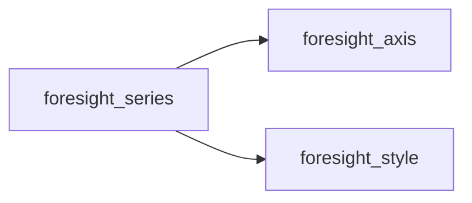
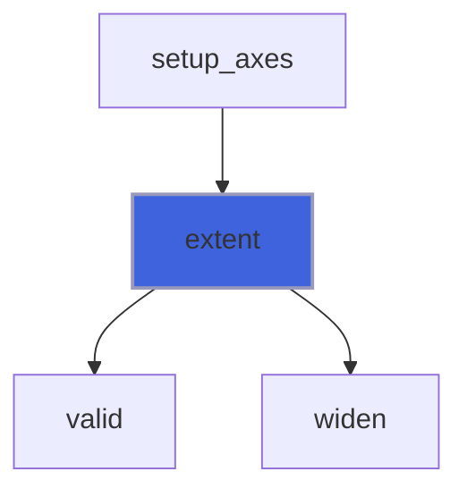
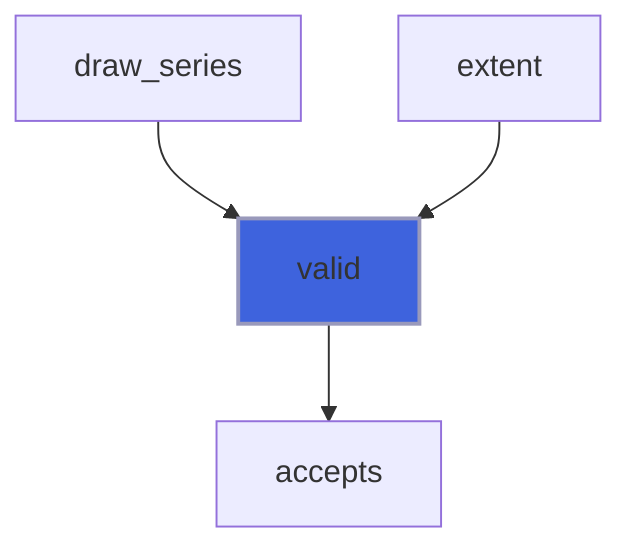

# foresight_series

> foresight_series, a plotted data series.

**Source**: `src/lib/foresight_series.F90`

**Dependencies**



## Contents

- [series_object](#series-object)
- [extent](#extent)
- [valid](#valid)

## Derived Types

### series_object

Data series.

#### Components

| Name | Type | Attributes | Description |
|------|------|------------|-------------|
| `x` | real(kind=R8P) | allocatable | Abscissae. |
| `y` | real(kind=R8P) | allocatable | Ordinates. |
| `xlow` | real(kind=R8P) | allocatable | Horizontal error bar starts, allocated for x error bars. |
| `xhigh` | real(kind=R8P) | allocatable | Horizontal error bar ends, allocated for x error bars. |
| `ylow` | real(kind=R8P) | allocatable | Vertical error bar starts, allocated for y error bars. |
| `yhigh` | real(kind=R8P) | allocatable | Vertical error bar ends, allocated for y error bars. |
| `title` | character(len=:) | allocatable | Key title, empty for none. |
| `style` | type([style_object](/api/src/lib/foresight_style#style-object)) |  | Drawing style. |

#### Type-Bound Procedures

| Name | Attributes | Description |
|------|------------|-------------|
| `extent` | pass(self) | Accumulate the data extent. |
| `valid` | pass(self) | Mask of the placeable points. |

## Subroutines

### extent

Widen the extent (`xmin`, `xmax`, `ymin`, `ymax`) to the placeable points of the series.

 With `xwindow` only the points whose abscissa lies inside it count: gnuplot autoscales y on the points inside the
 x range only. Error bar ends placeable on their axis widen the extent too, as in gnuplot.

**Attributes**: pure

```fortran
subroutine extent(self, xaxis, yaxis, xmin, xmax, ymin, ymax, found, xwindow)
```

**Arguments**

| Name | Type | Intent | Attributes | Description |
|------|------|--------|------------|-------------|
| `self` | class([series_object](/api/src/lib/foresight_series#series-object)) | in |  | Series. |
| `xaxis` | type([axis_object](/api/src/lib/foresight_axis#axis-object)) | in |  | Horizontal axis. |
| `yaxis` | type([axis_object](/api/src/lib/foresight_axis#axis-object)) | in |  | Vertical axis. |
| `xmin` | real(kind=R8P) | inout |  | Smallest abscissa. |
| `xmax` | real(kind=R8P) | inout |  | Largest abscissa. |
| `ymin` | real(kind=R8P) | inout |  | Smallest ordinate. |
| `ymax` | real(kind=R8P) | inout |  | Largest ordinate. |
| `found` | logical | inout |  | Set if the series has any counted point. |
| `xwindow` | real(kind=R8P) | in | optional | Abscissa window, in any order. |

**Call graph**



## Functions

### valid

Mask of the points placeable on both axes; the others are gaps, as gnuplot undefined points.

**Attributes**: pure

**Returns**: `logical`

```fortran
function valid(self, xaxis, yaxis) result(mask)
```

**Arguments**

| Name | Type | Intent | Attributes | Description |
|------|------|--------|------------|-------------|
| `self` | class([series_object](/api/src/lib/foresight_series#series-object)) | in |  | Series. |
| `xaxis` | type([axis_object](/api/src/lib/foresight_axis#axis-object)) | in |  | Horizontal axis. |
| `yaxis` | type([axis_object](/api/src/lib/foresight_axis#axis-object)) | in |  | Vertical axis. |

**Call graph**


