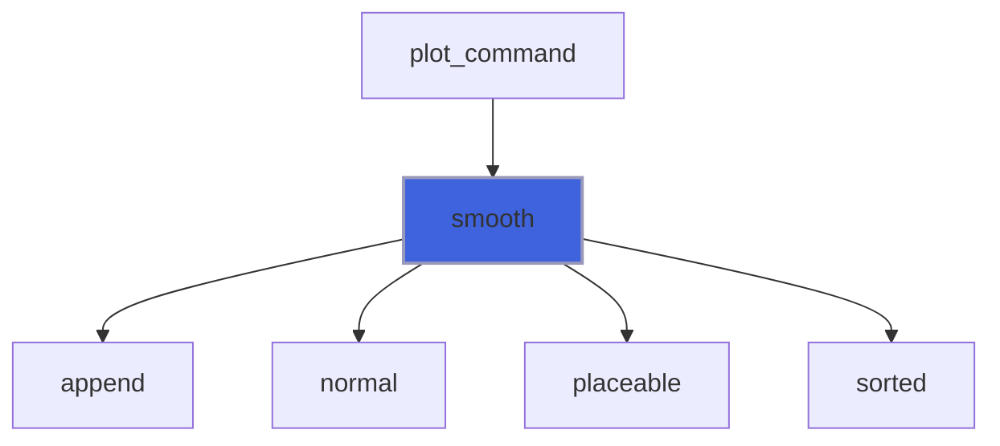
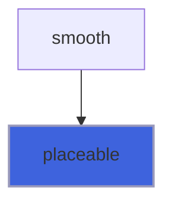
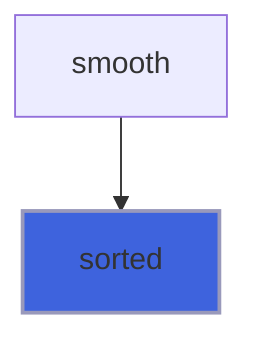

# foresight_smooth

> foresight_smooth, gnuplot `smooth` filters of a data series.

 The filters gnuplot computes from the data alone, without a fit: each run of placeable points (a block of the data
 file, broken by undefined points and by points not placeable on a log axis) is sorted by x, stably, and its points
 of equal x are merged into one:

 - `unique`: the mean of their y;
 - `frequency`: the sum of their y; `fnormal` divided by the sum of y over every run;
 - `cumulative`: the sum of y up to that x within the run; `cnormal` divided by the sum of y over every run.

 Runs stay separate, joined by an undefined (NaN) point that breaks the line, as gnuplot draws them.

**Source**: `src/lib/foresight_smooth.F90`

**Dependencies**


## Contents

- [smooth](#smooth)
- [placeable](#placeable)
- [sorted](#sorted)

## Variables

| Name | Type | Attributes | Description |
|------|------|------------|-------------|
| `SMOOTH_MODES` | character(len=*) | parameter | Supported filters. |

## Subroutines

### smooth

Filter the series (`x`, `y`) with the `smooth` `mode` (one of `SMOOTH_MODES`) into (`xs`, `ys`); `xlog`, `ylog`
 tell the log axes, on which non-positive values are not placeable.

```fortran
subroutine smooth(mode, x, y, xlog, ylog, xs, ys)
```

**Arguments**

| Name | Type | Intent | Attributes | Description |
|------|------|--------|------------|-------------|
| `mode` | character(len=*) | in |  | Filter. |
| `x` | real(kind=R8P) | in |  | Abscissae. |
| `y` | real(kind=R8P) | in |  | Ordinates. |
| `xlog` | logical | in |  | Log x axis. |
| `ylog` | logical | in |  | Log y axis. |
| `xs` | real(kind=R8P) | out | allocatable | Filtered abscissae. |
| `ys` | real(kind=R8P) | out | allocatable | Filtered ordinates. |

**Call graph**



## Functions

### placeable

Whether `v` is placeable on an axis: finite, and positive on a log axis (as foresight_axis%accepts).

**Attributes**: elemental

**Returns**: `logical`

```fortran
function placeable(v, log) result(ok)
```

**Arguments**

| Name | Type | Intent | Attributes | Description |
|------|------|--------|------------|-------------|
| `v` | real(kind=R8P) | in |  | Value. |
| `log` | logical | in |  | Log axis. |

**Call graph**



### sorted

Permutation sorting `keys` ascending, stable (equal keys keep their order): bottom-up merge sort.

**Attributes**: pure

**Returns**: `integer(kind=I4P)`

```fortran
function sorted(keys) result(order)
```

**Arguments**

| Name | Type | Intent | Attributes | Description |
|------|------|--------|------------|-------------|
| `keys` | real(kind=R8P) | in |  | Keys, no NaN. |

**Call graph**


