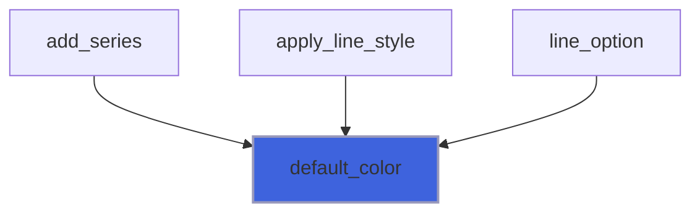
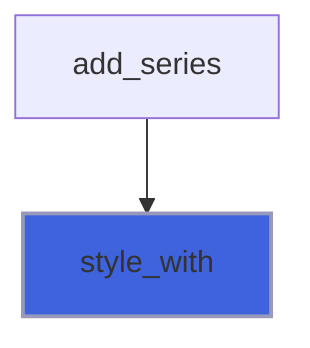
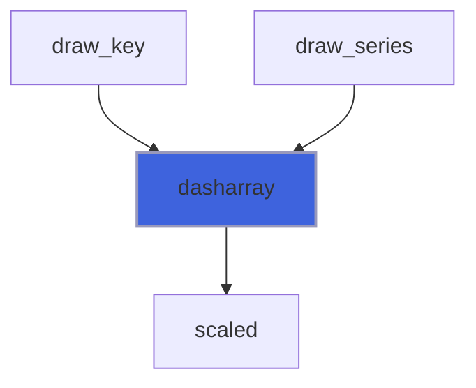
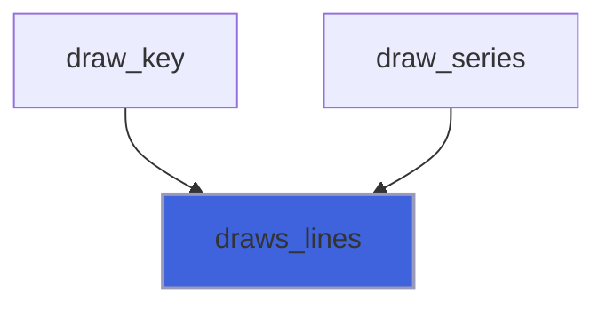
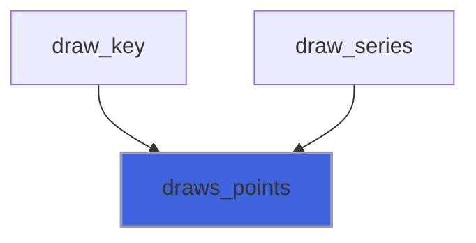
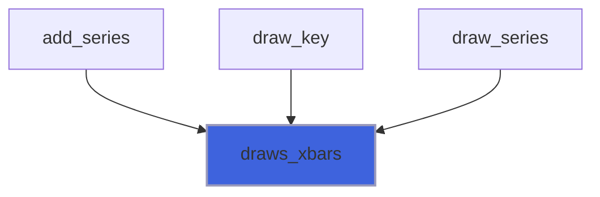
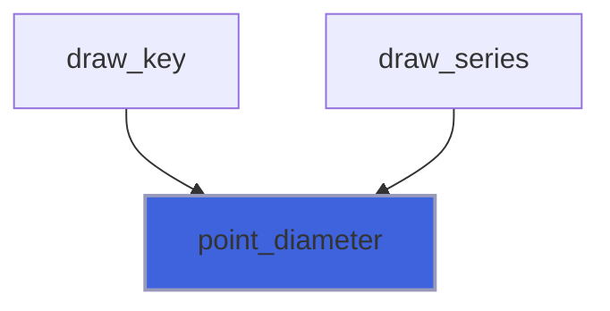

# foresight_style

> foresight_style, series drawing style (gnuplot `with`, `lc`, `lw`, `dt`, `ps`).

**Source**: `src/lib/foresight_style.F90`

**Dependencies**


## Contents

- [style_object](#style-object)
- [default_color](#default-color)
- [style_with](#style-with)
- [dasharray](#dasharray)
- [draws_lines](#draws-lines)
- [draws_points](#draws-points)
- [draws_xbars](#draws-xbars)
- [draws_ybars](#draws-ybars)
- [point_diameter](#point-diameter)

## Variables

| Name | Type | Attributes | Description |
|------|------|------------|-------------|
| `WITH_LINES` | integer(kind=I4P) | parameter | gnuplot `with lines`. |
| `WITH_POINTS` | integer(kind=I4P) | parameter | gnuplot `with points`. |
| `WITH_LINESPOINTS` | integer(kind=I4P) | parameter | gnuplot `with linespoints`. |
| `WITH_YERRORBARS` | integer(kind=I4P) | parameter | gnuplot `with yerrorbars`. |
| `WITH_XERRORBARS` | integer(kind=I4P) | parameter | gnuplot `with xerrorbars`. |
| `WITH_XYERRORBARS` | integer(kind=I4P) | parameter | gnuplot `with xyerrorbars`. |
| `PALETTE` | character(len=7) | parameter | gnuplot 5 line colors. |
| `DIAMETER_AT_UNIT_SIZE` | real(kind=R8P) | parameter | Point diameter at `pointsize` 1 [px]. |

## Derived Types

### style_object

Series drawing style.

#### Components

| Name | Type | Attributes | Description |
|------|------|------------|-------------|
| `with` | integer(kind=I4P) |  | Plotting style. |
| `color` | character(len=:) | allocatable | Line and point color (SVG color). |
| `linewidth` | real(kind=R8P) |  | Line width [px]. |
| `dashtype` | integer(kind=I4P) |  | gnuplot dash type: 1 solid, 2..5 dash patterns. |
| `pointsize` | real(kind=R8P) |  | Point size scale factor. |

#### Type-Bound Procedures

| Name | Attributes | Description |
|------|------------|-------------|
| `dasharray` | pass(self) | SVG dash array. |
| `draws_xbars` | pass(self) | Whether horizontal error bars are drawn. |
| `draws_ybars` | pass(self) | Whether vertical error bars are drawn. |
| `draws_lines` | pass(self) | Whether lines are drawn. |
| `draws_points` | pass(self) | Whether points are drawn. |
| `point_diameter` | pass(self) | Point diameter [px]. |

## Functions

### default_color

Default color of the `index`-th series, cycling the gnuplot 5 palette.

**Attributes**: pure

**Returns**: `character(len=:)`

```fortran
function default_color(index) result(color)
```

**Arguments**

| Name | Type | Intent | Attributes | Description |
|------|------|--------|------------|-------------|
| `index` | integer(kind=I4P) | in |  | Series index, from 1. |

**Call graph**



### style_with

Plotting style code of a gnuplot `with` keyword, full or abbreviated (`l`, `p`, `lp`, `yerr`, `xerr`, `xyerr`).

**Returns**: `integer(kind=I4P)`

```fortran
function style_with(name) result(with)
```

**Arguments**

| Name | Type | Intent | Attributes | Description |
|------|------|--------|------------|-------------|
| `name` | character(len=*) | in |  | gnuplot style keyword. |

**Call graph**



### dasharray

SVG `stroke-dasharray` of the dash type, scaled by the line width; empty for solid lines.

**Attributes**: pure

**Returns**: `character(len=:)`

```fortran
function dasharray(self) result(dashes)
```

**Arguments**

| Name | Type | Intent | Attributes | Description |
|------|------|--------|------------|-------------|
| `self` | class([style_object](/api/src/lib/foresight_style#style-object)) | in |  | Style. |

**Call graph**



### draws_lines

Whether the style draws lines.

**Attributes**: elemental

**Returns**: `logical`

```fortran
function draws_lines(self) result(lines)
```

**Arguments**

| Name | Type | Intent | Attributes | Description |
|------|------|--------|------------|-------------|
| `self` | class([style_object](/api/src/lib/foresight_style#style-object)) | in |  | Style. |

**Call graph**



### draws_points

Whether the style draws points.

**Attributes**: elemental

**Returns**: `logical`

```fortran
function draws_points(self) result(points)
```

**Arguments**

| Name | Type | Intent | Attributes | Description |
|------|------|--------|------------|-------------|
| `self` | class([style_object](/api/src/lib/foresight_style#style-object)) | in |  | Style. |

**Call graph**



### draws_xbars

Whether the style draws horizontal error bars.

**Attributes**: elemental

**Returns**: `logical`

```fortran
function draws_xbars(self) result(bars)
```

**Arguments**

| Name | Type | Intent | Attributes | Description |
|------|------|--------|------------|-------------|
| `self` | class([style_object](/api/src/lib/foresight_style#style-object)) | in |  | Style. |

**Call graph**



### draws_ybars

Whether the style draws vertical error bars.

**Attributes**: elemental

**Returns**: `logical`

```fortran
function draws_ybars(self) result(bars)
```

**Arguments**

| Name | Type | Intent | Attributes | Description |
|------|------|--------|------------|-------------|
| `self` | class([style_object](/api/src/lib/foresight_style#style-object)) | in |  | Style. |

**Call graph**


### point_diameter

Point diameter [px].

**Attributes**: elemental

**Returns**: `real(kind=R8P)`

```fortran
function point_diameter(self) result(diameter)
```

**Arguments**

| Name | Type | Intent | Attributes | Description |
|------|------|--------|------------|-------------|
| `self` | class([style_object](/api/src/lib/foresight_style#style-object)) | in |  | Style. |

**Call graph**


