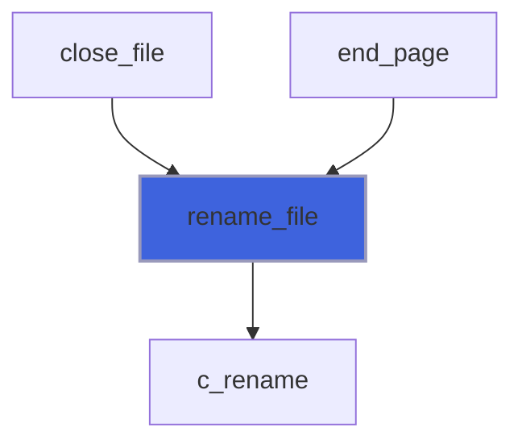
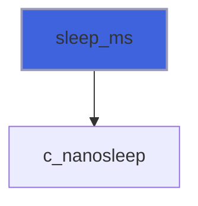

# foresight_sys

> foresight_sys, minimal libc interop for the services standard Fortran lacks.

 Standard Fortran has neither a file rename nor a sub-second sleep. Both are needed by the live (watch) mode: the
 output page is rewritten into a temporary file and atomically renamed over the published one (the browser must
 never read a half-written page), and data files are polled at a fixed cadence.

 @note POSIX only for now: `rename` replaces an existing destination atomically on POSIX, whereas on Windows the C
 runtime `rename` fails if the destination exists; `nanosleep` is POSIX. The `timespec` layout assumes an LP64 ABI
 (`time_t` and `long` both 64 bit), true on Linux and macOS x86_64/aarch64.

**Source**: `src/lib/foresight_sys.F90`

**Dependencies**


## Contents

- [timespec](#timespec)
- [c_rename](#c-rename)
- [c_nanosleep](#c-nanosleep)
- [rename_file](#rename-file)
- [sleep_ms](#sleep-ms)

## Derived Types

### timespec

POSIX `struct timespec`.

**Attributes**: bind(C)

#### Components

| Name | Type | Attributes | Description |
|------|------|------------|-------------|
| `tv_sec` | integer(kind=c_long) |  | Seconds. |
| `tv_nsec` | integer(kind=c_long) |  | Nanoseconds, in [0, 999999999]. |

## Interfaces

### c_rename

### c_nanosleep

## Subroutines

### rename_file

Rename (move) file `old` to `new`, replacing `new` if it exists.

 On POSIX the replacement is atomic: a concurrent reader sees either the old or the new `new`, never a partial file.
 Both paths must be on the same filesystem.

```fortran
subroutine rename_file(old, new, iostat)
```

**Arguments**

| Name | Type | Intent | Attributes | Description |
|------|------|--------|------------|-------------|
| `old` | character(len=*) | in |  | Current path. |
| `new` | character(len=*) | in |  | Target path. |
| `iostat` | integer(kind=I4P) | out | optional | 0 on success, non-zero on failure; if absent, failure stops. |

**Call graph**



### sleep_ms

Suspend the calling thread for at least `milliseconds` ms.

 An interruption by a signal resumes the sleep for the remaining interval.

```fortran
subroutine sleep_ms(milliseconds)
```

**Arguments**

| Name | Type | Intent | Attributes | Description |
|------|------|--------|------------|-------------|
| `milliseconds` | integer(kind=I8P) | in |  | Interval to sleep [ms]; non-positive values return immediately. |

**Call graph**


