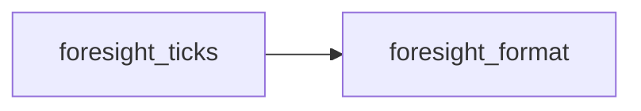
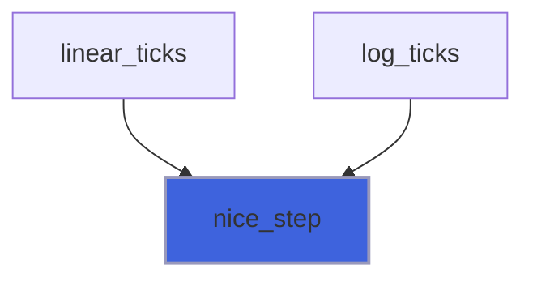
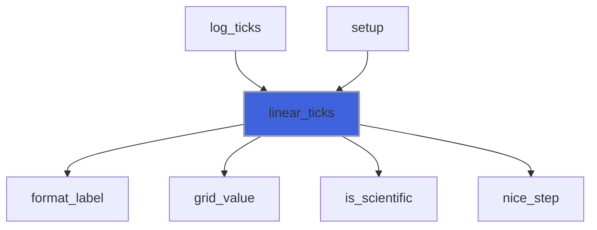
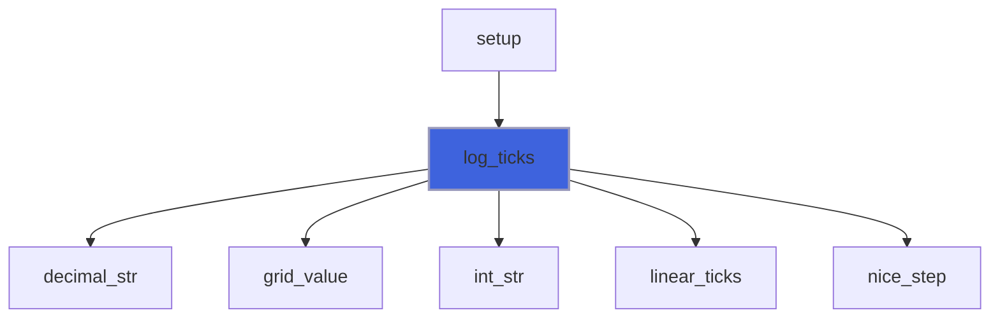
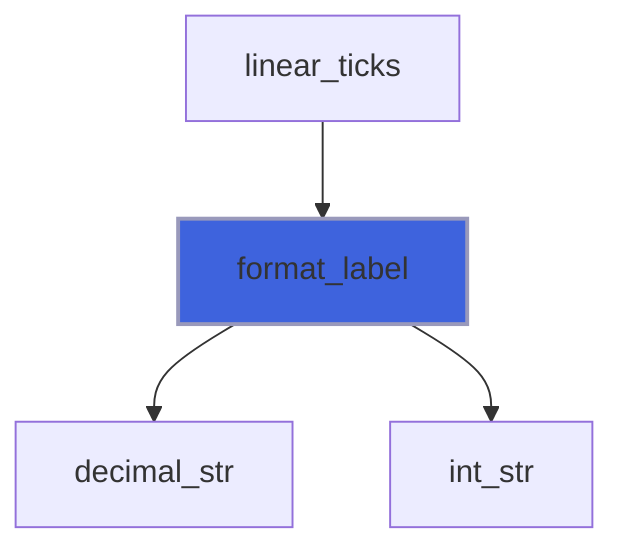
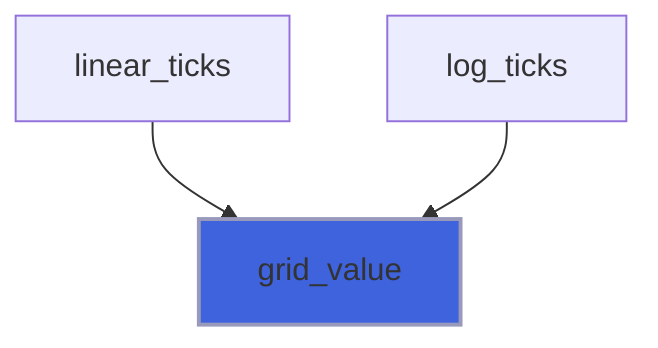
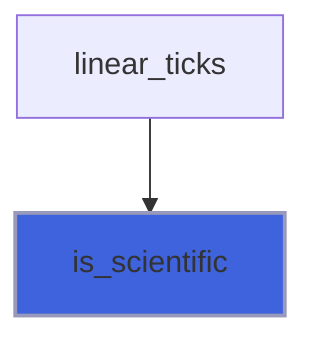

# foresight_ticks

> foresight_ticks, axis tick placement and labelling.

 Linear axes use the "nice numbers" rule (Heckbert, Graphics Gems, 1990): the step is rounded to `m * 10**e` with
 `m` in {1, 2, 5}. Log axes place majors at integer decades. Tick values are carried as the integer pair (`n`, `e`)
 meaning `n * 10**e`, so labels are exact decimal strings, free of floating point noise such as `0.30000000000000004`.

 The same rules will be mirrored by the interactive viewer, which must regenerate identical ticks after a zoom.

**Source**: `src/lib/foresight_ticks.F90`

**Dependencies**



## Contents

- [tick_object](#tick-object)
- [nice_step](#nice-step)
- [linear_ticks](#linear-ticks)
- [log_ticks](#log-ticks)
- [format_label](#format-label)
- [grid_value](#grid-value)
- [is_scientific](#is-scientific)

## Variables

| Name | Type | Attributes | Description |
|------|------|------------|-------------|
| `TOL` | real(kind=R8P) | parameter | Tolerance on tick-grid membership, in units of the step. |
| `TICK_SPACING` | real(kind=R8P) | parameter | Target distance between major ticks [px]. |
| `SCI_HIGH` | real(kind=R8P) | parameter | Labels switch to scientific notation from this magnitude... |
| `SCI_LOW` | real(kind=R8P) | parameter | ...or below this one. |
| `MAX_TICKS` | integer(kind=I8P) | parameter | Tick count cap: no ticks beyond it (degenerate or extreme zoom). |

## Derived Types

### tick_object

Axis tick.

#### Components

| Name | Type | Attributes | Description |
|------|------|------------|-------------|
| `value` | real(kind=R8P) |  | Data value. |
| `major` | logical |  | Major (labelled) tick, else minor. |
| `label` | character(len=:) | allocatable | Label text, empty for minor ticks. |
| `sup` | character(len=:) | allocatable | Superscript appended to the label, empty if none. |

## Subroutines

### nice_step

Round `raw > 0` to the "nice" step `m * 10**e` with `m` in {1, 2, 5}.

**Attributes**: pure

```fortran
subroutine nice_step(raw, m, e)
```

**Arguments**

| Name | Type | Intent | Attributes | Description |
|------|------|--------|------------|-------------|
| `raw` | real(kind=R8P) | in |  | Raw step. |
| `m` | integer(kind=I8P) | out |  | Step mantissa. |
| `e` | integer(kind=I4P) | out |  | Step exponent. |

**Call graph**



### linear_ticks

Major ticks of a linear axis `npx` pixels long; autoscaled ends are extended outward to the tick grid.

**Attributes**: pure

```fortran
subroutine linear_ticks(lo, hi, npx, extend_lo, extend_hi, ticks)
```

**Arguments**

| Name | Type | Intent | Attributes | Description |
|------|------|--------|------------|-------------|
| `lo` | real(kind=R8P) | inout |  | Value at the axis start (`lo > hi`: reversed axis). |
| `hi` | real(kind=R8P) | inout |  | Value at the axis end. |
| `npx` | real(kind=R8P) | in |  | Axis length [px]. |
| `extend_lo` | logical | in |  | Extend `lo` outward to the tick grid. |
| `extend_hi` | logical | in |  | Extend `hi` outward to the tick grid. |
| `ticks` | type([tick_object](/api/src/lib/foresight_ticks#tick-object)) | out | allocatable | Ticks, ascending in value. |

**Call graph**



### log_ticks

Ticks of a base-10 log axis `npx` pixels long; autoscaled ends are extended outward to whole decades.

 Majors sit at decades (labelled `10` with the exponent as superscript), minors at 2..9 times a decade when the
 axis spans at most 10 decades. With fewer than two decades in range the minors are labelled too, in plain decimals;
 if still fewer than two ticks are labelled (a range inside one decade), linear ticks are placed instead.

**Attributes**: pure

```fortran
subroutine log_ticks(lo, hi, npx, extend_lo, extend_hi, ticks)
```

**Arguments**

| Name | Type | Intent | Attributes | Description |
|------|------|--------|------------|-------------|
| `lo` | real(kind=R8P) | inout |  | Value at the axis start, > 0. |
| `hi` | real(kind=R8P) | inout |  | Value at the axis end, > 0. |
| `npx` | real(kind=R8P) | in |  | Axis length [px]. |
| `extend_lo` | logical | in |  | Extend `lo` outward to a decade. |
| `extend_hi` | logical | in |  | Extend `hi` outward to a decade. |
| `ticks` | type([tick_object](/api/src/lib/foresight_ticks#tick-object)) | out | allocatable | Ticks, majors first. |

**Call graph**



### format_label

Label of the tick value `n * 10**e`: plain decimal, or gnuplot-like `1.5x10` with the exponent as superscript.

**Attributes**: pure

```fortran
subroutine format_label(n, e, sci, label, sup)
```

**Arguments**

| Name | Type | Intent | Attributes | Description |
|------|------|--------|------------|-------------|
| `n` | integer(kind=I8P) | in |  | Value mantissa. |
| `e` | integer(kind=I4P) | in |  | Value exponent. |
| `sci` | logical | in |  | Scientific notation. |
| `label` | character(len=:) | out | allocatable | Label text. |
| `sup` | character(len=:) | out | allocatable | Label superscript. |

**Call graph**



## Functions

### grid_value

Value `n * 10**e`, correctly rounded for `|e| <= 22` (powers of ten are exact there).

**Attributes**: pure

**Returns**: `real(kind=R8P)`

```fortran
function grid_value(n, e) result(value)
```

**Arguments**

| Name | Type | Intent | Attributes | Description |
|------|------|--------|------------|-------------|
| `n` | integer(kind=I8P) | in |  | Mantissa. |
| `e` | integer(kind=I4P) | in |  | Exponent. |

**Call graph**



### is_scientific

Whether labels of an axis reaching `magnitude` use scientific notation.

**Attributes**: pure

**Returns**: `logical`

```fortran
function is_scientific(magnitude) result(sci)
```

**Arguments**

| Name | Type | Intent | Attributes | Description |
|------|------|--------|------------|-------------|
| `magnitude` | real(kind=R8P) | in |  | Largest absolute value on the axis. |

**Call graph**


