# foresight_ticks

> foresight_ticks, axis tick placement and labelling.

 Linear axes use the "nice numbers" rule (Heckbert, Graphics Gems, 1990): the step is rounded to `m * 10**e` with
 `m` in {1, 2, 5}. Log axes place majors at integer decades. Tick values are carried as the integer pair (`n`, `e`)
 meaning `n * 10**e`, so labels are exact decimal strings, free of floating point noise such as `0.30000000000000004`.

 User settings (`tics_object`, gnuplot `set xtics` and `set format`) replace the automatic rule: a fixed step from an
 optional start to an optional end (a multiplying factor on log axes), no ticks at all, or a printf-like label format.
 Fixed steps are kept as the decimal text the user wrote, so linear ticks stay exact decimals too.

 The same rules are mirrored by the interactive viewer, which must regenerate identical ticks after a zoom.

**Source**: `src/lib/foresight_ticks.F90`

**Dependencies**


## Contents

- [tick_object](#tick-object)
- [tics_object](#tics-object)
- [set_fixed](#set-fixed)
- [nice_step](#nice-step)
- [linear_ticks](#linear-ticks)
- [log_ticks](#log-ticks)
- [common_scale](#common-scale)
- [fixed_values](#fixed-values)
- [fixed_linear_ticks](#fixed-linear-ticks)
- [fixed_log_ticks](#fixed-log-ticks)
- [tick_label](#tick-label)
- [format_label](#format-label)
- [attribute](#attribute)
- [has_format](#has-format)
- [power](#power)
- [grid_value](#grid-value)
- [is_scientific](#is-scientific)

## Variables

| Name | Type | Attributes | Description |
|------|------|------------|-------------|
| `TICS_AUTO` | integer(kind=I4P) | parameter | Ticks by the automatic rule. |
| `TICS_FIXED` | integer(kind=I4P) | parameter | Ticks at a fixed step. |
| `TICS_NONE` | integer(kind=I4P) | parameter | No ticks. |
| `TOL` | real(kind=R8P) | parameter | Tolerance on tick-grid membership, in units of the step. |
| `TICK_SPACING` | real(kind=R8P) | parameter | Target distance between major ticks [px]. |
| `SCI_HIGH` | real(kind=R8P) | parameter | Labels switch to scientific notation from this magnitude... |
| `SCI_LOW` | real(kind=R8P) | parameter | ...or below this one. |
| `MAX_TICKS` | integer(kind=I8P) | parameter | Tick count cap: no ticks beyond it (degenerate or extreme zoom). |
| `MAX_POWER` | integer(kind=I8P) | parameter | Largest power of a fixed log step: no ticks beyond it. |

## Derived Types

### tick_object

Axis tick.

#### Components

| Name | Type | Attributes | Description |
|------|------|------------|-------------|
| `value` | real(kind=R8P) |  | Data value. |
| `major` | logical |  | Major (labelled) tick, else minor. |
| `label` | character(len=:) | allocatable | Label text, empty for minor ticks. |
| `sup` | character(len=:) | allocatable | Superscript appended to the label, empty if none. |

### tics_object

User tick settings of an axis, gnuplot `set xtics` and `set format`.

#### Components

| Name | Type | Attributes | Description |
|------|------|------------|-------------|
| `mode` | integer(kind=I4P) |  | TICS_AUTO, TICS_FIXED or TICS_NONE. |
| `start` | character(len=:) | allocatable | Fixed ticks start (decimal text), empty for none. |
| `step` | character(len=:) | allocatable | Fixed ticks step, a factor on log axes (decimal text). |
| `end` | character(len=:) | allocatable | Fixed ticks end (decimal text), empty for none. |
| `format` | character(len=:) | allocatable | Label format, empty for the default labels. |

#### Type-Bound Procedures

| Name | Attributes | Description |
|------|------------|-------------|
| `attribute` | pass(self) | Viewer attribute of the tick positions. |
| `has_format` | pass(self) | Whether a label format is set. |
| `set_fixed` | pass(self) | Set fixed ticks, validated. |

## Subroutines

### set_fixed

Fixed ticks every `step` (a factor on log axes) from `start` to `end`, given as decimal texts (empty for absent);
 `message` is empty on success, else the settings are unchanged.

**Attributes**: pure

```fortran
subroutine set_fixed(self, step, start, end, message)
```

**Arguments**

| Name | Type | Intent | Attributes | Description |
|------|------|--------|------------|-------------|
| `self` | class([tics_object](/api/src/lib/foresight_ticks#tics-object)) | inout |  | Settings. |
| `step` | character(len=*) | in |  | Step. |
| `start` | character(len=*) | in |  | Start, empty for none. |
| `end` | character(len=*) | in |  | End, empty for none. |
| `message` | character(len=:) | out | allocatable | Problem, empty if none. |

**Call graph**

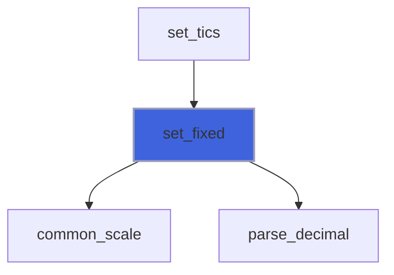

### nice_step

Round `raw > 0` to the "nice" step `m * 10**e` with `m` in {1, 2, 5}.

**Attributes**: pure

```fortran
subroutine nice_step(raw, m, e)
```

**Arguments**

| Name | Type | Intent | Attributes | Description |
|------|------|--------|------------|-------------|
| `raw` | real(kind=R8P) | in |  | Raw step. |
| `m` | integer(kind=I8P) | out |  | Step mantissa. |
| `e` | integer(kind=I4P) | out |  | Step exponent. |

**Call graph**

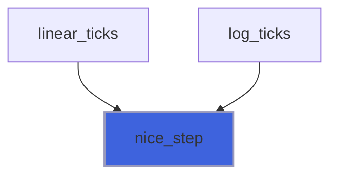

### linear_ticks

Major ticks of a linear axis `npx` pixels long; autoscaled ends are extended outward to the tick grid.

 With `tics`: no ticks and no extension (TICS_NONE), or the fixed grid (TICS_FIXED), and the label format.

**Attributes**: pure

```fortran
subroutine linear_ticks(lo, hi, npx, extend_lo, extend_hi, ticks, tics)
```

**Arguments**

| Name | Type | Intent | Attributes | Description |
|------|------|--------|------------|-------------|
| `lo` | real(kind=R8P) | inout |  | Value at the axis start (`lo > hi`: reversed). |
| `hi` | real(kind=R8P) | inout |  | Value at the axis end. |
| `npx` | real(kind=R8P) | in |  | Axis length [px]. |
| `extend_lo` | logical | in |  | Extend `lo` outward to the tick grid. |
| `extend_hi` | logical | in |  | Extend `hi` outward to the tick grid. |
| `ticks` | type([tick_object](/api/src/lib/foresight_ticks#tick-object)) | out | allocatable | Ticks, ascending in value. |
| `tics` | type([tics_object](/api/src/lib/foresight_ticks#tics-object)) | in | optional | User settings. |

**Call graph**

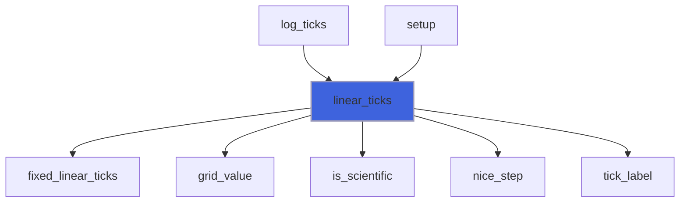

### log_ticks

Ticks of a base-10 log axis `npx` pixels long; autoscaled ends are extended outward to whole decades.

 Majors sit at decades (labelled `10` with the exponent as superscript), minors at 2..9 times a decade when the
 axis spans at most 10 decades. With fewer than two decades in range the minors are labelled too, in plain decimals;
 if still fewer than two ticks are labelled (a range inside one decade), linear ticks are placed instead.

 With `tics`: no ticks (TICS_NONE), or ticks multiplying by the step (TICS_FIXED), and the label format; the
 extension to decades applies anyway, as in gnuplot.

**Attributes**: pure

```fortran
subroutine log_ticks(lo, hi, npx, extend_lo, extend_hi, ticks, tics)
```

**Arguments**

| Name | Type | Intent | Attributes | Description |
|------|------|--------|------------|-------------|
| `lo` | real(kind=R8P) | inout |  | Value at the axis start, > 0. |
| `hi` | real(kind=R8P) | inout |  | Value at the axis end, > 0. |
| `npx` | real(kind=R8P) | in |  | Axis length [px]. |
| `extend_lo` | logical | in |  | Extend `lo` outward to a decade. |
| `extend_hi` | logical | in |  | Extend `hi` outward to a decade. |
| `ticks` | type([tick_object](/api/src/lib/foresight_ticks#tick-object)) | out | allocatable | Ticks, majors first. |
| `tics` | type([tics_object](/api/src/lib/foresight_ticks#tics-object)) | in | optional | User settings. |

**Call graph**

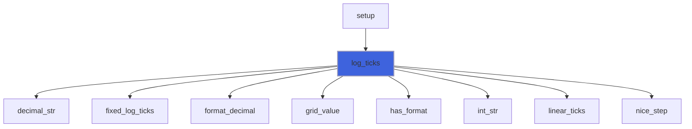

### common_scale

Rescale the decimals `n * 10**e` to their smallest exponent, keeping every mantissa below 1e15 (exact in the
 viewer's double precision integers); `ok` false if impossible.

**Attributes**: pure

```fortran
subroutine common_scale(n, e, ok)
```

**Arguments**

| Name | Type | Intent | Attributes | Description |
|------|------|--------|------------|-------------|
| `n` | integer(kind=I8P) | inout |  | Mantissas. |
| `e` | integer(kind=I4P) | inout |  | Exponents, all equal on exit. |
| `ok` | logical | out |  | Rescaled. |

**Call graph**

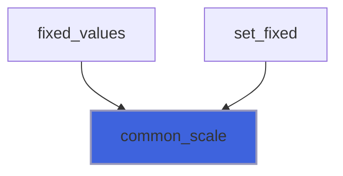

### fixed_values

Decimals of the fixed ticks at a common exponent: `n` holds step, start (0 if none) and end mantissas.

**Attributes**: pure

```fortran
subroutine fixed_values(tics, n, e, has_start, has_end)
```

**Arguments**

| Name | Type | Intent | Attributes | Description |
|------|------|--------|------------|-------------|
| `tics` | type([tics_object](/api/src/lib/foresight_ticks#tics-object)) | in |  | Settings, TICS_FIXED (validated by `set_fixed`). |
| `n` | integer(kind=I8P) | out |  | Mantissas: step, start, end. |
| `e` | integer(kind=I4P) | out |  | Exponents, equal. |
| `has_start` | logical | out |  | Start given. |
| `has_end` | logical | out |  | End given. |

**Call graph**

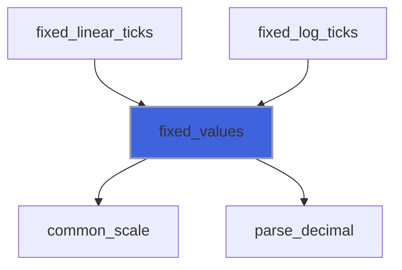

### fixed_linear_ticks

Ticks at start + k * step within [start, end], as gnuplot `set xtics START,STEP,END`.

 An autoscaled end is extended outward to a multiple of the step, unless it lies outside [start, end] (gnuplot).

**Attributes**: pure

```fortran
subroutine fixed_linear_ticks(lo, hi, extend_lo, extend_hi, tics, ticks)
```

**Arguments**

| Name | Type | Intent | Attributes | Description |
|------|------|--------|------------|-------------|
| `lo` | real(kind=R8P) | inout |  | Value at the axis start. |
| `hi` | real(kind=R8P) | inout |  | Value at the axis end. |
| `extend_lo` | logical | in |  | `lo` autoscaled. |
| `extend_hi` | logical | in |  | `hi` autoscaled. |
| `tics` | type([tics_object](/api/src/lib/foresight_ticks#tics-object)) | in |  | Settings, TICS_FIXED. |
| `ticks` | type([tick_object](/api/src/lib/foresight_ticks#tick-object)) | out | allocatable | Ticks, ascending in value. |

**Call graph**

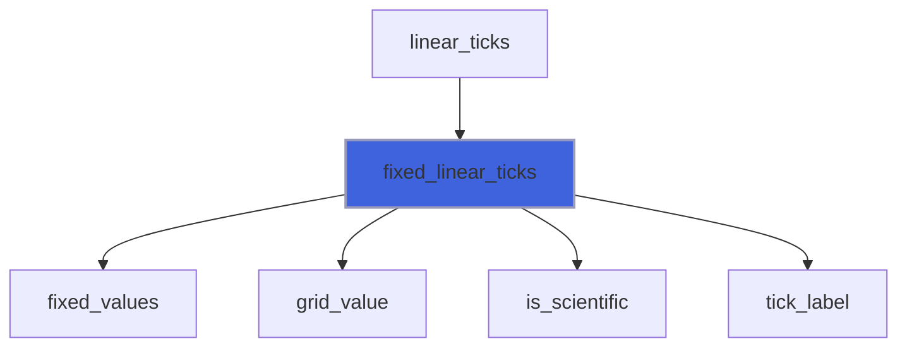

### fixed_log_ticks

Ticks of a log axis at start * step**k (start 1 if absent) within [start, end], as gnuplot `set ytics` on a log
 axis: the step is a factor, greater than 1.

 Tick values are built by repeated multiplication, so that the viewer reproduces them exactly.

**Attributes**: pure

```fortran
subroutine fixed_log_ticks(lo, hi, tics, ticks)
```

**Arguments**

| Name | Type | Intent | Attributes | Description |
|------|------|--------|------------|-------------|
| `lo` | real(kind=R8P) | in |  | Value at the axis start, > 0. |
| `hi` | real(kind=R8P) | in |  | Value at the axis end, > 0. |
| `tics` | type([tics_object](/api/src/lib/foresight_ticks#tics-object)) | in |  | Settings, TICS_FIXED. |
| `ticks` | type([tick_object](/api/src/lib/foresight_ticks#tick-object)) | out | allocatable | Ticks, ascending in value. |

**Call graph**

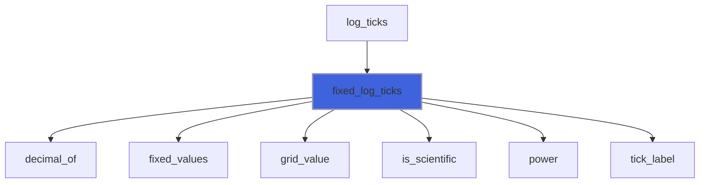

### tick_label

Label of the tick value `n * 10**e`: by the user format of `tics` if any, else by `format_label`.

**Attributes**: pure

```fortran
subroutine tick_label(n, e, sci, label, sup, tics)
```

**Arguments**

| Name | Type | Intent | Attributes | Description |
|------|------|--------|------------|-------------|
| `n` | integer(kind=I8P) | in |  | Value mantissa. |
| `e` | integer(kind=I4P) | in |  | Value exponent. |
| `sci` | logical | in |  | Scientific notation (default labels). |
| `label` | character(len=:) | out | allocatable | Label text. |
| `sup` | character(len=:) | out | allocatable | Label superscript. |
| `tics` | type([tics_object](/api/src/lib/foresight_ticks#tics-object)) | in | optional | User settings. |

**Call graph**

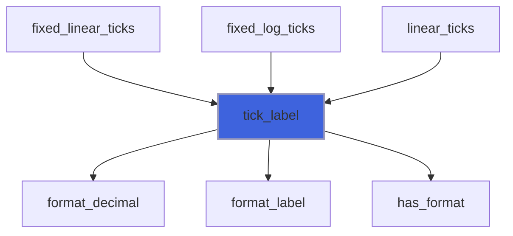

### format_label

Label of the tick value `n * 10**e`: plain decimal, or gnuplot-like `1.5x10` with the exponent as superscript.

**Attributes**: pure

```fortran
subroutine format_label(n, e, sci, label, sup)
```

**Arguments**

| Name | Type | Intent | Attributes | Description |
|------|------|--------|------------|-------------|
| `n` | integer(kind=I8P) | in |  | Value mantissa. |
| `e` | integer(kind=I4P) | in |  | Value exponent. |
| `sci` | logical | in |  | Scientific notation. |
| `label` | character(len=:) | out | allocatable | Label text. |
| `sup` | character(len=:) | out | allocatable | Label superscript. |

**Call graph**

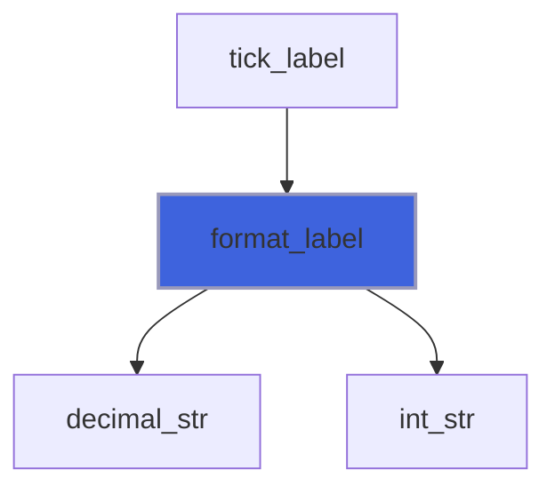

## Functions

### attribute

Tick positions for the viewer: empty for automatic, `none`, or `START STEP END` with `*` for an absent end.

**Attributes**: pure

**Returns**: `character(len=:)`

```fortran
function attribute(self) result(text)
```

**Arguments**

| Name | Type | Intent | Attributes | Description |
|------|------|--------|------------|-------------|
| `self` | class([tics_object](/api/src/lib/foresight_ticks#tics-object)) | in |  | Settings. |

**Call graph**

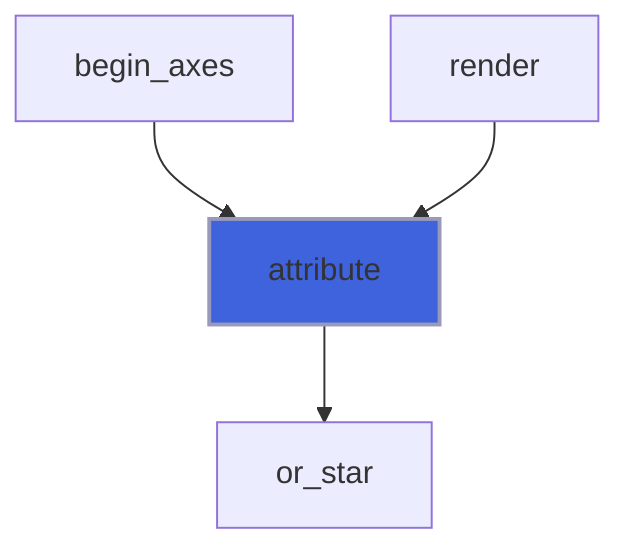

### has_format

Whether a label format is set.

**Attributes**: pure

**Returns**: `logical`

```fortran
function has_format(self) result(has)
```

**Arguments**

| Name | Type | Intent | Attributes | Description |
|------|------|--------|------------|-------------|
| `self` | class([tics_object](/api/src/lib/foresight_ticks#tics-object)) | in |  | Settings. |

**Call graph**

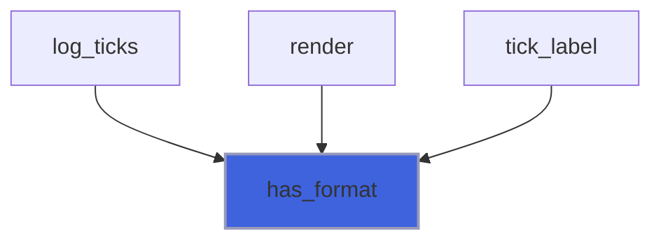

### power

first * factor**k by |k| multiplications or divisions: the operation sequence the viewer repeats.

**Attributes**: pure

**Returns**: `real(kind=R8P)`

```fortran
function power(first, factor, k) result(v)
```

**Arguments**

| Name | Type | Intent | Attributes | Description |
|------|------|--------|------------|-------------|
| `first` | real(kind=R8P) | in |  | Start. |
| `factor` | real(kind=R8P) | in |  | Factor. |
| `k` | integer(kind=I8P) | in |  | Power. |

**Call graph**

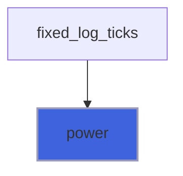

### grid_value

Value `n * 10**e`, correctly rounded for `|e| <= 22` (powers of ten are exact there); beyond, scaled in steps of
 1e22, the operation sequence the viewer repeats.

**Attributes**: pure

**Returns**: `real(kind=R8P)`

```fortran
function grid_value(n, e) result(value)
```

**Arguments**

| Name | Type | Intent | Attributes | Description |
|------|------|--------|------------|-------------|
| `n` | integer(kind=I8P) | in |  | Mantissa. |
| `e` | integer(kind=I4P) | in |  | Exponent. |

**Call graph**

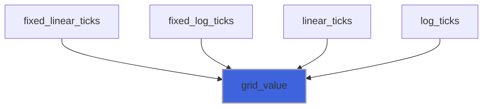

### is_scientific

Whether labels of an axis reaching `magnitude` use scientific notation.

**Attributes**: pure

**Returns**: `logical`

```fortran
function is_scientific(magnitude) result(sci)
```

**Arguments**

| Name | Type | Intent | Attributes | Description |
|------|------|--------|------------|-------------|
| `magnitude` | real(kind=R8P) | in |  | Largest absolute value on the axis. |

**Call graph**

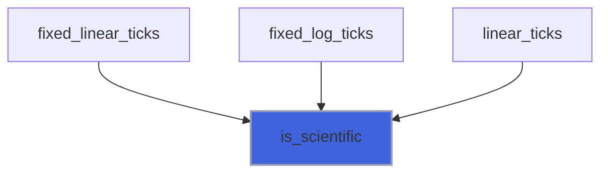
