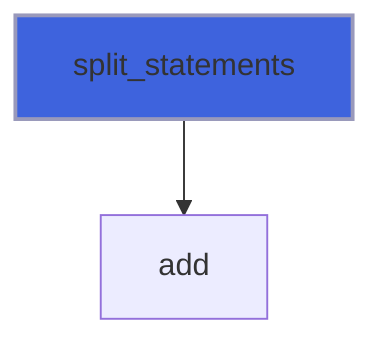
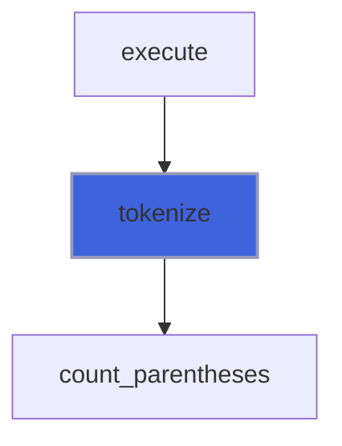

# foresight_tokens

> foresight_tokens, lexer of the gnuplot-like command language.

 A line is split into statements at `;` and cut at `#` (both outside quotes); a statement into tokens: words,
 quoted strings (single quotes literal, double quotes with `\"` and `\\` escapes, as gnuplot), commas and bracketed
 ranges `[a:b]`. Inside parentheses a word goes on across blanks and commas: `($2 * 1e3)` and `atan2($2, $1)` are
 single words.

**Source**: `src/lib/foresight_tokens.F90`

## Contents

- [token_object](#token-object)
- [split_statements](#split-statements)
- [tokenize](#tokenize)

## Variables

| Name | Type | Attributes | Description |
|------|------|------------|-------------|
| `TOKEN_WORD` | integer(kind=I4P) | parameter | Bare word: keyword, number, column spec. |
| `TOKEN_STRING` | integer(kind=I4P) | parameter | Quoted string, quotes removed. |
| `TOKEN_COMMA` | integer(kind=I4P) | parameter | Comma. |
| `TOKEN_RANGE` | integer(kind=I4P) | parameter | Bracketed range, brackets removed. |

## Derived Types

### token_object

Token.

#### Components

| Name | Type | Attributes | Description |
|------|------|------------|-------------|
| `kind` | integer(kind=I4P) |  | Token kind. |
| `text` | character(len=:) | allocatable | Token text. |
| `quote` | character(len=1) |  | Quote of a string token, blank for others. |

## Subroutines

### split_statements

Split `line` at `;` outside quotes, dropping the `#` comment; blank statements are skipped.

```fortran
subroutine split_statements(line, statements)
```

**Arguments**

| Name | Type | Intent | Attributes | Description |
|------|------|--------|------------|-------------|
| `line` | character(len=*) | in |  | Source line. |
| `statements` | type([token_object](/api/src/lib/foresight_tokens#token-object)) | out | allocatable | Statements (kind word). |

**Call graph**



### tokenize

Split `statement` into tokens.

**Attributes**: pure

```fortran
subroutine tokenize(statement, tokens, iostat, iomsg)
```

**Arguments**

| Name | Type | Intent | Attributes | Description |
|------|------|--------|------------|-------------|
| `statement` | character(len=*) | in |  | Statement. |
| `tokens` | type([token_object](/api/src/lib/foresight_tokens#token-object)) | out | allocatable | Tokens. |
| `iostat` | integer(kind=I4P) | out |  | 0, or 1 on a lexical error. |
| `iomsg` | character(len=:) | out | allocatable | Error message. |

**Call graph**


