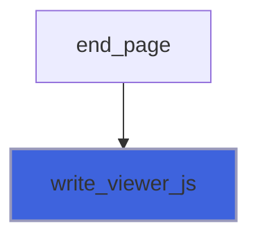

# foresight_viewer_js

> foresight_viewer_js, the interactive viewer embedded in HTML pages.

 GENERATED by scripts/embed_js.sh from src/js/viewer.js: do not edit, edit the JavaScript and regenerate.

**Source**: `src/lib/foresight_viewer_js.F90`

## Contents

- [write_viewer_js](#write-viewer-js)

## Subroutines

### write_viewer_js

Write the viewer script, one line per record, on the open formatted `unit`.

```fortran
subroutine write_viewer_js(unit)
```

**Arguments**

| Name | Type | Intent | Attributes | Description |
|------|------|--------|------------|-------------|
| `unit` | integer(kind=I4P) | in |  | Output unit. |

**Call graph**


