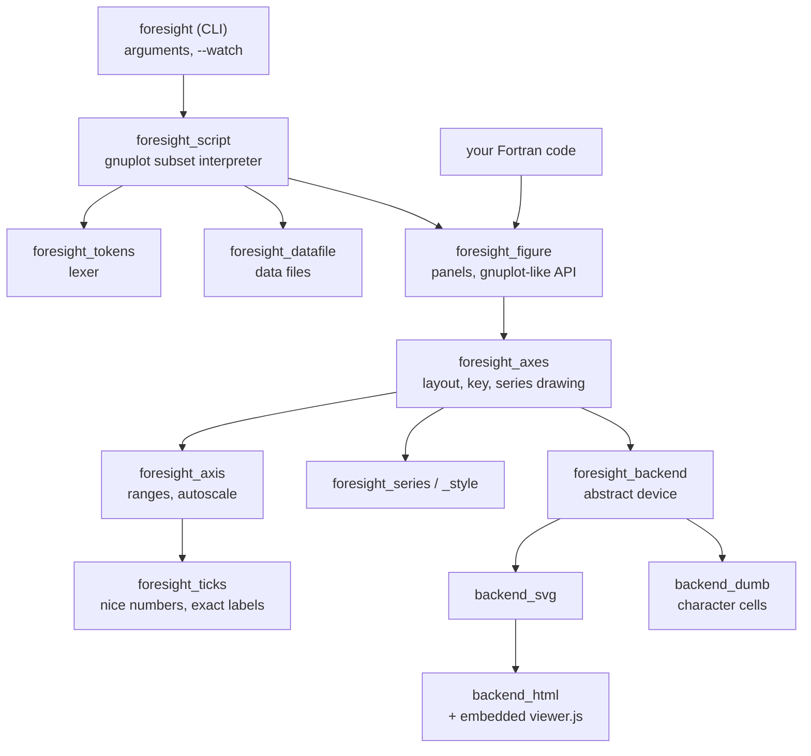

# Architecture

## Layers

- **Interpreter** (`foresight_script`, `foresight_tokens`, `foresight_datafile`): turns gnuplot statements into calls
  of the figure API. It lives in the library, so the command line tool is a thin shell and Fortran code can run
  scripts too. Errors are returned, not stopped on, which lets a watch loop survive a bad cycle.
- **Model** (`foresight_figure`, `foresight_axes`, `foresight_axis`, `foresight_series`, `foresight_style`): panels,
  axes with gnuplot range semantics, series with their style.
- **Rules** (`foresight_ticks`, `foresight_format`): tick placement and labels, number formatting.
- **Devices** (`foresight_backend` and its extensions): an abstract drawing interface with two coordinate spaces —
  page pixels for decorations, the unit square of the plot area for data.

## Design decisions

**Data in the unit square.** Data are mapped to [0, 1] per axis (after the log transform) and drawn inside a clipped
area. An interactive device zooms by changing one view transform; the text device rasterises the same coordinates.
Coordinates are written with 6 decimals, which allows zooming by about 10⁵ before the steps show.

**Exact labels.** A tick value is the integer pair (`n`, `e`) meaning `n * 10**e`; its label is assembled from the
digits of `n`. Every number written to a file goes through integer arithmetic, because the processor-dependent parts
of Fortran edit descriptors differ between compilers: golden files are byte-exact.

**One set of tick rules.** The viewer regenerates ticks after a zoom with a line-by-line JavaScript port of
`foresight_ticks`, including the single-rounding power-of-ten scaling, so both sides agree to the last bit; the same
test cases run on both (`src/tests/foresight_ticks_test.F90`, `src/js/viewer_test.js`).

**Device-measured text.** Margins depend on label widths; each device reports them (`text_width`): estimated for
vector formats, whose viewer renders the glyphs, exact for character cells.

**Decorations regenerated, data never re-plotted.** Grid, ticks and error bar caps are named groups the viewer
rebuilds; data geometry is written once.

**Atomic output.** Write to `<file>.tmp`, then `rename`: live viewers never read partial files.

**Bounded work.** Tick generation stops at 1000 ticks; the text device clips segments before rasterising. Degenerate
ranges and far outliers cannot turn into runaway loops or allocations.

## The viewer script

`src/js/viewer.js` is the source; `scripts/embed_js.sh` (`fobis rule --ex embed-js`) generates
`src/lib/foresight_viewer_js.F90`, one `write` statement per line, which is committed. Regenerate after every edit of
the script; the generator rejects lines longer than 100 characters, so that each generated line fits 132 columns.
