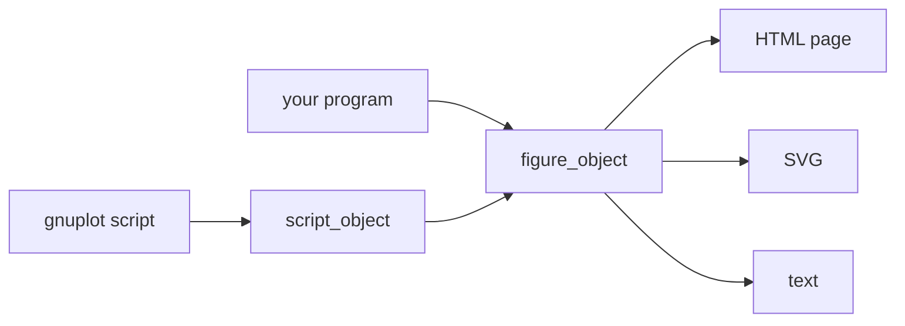

# Feature map

Everything foresight does, and where it is documented. The [tutorial](/manual/) shows it at work; the
[cookbook](/manual/cookbook) one task at a time.

| Area | Features | Where |
|---|---|---|
| Plot styles | `lines`, `points`, `linespoints`, `yerrorbars`, `xerrorbars`, `xyerrorbars`; gnuplot palette, dash types, widths, 15 point types and sizes; `set style line`, `ls` | [gnuplot Subset](gnuplot-subset#styles), [point types](gnuplot-subset#point-types) |
| Axes | linear and log scales, fixed or autoscaled ends extended to the ticks, reversed ranges; tick steps, `mirror`, printf label formats; a second y axis | [Ticks](gnuplot-subset#ticks-and-label-formats), [Second y axis](gnuplot-subset#second-y-axis) |
| Key | inside (any corner, centred), `outside`, `below`/`above` in rows, box; titles as written, from column headers, or none | [Key](gnuplot-subset#key) |
| Data files | whitespace, CSV or any separator; comments, blocks, datasets; `using`, `index`, `every`; column 0; missing values; cells read as gnuplot (C `strtod`) | [Data Files](data-files) |
| Expressions | `using ($2*1e3)`, `column("name")`, `?:`, `1/0` gaps, gnuplot's integer arithmetic and functions | [Expressions](gnuplot-subset#expressions-in-using) |
| Column headers | `using 1:"residual"`, `title columnhead`, `set key autotitle columnhead` | [Column headers](gnuplot-subset#column-headers) |
| Functions | `plot sin(x)/x`, sampled over the data x range, `set samples`, `set style function` | [Functions](gnuplot-subset#functions) |
| Layout | multiplot grids with a title, panels in `origin`/`size` boxes (insets) | [Multiplot](gnuplot-subset#multiplot) |
| Output | interactive HTML (one self-contained page), SVG, text (`dumb`), atomic rewrites | [Output Formats](output-formats) |
| Viewer | wheel and box zoom, pan, `u` `a` `g` `h`, live coordinates (y2 too), ticks and markers regenerated on zoom, the view kept in the URL | [Interactive Viewer](viewer) |
| Monitoring | `--watch`: re-render on any change of the script or its data; reloading pages; the text terminal redrawn in place | [Live Monitoring](monitoring) |
| Library | `figure_object` (methods mirroring gnuplot commands), `script_object` (the interpreter) | [Fortran Library](library), [API](/api/) |
| Command line | `foresight [-e CMDS] [-o OUT] [-w [S]] [SCRIPT]` | [Command Line](cli) |
| Engineering | pure Fortran 2018; exact tick labels from integers; byte-exact golden tests; never an IEEE exception on bad data | [Architecture](architecture) |

